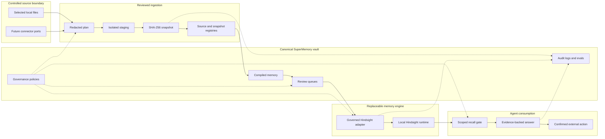

# SuperMemory

[](https://github.com/arnaudlopez/SuperMemory/actions/workflows/supermemory-specs.yml)


> Governed, living memory for personal, professional, and enterprise AI agents.

SuperMemory is a local-first memory architecture that makes AI memory **traceable, reviewable, revocable, and safe to use**. It combines a Markdown/Obsidian-compatible vault, immutable source snapshots, deterministic governance, explicit operator approvals, and a Hindsight-backed recall layer.

Most memory systems ask, “What can we retrieve?” SuperMemory asks the harder questions:

- Should this information be memory at all?
- Which source and snapshot prove it?
- Is it still fresh, or has the source changed?
- Which workspace, agent, and use pattern may consume it?
- What must be reviewed before promotion, recall, or external action?

The vault remains the source of truth. Hindsight is a replaceable recall projection, not the authority for permissions, provenance, freshness, or revocation.

## Table of contents

- [What SuperMemory provides](#what-supermemory-provides)
- [Architecture](#architecture)
- [End-to-end lifecycle](#end-to-end-lifecycle)
- [Vault model](#vault-model)
- [Governance and security](#governance-and-security)
- [Readiness model](#readiness-model)
- [Quickstart](#quickstart)
- [Operator workflows](#operator-workflows)
- [Testing and CI](#testing-and-ci)
- [Repository structure](#repository-structure)
- [Production operations](#production-operations)
- [Scope and limitations](#scope-and-limitations)
- [Documentation](#documentation)
- [Contributing, security, and license](#contributing-security-and-license)

## What SuperMemory provides

### Governed ingestion

Sources are selected explicitly. Capture, onboarding, refresh, and promotion use a three-step workflow:

```text
plan -> stage -> owner-confirmed commit
```

Plans are reviewable and redacted. Staging is isolated from the vault. Final commits verify that the source has not changed since review.

### Immutable evidence

Mutable references such as files, URLs, CRM records, documents, and email threads are pointers—not proof. SuperMemory stores the reviewed bytes as SHA-256 content-addressed snapshots and records their provenance, capture time, workspace, sensitivity, and lineage.

### Living-memory lifecycle

Memory is not assumed to remain true forever. The governance model distinguishes:

`fresh` · `changed` · `stale` · `needs_review` · `conflicting` · `unavailable` · `historical_only` · `do_not_use`

A changed source can invalidate derived memory without destroying the historical evidence that explains what happened.

### LLM-first meaning, deterministic governance

LLMs may interpret source-backed observations and adapt them to unfamiliar requests. Deterministic contracts still enforce evidence, confidence, uncertainty, review state, access policy, freshness, allowed use patterns, and external-action confirmation.

### Governed recall and answers

Hindsight promotion uses stable document identifiers, scoped tags, provenance metadata, and reviewed plans. Recall fails closed when required scope tags are absent or forbidden tags are present. Final answers must cite the memories and source snapshots that support them.

### Executable specification

The product contract is expressed through fixtures, Node.js verifiers, and 34 automated tests. CI runs the complete specification and release gates on Node.js 18 and 22 without live credentials or live network writes.

## Architecture

### System flow



### Architectural responsibilities

| Component | Responsibility | Trust boundary |
|---|---|---|
| Operator CLIs | Produce plans, staging artifacts, reports, and explicit approval gates | No implicit mutation |
| Snapshot layer | Preserve the exact reviewed bytes under a content-derived identity | Immutable evidence |
| Source and snapshot registries | Track provenance, freshness, lineage, and source state | Recoverable transaction |
| Markdown vault | Hold canonical memory, policies, queues, signals, logs, and evals | Source of truth |
| Interpretation contract | Let LLMs derive meaning while declaring evidence and uncertainty | Review before activation |
| Hindsight adapter | Translate governed memory into a recall-engine projection | Reviewed writes only |
| Recall and answer contracts | Enforce scope, forbidden tags, freshness, and citations | Deny by default |
| Verification suite | Prove contracts, release surface, runtime evidence, and secret hygiene | CI is mock-only |

### Control plane and execution plane

SuperMemory deliberately separates two concerns:

- **Control plane — the vault:** provenance, permissions, snapshots, freshness, review queues, governance, agent contracts, and audit evidence.
- **Execution plane — memory engines and agents:** retrieval, ranking, recall, interpretation, answer drafting, and explicitly confirmed actions.

This separation prevents a retrieval engine from silently becoming the authority for data access or truth.

### Canonical state versus projection

```text
Canonical state                           Derived projection
──────────────────────────────────────    ─────────────────────────────
Source bytes + immutable snapshots        Hindsight documents
Source/snapshot registries                Recall indexes and observations
Compiled Markdown memory                  Serialized metadata and tags
Policies and review queues                Scoped query filters
Audit logs and evals                      Adapter traces
```

Deleting or changing a Hindsight projection does not erase the vault's evidence. Conversely, a document present in Hindsight is not automatically authorized for use.

## End-to-end lifecycle

The Golden End State is:

```text
capture -> snapshot -> interpretation -> promotion -> recall -> answer -> refresh -> audit
```

1. **Select:** an operator chooses a bounded source and declares workspace, owner, and capture reason.
2. **Plan:** the CLI validates scope and writes a redacted plan outside the vault.
3. **Stage:** reviewable artifacts are produced without changing canonical state.
4. **Commit:** owner confirmation triggers source re-reading, SHA-256 verification, immutable snapshot creation, and transactional registry updates.
5. **Interpret:** source-backed observations become interpretation candidates with evidence, confidence, uncertainty, and review state.
6. **Review:** ambiguity, staleness, conflicts, permissions, new types, and external actions enter explicit queues.
7. **Promote:** a reviewed plan projects only governed memory into Hindsight using stable `document_id` values and strict metadata.
8. **Recall:** agents query with workspace, consumer, status, sensitivity, schema, and forbidden-tag constraints.
9. **Answer:** responses cite used memory, snapshots, relations, and adapter traces; unsafe evidence degrades the answer state.
10. **Refresh:** changed or unavailable sources create new evidence and review work instead of silently overwriting truth.
11. **Audit:** fixtures, logs, secret hygiene, release gates, and runtime evidence prove the system's current state.

See the executable [Golden End State operator workflow](docs/golden-end-state-operator-workflow.md).

## Vault model

```text
identity-vault/
├── AGENTS.md             # operating rules for memory-consuming agents
├── memory_map.md         # human and agent navigation entry point
├── 00_inbox/             # source registry and immutable snapshots
├── 10_shared/            # redacted shared constraints and signals
├── 20_professional/      # compiled professional memory
├── 30_personal/          # personal memory
├── 40_private/           # restricted memory
├── 50_review/            # staleness, conflict, permission, type, action queues
├── 60_signals/           # typed JSONL signals
├── 70_agent_contracts/   # read, write, recall, and action contracts
├── 75_governance/        # lifecycle, access, freshness, interpretation policies
├── 80_logs/              # source changes, promotions, traces, engine evals
└── 90_evals/             # executable acceptance fixtures and golden questions
```

The vault is plain-text first: inspectable in Git, compatible with Obsidian, and usable without a proprietary database.

### Snapshot and registry safety

- Snapshot paths are derived from SHA-256 content identity.
- The source is re-read at commit time to detect post-review drift.
- Snapshot artifacts use restrictive file permissions.
- Symlinks and path escapes fail closed.
- Registry writes use a vault lock, journal, backups, atomic replacement, and recovery.
- Historical snapshots are preserved for audit rather than overwritten.

## Governance and security

| Invariant | Enforcement |
|---|---|
| Retrieval is not authorization | Required workspace, access, owner, consumer, and status tags |
| Mutable pointers are not proof | Immutable, content-addressed snapshots |
| Stale memory is not current memory | Freshness states and `needs_review` routing |
| Forbidden memory must not answer | `do_not_use`, restricted-field, and forbidden-tag guards |
| LLM output is not automatically memory | Interpretation candidate and review contracts |
| External actions require confirmation | `action_confirmation_queue` and owner gates |
| Live writes are exceptional | Reviewed apply plan, explicit live flag, owner confirmation |
| Cloud is never an implicit fallback | Localhost default; remote endpoints fail closed |
| Secrets do not belong in Git | Dedicated secret-hygiene verifier and CI gate |
| Partial writes are not hidden | Bounded timeouts and completed/pending request reports |

Sensitive source material, credentials, live evidence, and production-like logs must remain outside tracked files. See [SECURITY.md](SECURITY.md).

## Readiness model

Readiness is deliberately split into three independent levels:

| Level | Proves | Does not prove |
|---|---|---|
| `contract-ready` | Tests, fixtures, mock transport, docs, compose safety, CI, secret hygiene | A healthy live runtime |
| `runtime-ready` | Contract gate plus strict local preflight and fresh redacted live smoke evidence | Owner approval for production |
| `production-ready` | Runtime readiness plus post-evidence owner approval, exact scope, approval reference, and rollback acknowledgement | Readiness after evidence expires or scope changes |

Runtime evidence expires after 24 hours by default. Production approval is environment-specific and time-bound; it is not a permanent repository badge.

```bash
npm test
npm run verify:release
npm run verify:runtime -- --evidence-path tmp/hindsight-live-smoke-local.jsonl --json
npm run verify:production -- \
  --evidence-path tmp/hindsight-live-smoke-local.jsonl \
  --deployment-scope local-first-operator \
  --rollback-acknowledged \
  --owner-approved \
  --approval-reference <non-secret-reference> \
  --json
```

The production verifier performs no live writes. It refuses stale, failed, mock, unredacted, or pre-approval evidence.

## Quickstart

### Requirements

- Node.js 18 or 22
- Git
- Docker with Compose, only for the local Hindsight runtime

### Clone and verify

```bash
git clone https://github.com/arnaudlopez/SuperMemory.git
cd SuperMemory
npm test
npm run verify:release
```

No application dependencies are required for the deterministic specification and governance checks.

### Inspect the supported operator surface

```bash
node scripts/supermemory-operator.mjs
node scripts/supermemory-operator.mjs --json
```

### Start local Hindsight

```bash
docker compose -f compose.hindsight.yml up -d
```

The image is pinned by digest and ports `8888` and `9999` are bound to `127.0.0.1` only. Hindsight Cloud is not used by default.

Set explicit local runtime values before strict preflight or live smoke:

```bash
export HINDSIGHT_API_KEY='<local-key>'
export HINDSIGHT_BANK_ID='<sacrificial-bank>'
export HINDSIGHT_BASE_URL='http://127.0.0.1:8888'
export SUPERMEMORY_ALLOW_LIVE_HINDSIGHT='1'

node scripts/hindsight-local-live-smoke-preflight.mjs --json --require-ready
```

The preflight performs no writes. Follow [docs/production-runbook.md](docs/production-runbook.md) before running the credentialed live smoke or any production decision.

### Verify the Golden End State

```bash
node scripts/verify-golden-end-state-workflow.mjs
```

## Operator workflows

| Workflow | Entry point | Mutation model |
|---|---|---|
| Client onboarding | `scripts/supermemory-onboard.mjs` | inventory → plan → staging → confirmed vault commit |
| Manual capture | `scripts/local-manual-capture.mjs` | one selected source → plan → staging → confirmed vault commit |
| Local-file refresh | `scripts/local-file-source-refresh.mjs` | connector result → refresh plan → staging → confirmed commit |
| Hindsight promotion | `scripts/hindsight-promote.mjs` | governed input → reviewed plan → mock or explicit live apply |
| Runtime preflight | `scripts/hindsight-local-live-smoke-preflight.mjs` | read-only health, env, Docker, and binding checks |
| Live smoke | `scripts/hindsight-live-smoke-runner.mjs` | explicit writes to a sacrificial local bank |
| Release gate | `scripts/verify-supermemory-release-readiness.mjs` | mock-only, no credentials |
| Runtime gate | `scripts/verify-supermemory-runtime-readiness.mjs` | validates fresh live evidence, no writes |
| Production gate | `scripts/verify-supermemory-production-readiness.mjs` | records explicit decision, no writes |

Every mutating workflow is bounded by reviewed artifacts and explicit owner confirmation. The [production runbook](docs/production-runbook.md) contains complete commands, rollback, credential boundaries, and failure handling.

## Testing and CI

```bash
npm test
npm run verify
npm run verify:release
npm run verify:secrets
git diff --check
```

GitHub Actions runs on every push and pull request with:

- Node.js 18 and 22;
- secret hygiene;
- CI regression suite;
- complete SuperMemory specification;
- release-readiness verification;
- whitespace validation;
- read-only repository permissions.

CI is intentionally mock-only. It never receives Hindsight credentials and never performs live Hindsight writes.

### Acceptance fixtures

| Fixture | Purpose |
|---|---|
| `acme-meeting-complete` | Initial personal/professional vault, source capture, signals, promotion logs, and governance |
| `enterprise-living-memory-partial` | Mutable sources, stale memory, reviewed re-promotion, revocation, and evidence-backed answers |
| `enterprise-living-memory-complete` | Full enterprise Golden Case: conflicts, unavailable sources, access, secrets, legal hold, adaptive types, queues, agents, and engine-port decisions |

Fixtures live under [`identity-vault/90_evals/cases/`](identity-vault/90_evals/cases/) and are validated by the scripts in [`scripts/`](scripts/) plus the Node tests in [`tests/`](tests/).

## Repository structure

```text
.
├── identity-vault/          # canonical governed memory and executable fixtures
├── scripts/                 # operator CLIs, adapters, gates, and verifiers
│   └── lib/                 # snapshot and recoverable-transaction primitives
├── tests/                   # Node.js regression tests
├── docs/                    # architecture, PRD, runbooks, audits, and goals
├── .github/workflows/       # pinned, read-only CI
├── compose.hindsight.yml    # pinned localhost-only Hindsight runtime
├── SECURITY.md              # private vulnerability reporting policy
└── package.json             # stable verification command surface
```

## Production operations

### Deployment target

The supported target is a **local-first operator deployment**:

- SuperMemory operator and governance tools run from the repository.
- The Markdown vault is canonical local state.
- Hindsight runs locally through Docker Compose.
- Live evidence is stored under ignored `tmp/`.
- There is no hosted web application in this release.

### Observability

All operator scripts expose machine-readable JSON. The release, runtime, production, smoke, promotion, and operator reports form the operational audit trail. Hindsight exposes local health and metrics endpoints through localhost-bound ports.

### Rollback

```bash
git revert <release-commit-sha>
npm run verify:release
```

Interrupted registry transactions recover from their journal. Completed vault changes must be reversed through a new reviewed change; immutable snapshots are not deleted to conceal history.

See [docs/production-runbook.md](docs/production-runbook.md) for the full release, smoke, approval, observability, and rollback procedure.

## Scope and limitations

### Implemented

- governed Markdown vault and agent contracts;
- immutable content-addressed source artifacts;
- recoverable source/snapshot registry transactions;
- local onboarding, manual capture, and local-file refresh;
- LLM-first interpretation contract with deterministic governance;
- reviewed Hindsight promotion, strict recall, revocation, and trace contracts;
- local Docker Hindsight preflight and governed live smoke;
- access, secret, retention, legal-hold, conflict, and review-queue policies;
- adaptive business types and reusable agent use patterns;
- complete enterprise Golden Case and CI regression suite;
- contract, runtime, production, and secret-hygiene gates.

### Not implemented in this release

- hosted SaaS UI or public API;
- multi-tenant authentication, RLS, billing, or background workers;
- automated Gmail, Drive, CRM, web-crawler, or paid external connectors;
- automated remote source refresh;
- Hindsight Cloud as a default dependency;
- Graphiti or Memoria engine ports;
- unconfirmed external actions.

Hindsight capabilities that depend on its internal LLM provider are outside the currently verified SuperMemory memory-operation scope.

## Documentation

| Document | Purpose |
|---|---|
| [Documentation map](docs/README.md) | Canonical navigation and current technical decision |
| [Production runbook](docs/production-runbook.md) | Setup, preflight, live smoke, approval, observability, rollback |
| [Golden End State workflow](docs/golden-end-state-operator-workflow.md) | Executable operator lifecycle |
| [V2 product requirements](docs/prd-memoire-agentique-v2.md) | Full product contract |
| [V2 architecture audit](docs/audit-memoire-agentique-v2.md) | Rationale, trade-offs, and engine decisions |
| [Hardening audit](docs/improvement-plan-and-audit-2026-07-17.md) | Production-hardening changes and residual risks |
| [Vault agent rules](identity-vault/AGENTS.md) | Agent operating constraints |
| [Memory map](identity-vault/memory_map.md) | Vault entry points |

## Roadmap

1. Keep the executable specification and release gate green.
2. Add connector-backed refresh only for concrete, approved source workflows.
3. Improve local runtime packaging, health checks, backup, and recovery.
4. Add optional reporting only when current Node.js eval output becomes insufficient.
5. Benchmark alternative engine ports only when Hindsight or snapshot evals demonstrate a measurable gap.

## Contributing, security, and license

### Contributing

Before opening a pull request:

```bash
npm test
npm run verify:release
npm run verify:secrets
git diff --check
```

Changes to governance or runtime behavior should include an executable fixture or regression test. Live credentials, live evidence, raw customer data, and private vault content must never be committed.

### Security

Use GitHub's private security-advisory flow for suspected vulnerabilities. Do not disclose sensitive source material in a public issue. See [SECURITY.md](SECURITY.md).

### License

This repository is currently `UNLICENSED`. Publication on GitHub does not grant permission to use, copy, modify, or redistribute the software.

## Design principles

- The vault is the source of truth.
- Governance is the product; engines are replaceable ports.
- Retrieval is not authorization.
- A mutable external reference is not proof.
- Stale memory is not current memory.
- Forbidden memory must not support an active answer.
- LLM interpretation requires deterministic evidence and review gates.
- External actions require explicit confirmation.
- Unavailable evidence creates uncertainty, not fabricated freshness.
- Every production claim must be backed by a current, scoped gate.
