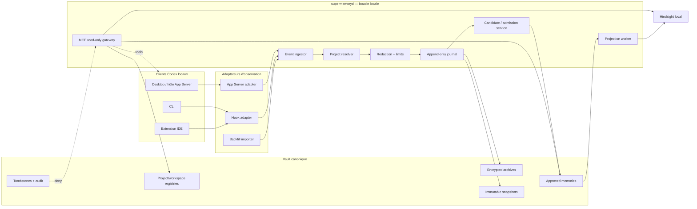
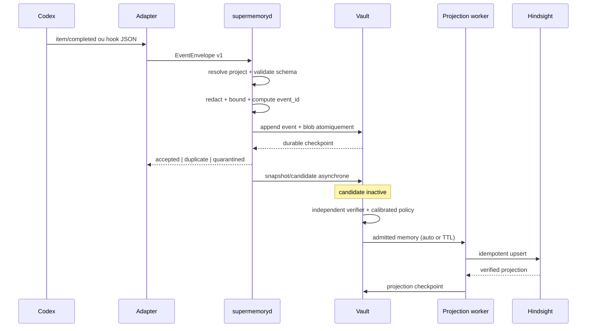
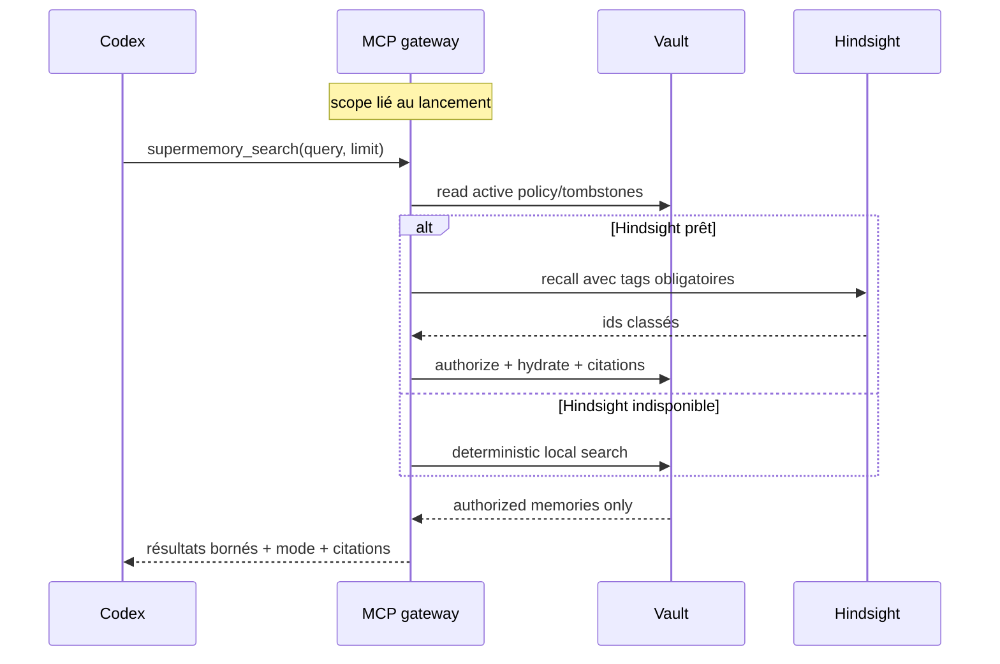
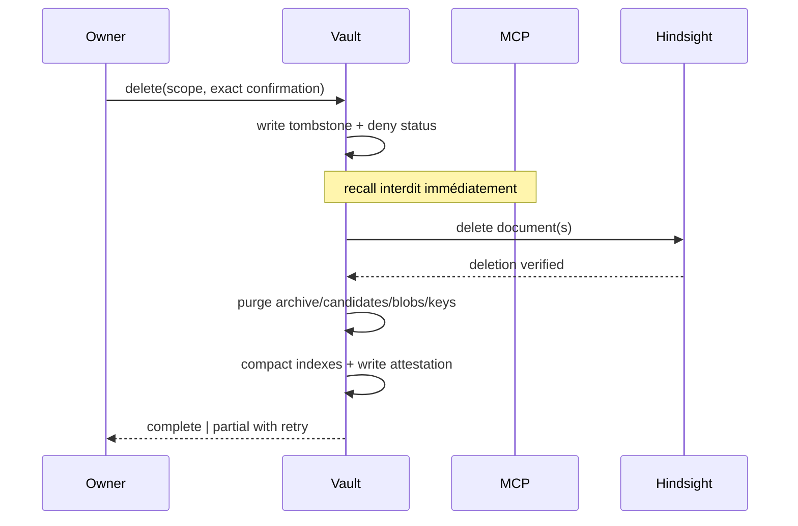

# Conception technique — intégration Codex ↔ SuperMemory

Statut : conception approuvable, prête à découper en implémentation
Date : 24 juillet 2026
Portée : intégration local-first de Codex Desktop, CLI et extension IDE
Hors portée : modification du produit, installation de hooks, migration de données ou activation d’une configuration utilisateur

Les termes **DOIT**, **NE DOIT PAS**, **DEVRAIT** et **PEUT** sont normatifs.

## Contexte

### Objectif produit

Quand Codex travaille dans un dossier inscrit dans SuperMemory, les activités visibles de ses sessions doivent être :

1. rattachées à une identité de projet stable, y compris entre onglets, déplacements et worktrees ;
2. journalisées et versionnées sans confondre archive détaillée et mémoire utile ;
3. transformées en candidates traçables, puis en mémoires actives uniquement après admission déterministe ou revue legacy explicite ;
4. retrouvables à la demande par Codex via une interface de recall bornée, citée et fail-closed.

Le résultat attendu n’est donc pas « enregistrer un transcript ». C’est une boucle :

```text
observer -> journal -> archive -> candidate -> independent verify -> admission -> mémoire -> projection
   ^                                                        |
   └────────────────────── recall MCP ──────────────────────┘
```

### État de départ observé

- Le vault est déjà canonique ; Hindsight est une projection reconstruisible ([README](../README.md#canonical-state-versus-projection)).
- Le store produit initialise encore `workspace:local` par défaut
  ([product-store.mjs](../scripts/lib/product-store.mjs#L299)).
- Une source produit est identifiée par `workspaceId + relativePath`, ce qui ne
  résiste pas à un renommage comme identité primaire
  ([product-store.mjs](../scripts/lib/product-store.mjs#L788)).
- Les snapshots sont immuables et adressés par SHA-256
  ([product-store.mjs](../scripts/lib/product-store.mjs#L348)).
- Un changement de source rend déjà les mémoires dérivées `stale` et programme
  leur retrait de Hindsight
  ([product-store.mjs](../scripts/lib/product-store.mjs#L422)).
- En mode automatique, seules les décisions attestées `auto_activate|activate_ttl` deviennent actives ; `quarantine|discard|pending_verification` restent hors recall
- En mode legacy (flags off), le parcours approve/reject existant reste inchangé
  ([product-store.mjs](../scripts/lib/product-store.mjs#L1125)).
- La projection Hindsight actuelle autorise seulement
  `consumer:supermemory`
  ([product-hindsight.mjs](../scripts/lib/product-hindsight.mjs#L44)).

### Contrats officiels Codex

Cette conception s’appuie sur les pages OpenAI officielles suivantes :

- [Hooks Codex](https://learn.chatgpt.com/docs/hooks) : événements, entrées,
  sorties, couches de configuration et limites de `transcript_path`.
- [MCP dans Codex](https://learn.chatgpt.com/docs/extend/mcp) : serveur STDIO ou
  HTTP, instructions serveur et configuration partagée par Desktop, CLI et IDE.
- [Codex App Server](https://learn.chatgpt.com/docs/app-server) : threads,
  turns, items, notifications et état final autoritatif `item/completed`.
- [Référence de configuration](https://learn.chatgpt.com/docs/config-file/config-reference) :
  persistance d’historique, hooks, MCP et Memories natives.

Le format du transcript fourni aux hooks n’est pas une interface stable. Les
hooks ne garantissent pas non plus l’observation de toutes les actions
hébergées. La conception ne doit donc dépendre ni d’un parseur de transcript
permanent, ni d’une promesse de capture universelle.

### Exigences et preuves attendues

| ID | Exigence | Contrat principal | Échec sûr | Preuve d’acceptation |
|---|---|---|---|---|
| R01 | Même projet entre onglets | `project_id` persistant | binding en revue | AC-ID-01 à 05 |
| R02 | Déplacement/renommage/worktree | chemins = aliases | aucune fusion implicite | AC-ID-02 à 05 |
| R03 | Capture détaillée visible | journal d’événements versionné | file locale + lacune déclarée | AC-CAP-01 à 09 |
| R04 | Versioning | blobs et snapshots immuables | dérivés `stale` | AC-VER-01 à 06 |
| R05 | Archive ≠ mémoire active | trois niveaux séparés | archive jamais rappelée directement | AC-GOV-01 à 05 |
| R06 | Recall utile dans Codex | MCP local scopé | refus ou fallback local explicite | AC-MCP-01 à 09 |
| R07 | Desktop/CLI/IDE | adaptateurs par capacité | matrice de dégradation | AC-CLI-01 à 06 |
| R08 | Vault canonique | commit vault avant projection | Hindsight reconstruisible | AC-HIN-01 à 05 |
| R09 | Secrets et vie privée | redaction + chiffrement + TTL | quarantaine/refus | AC-SEC-01 à 12 |
| R10 | Suppression | tombstone immédiat + purge vérifiée | deny recall dès l’étape 1 | AC-DEL-01 à 06 |
| R11 | Migration ancien compiler | import idempotent et réversible | rollback vers sauvegarde | AC-MIG-01 à 08 |
| R12 | Pas de double vérité | Memories natives non autoritatives | désactivées par défaut | AC-MEM-01 à 03 |
| R13 | Pas de raisonnement caché | seulement contenu observable | champ absent/filtré | AC-SEC-09 |

## Décisions

| ID | Décision retenue | Alternative rejetée | Motif |
|---|---|---|---|
| D01 | UUID SuperMemory persistant pour `project_id` | chemin absolu, nom de dossier ou URL Git comme ID | ces valeurs changent ou collisionnent |
| D02 | `workspace_id` stable et obligatoire sur tout objet | store global `workspace:local` | isolation multi-projets impossible |
| D03 | un projet possède un workspace par défaut ; une association plusieurs-à-un exige une action owner | fusion automatique de projets proches | risque de fuite inter-projets |
| D04 | App Server autoritatif quand SuperMemory héberge le client | transcript comme source primaire | le flux App Server est structuré et versionnable |
| D05 | hooks comme capture portable et filet de reprise | hooks comme preuve exhaustive | événements hébergés et formats peuvent manquer |
| D06 | import d’historique uniquement pour backfill explicite | lecture continue de `history.jsonl` | fichier global, rétention et format non garantis |
| D07 | journal append-only avec ingestion « au moins une fois » et application idempotente | « exactement une fois » distribué | irréaliste après crash et multi-adaptateur |
| D08 | archive détaillée, candidates et mémoires actives physiquement séparées | RAG direct sur les transcripts | contournerait consentement, fraîcheur et provenance |
| D09 | MCP local read-only comme interface de recall Codex | injection intégrale à chaque session | coût, bruit et exposition excessive |
| D10 | bref contexte `SessionStart` + instructions MCP | recherche obligatoire à chaque tour | le modèle doit juger la pertinence dans un budget borné |
| D11 | vault comme autorité ; Hindsight comme index | autorisation décidée par les tags Hindsight seuls | une projection peut être ancienne ou incomplète |
| D12 | Memories natives désactivées par défaut pour le profil SuperMemory | synchronisation bidirectionnelle | double vérité et suppression non atomique |
| D13 | redaction avant journal normalisé, chiffrement au repos et rétention par classe | stockage brut illimité | secrets, données personnelles et coûts de purge |
| D14 | suppression logique immédiate puis purge asynchrone attestée | effacement silencieux direct | audit, reprise et retrait Hindsight seraient fragiles |
| D15 | migration en shadow, cutover unique et rollback vérifié | conserver deux jeux de hooks actifs | doublons et activation concurrente |
| D16 | détection de capacités au démarrage | dépendance à un numéro de version Codex fixe | les surfaces peuvent évoluer indépendamment |

### Garanties et non-garanties

Le système DOIT garantir :

- une isolation stricte par `workspace_id` ;
- la déduplication des événements reçus plusieurs fois ;
- la traçabilité entre mémoire, candidate, snapshot et événement ;
- le retrait immédiat du recall d’une mémoire révoquée ;
- une indication explicite des lacunes et modes dégradés.

Le système NE DOIT PAS prétendre :

- capturer le raisonnement interne caché du modèle ;
- observer les chats cloud, navigateurs ou outils hébergés qui ne passent pas par
  une surface instrumentée ;
- enregistrer tous les onglets « parce que le dossier est identique » si le
  client correspondant n’a ni plugin, ni hooks, ni hôte App Server actif ;
- garantir que Codex appellera MCP à chaque tour ;
- traiter une synthèse LLM comme un fait actif sans revue.

## Architecture

### Composants



### Responsabilités

| Composant | Responsabilité | Ne décide jamais |
|---|---|---|
| `supermemoryd` | résolution, ingestion, redaction, journal, reprise | vérité métier d’une conclusion LLM |
| Project resolver | lier `cwd`/checkout à un projet | fusion ambiguë de deux projets |
| Capture adapters | traduire une surface Codex en enveloppes | promotion en mémoire |
| Vault | identité, provenance, politiques, archives, mémoire | ranking sémantique |
| Review service | appliquer les décisions owner | modifier la preuve source |
| Hindsight adapter | projeter/rechercher dans un scope | autoriser seul un résultat |
| MCP gateway | exposer un recall borné et cité | retourner archive brute ou scope voisin |

### Profils runtime

| Profil | Capture primaire | Capture secondaire | Recall | Couverture |
|---|---|---|---|---|
| Desktop géré par SuperMemory | App Server | hooks | MCP partagé | riche |
| Desktop standard | hooks | backfill manuel | MCP partagé | standard |
| CLI interactive | hooks | backfill manuel | MCP partagé | standard |
| IDE extension | App Server si exposé, sinon hooks | backfill manuel | MCP partagé | riche ou standard |
| `codex exec` non interactif | hooks si chargés | import explicite | MCP si configuré | déclaré par run |
| Codex cloud/web | aucune par défaut | export explicite futur | hors portée local | non couvert |

La configuration MCP d’un même hôte Codex est partagée entre Desktop, CLI et
IDE. Pour le recall, la v1 exige toutefois une instance MCP **liée au projet au
lancement** depuis le `.codex/config.toml` d’un projet de confiance. Le process
reçoit son `project_id` et son `workspace_id` depuis une configuration
contrôlée par l’owner, vérifie que son répertoire de lancement est un alias
actif, puis rend ce scope immuable pour toute sa durée de vie. Le modèle ne peut
donc pas choisir le workspace en passant un chemin à un outil.

Un serveur global PEUT exposer uniquement le diagnostic et la résolution sans
contenu. Il NE DOIT PAS exposer de recherche ou lecture de mémoire. Les hooks
project-local ne chargent que pour un projet de confiance.

### Flux de capture



L’accusé `accepted` ne doit être envoyé qu’après persistance durable dans le
vault. La génération de candidate et la projection sont asynchrones : une panne
Hindsight ne bloque jamais Codex.

### Flux de recall



## Identité

### Identifiants

Tous les identifiants sont opaques, non sémantiques et immuables :

| Objet | Format logique | Création | Stabilité |
|---|---|---|---|
| Projet | `prj_<uuidv7>` | première inscription owner | déplacement, renommage |
| Workspace | `ws_<uuidv7>` | avec le projet par défaut | indépendante du chemin |
| Checkout | `co_<uuidv7>` | première vue d’une racine/worktree | vie du checkout |
| Session Codex | `ses_<source>:<external_id>` | observation | vie de la session |
| Turn | `turn_<source>:<external_id>` | observation | vie du turn |
| Événement | `evt_<sha256>` | ingestion déterministe | globalement idempotent |
| Source | `src_<uuidv7>` | première preuve | renommage si continuité prouvée |
| Snapshot | `snap_<sha256>` | contenu | immuable |
| Candidate | `cand_<uuidv7>` | extraction | immuable hors statut/revue |
| Mémoire | `mem_<uuidv7>` | promotion | stable entre projections |

### Marqueur et registre

Le registre canonique est
`00_inbox/supermemory-product/projects.jsonl`. Il contient le `project_id`,
le `workspace_id`, les aliases et l’historique des bindings.

Pour un dépôt Git, `supermemory init` DOIT écrire un marqueur local dans le
Git common dir, par exemple :

```text
$(git rev-parse --git-common-dir)/supermemory/project.json
```

Ce marqueur n’est pas commité, suit le dépôt lors d’un déplacement et est
partagé par ses worktrees. Chaque worktree garde toutefois un `checkout_id`
distinct dans le registre du vault.

Pour un dossier non Git, le marqueur est
`<project-root>/.supermemory/project.json`. L’installation DOIT proposer
l’ajout à l’ignore approprié et NE DOIT PAS commiter ce fichier sans action
owner.

Une nouvelle clone ne récupère pas automatiquement l’identité du projet. Elle
est créée comme nouveau projet, puis peut être liée explicitement au projet
existant. Cela évite de fusionner deux forks ou clients différents.

### Résolution

L’algorithme `resolveProject(cwd)` est déterministe :

1. normaliser le chemin sans le prendre comme identité ;
2. rechercher le Git common dir ; lire son marqueur si présent ;
3. sinon remonter jusqu’au marqueur `.supermemory/project.json` le plus proche ;
4. sinon chercher un alias exact dans le registre ;
5. valider que le marqueur, l’alias et le workspace concordent ;
6. si aucun binding n’existe, retourner `unbound` et proposer l’inscription ;
7. si plusieurs bindings concordent, retourner `ambiguous` et exiger une
   décision owner.

La résolution NE DOIT PAS deviner à partir du seul nom du dossier, de l’URL
remote ou du contenu. Ces signaux servent uniquement à présenter une suggestion.

### Renommages, déplacements, multi-root et worktrees

- Un chemin nouveau avec le même marqueur ajoute un alias `active`.
- L’ancien alias passe `historical`, sans changer `project_id`.
- Un worktree partage `project_id` et `workspace_id`, mais a son propre
  `checkout_id`, sa branche et son alias.
- Un projet multi-root possède plusieurs `ProjectRootBinding` explicitement
  approuvés. Aucun parent commun large n’est inféré.
- Deux workspaces ne peuvent pas revendiquer simultanément un alias actif.
- Une racine imbriquée avec son propre marqueur gagne sur sa parente.
- Une copie de dossier avec le même marqueur détectée simultanément est mise en
  `binding_conflict`; aucun événement n’est activé avant résolution.

### Isolation

`workspace_id` DOIT figurer dans chaque clé de lecture, index, événement,
archive, candidate, mémoire, projection et tombstone. Toute API sans
`workspace_id` résolu échoue avec `scope_unresolved`. Une requête cross-workspace
requiert une méthode différente, un consentement explicite et n’est pas prévue
dans la première implémentation.

## Modèle de données

### `Project`

```json
{
  "schema": "supermemory.project.v1",
  "project_id": "prj_...",
  "workspace_id": "ws_...",
  "display_name": "SuperMemory",
  "status": "active",
  "created_at": "RFC3339",
  "policy_id": "policy_...",
  "native_memories_mode": "disabled"
}
```

### `ProjectRootBinding`

```json
{
  "binding_id": "bind_...",
  "project_id": "prj_...",
  "checkout_id": "co_...",
  "path_ciphertext": "aead:...",
  "path_fingerprint": "hmac-sha256:...",
  "kind": "git_primary|git_worktree|non_git|multi_root",
  "git_common_dir_fingerprint": "hmac-sha256:...|null",
  "branch": "main|null",
  "status": "active|historical|conflict",
  "first_seen_at": "RFC3339",
  "last_seen_at": "RFC3339"
}
```

Le chemin absolu est chiffré parce qu’il peut révéler un nom de client ou
d’utilisateur. Le fingerprint HMAC permet une comparaison sans exposer le
chemin dans les logs.

### `EventEnvelope`

```json
{
  "schema": "supermemory.codex-event.v1",
  "event_id": "evt_<sha256>",
  "adapter": "app_server|hook|history_import",
  "adapter_version": "semver",
  "external_event_id": "opaque|null",
  "project_id": "prj_...",
  "workspace_id": "ws_...",
  "checkout_id": "co_...",
  "session_id": "ses_...",
  "thread_id": "external|null",
  "turn_id": "turn_...|null",
  "item_id": "external|null",
  "event_type": "session.started|prompt.submitted|tool.completed|file.changed|assistant.completed|turn.completed|session.ended|context.compacted",
  "occurred_at": "RFC3339",
  "observed_at": "RFC3339",
  "payload_hash": "sha256:...",
  "payload_ref": "blob:sha256:...|null",
  "redaction_profile": "redaction.v1",
  "capture_level": "rich|standard|backfill",
  "sequence": 42,
  "causation_id": "evt_...|null"
}
```

`event_id` est calculé sur :

```text
adapter namespace + stable external ids + canonical event_type + payload_hash
```

Si un même fait arrive par App Server et hook, une table
`EventEquivalence` relie les deux événements à un `logical_event_id`. On garde
les preuves d’observation, mais on n’applique l’effet métier qu’une fois.

### `SessionCaptureBinding`

À l’ouverture d’une session, le daemon persiste :

```json
{
  "session_id": "ses_...",
  "workspace_id": "ws_...",
  "capture_mode": "app_server_primary|hooks_primary|backfill_only",
  "primary_adapter": "app_server|hook|history_import",
  "shadow_adapter": "hook|null",
  "capture_coverage": "rich|standard|partial|none",
  "bound_at": "RFC3339",
  "failover_at": null
}
```

Ce binding empêche deux adaptateurs d’appliquer simultanément le même effet.
Son scope et son adaptateur primaire ne changent pas silencieusement au milieu
d’une session.

### `ConversationArchive`

```json
{
  "archive_id": "arc_...",
  "workspace_id": "ws_...",
  "session_id": "ses_...",
  "turn_id": "turn_...",
  "visible_messages": ["blob:sha256:..."],
  "tool_events": ["evt_..."],
  "turn_snapshot_id": "tsnap_...",
  "classification": "standard|restricted|quarantined",
  "retention_class": "short|standard|legal_hold",
  "expires_at": "RFC3339|null",
  "encryption_key_id": "key_...",
  "status": "active|expired|deletion_pending|deleted"
}
```

`visible_messages` contient uniquement les messages et résumés de raisonnement
effectivement exposés par le client. Aucun champ ne doit être prévu pour une
chaîne de pensée cachée.

### `TurnSnapshot`

```json
{
  "turn_snapshot_id": "tsnap_<sha256>",
  "workspace_id": "ws_...",
  "turn_id": "turn_...",
  "event_ids": ["evt_..."],
  "file_snapshot_ids": ["snap_..."],
  "git_head_before": "sha|null",
  "git_head_after": "sha|null",
  "manifest_hash": "sha256:...",
  "completed_at": "RFC3339",
  "immutable": true
}
```

### `MemoryCandidate`

Une candidate DOIT référencer :

- `workspace_id`, `project_id`, `candidate_id` ;
- les `event_ids`, `turn_snapshot_id` et `source_snapshot_ids` utilisés ;
- texte proposé, type, confiance, incertitude et sensibilité ;
- `status = pending` à la création ;
- version du modèle/prompt d’extraction ;
- décision owner et date de revue.

Une sortie LLM sans références existantes est rejetée avec
`candidate_missing_evidence`.

### `ActiveMemory`

Une mémoire active étend le contrat actuel. Les mémoires legacy conservent leurs champs `approved_*`; une admission automatique ajoute obligatoirement `admission_id`, `admission_decision`, `policy_version` et éventuellement `valid_until` :

```json
{
  "memory_id": "mem_...",
  "workspace_id": "ws_...",
  "project_id": "prj_...",
  "candidate_id": "cand_...",
  "evidence": ["evt_...", "tsnap_...", "snap_..."],
  "title": "Décision durable",
  "text": "Contenu approuvé",
  "status": "active",
  "sensitivity": "standard",
  "allowed_consumers": ["supermemory", "codex"],
  "approved_by": "local_owner",
  "approved_at": "RFC3339",
  "valid_from": "RFC3339",
  "valid_until": null,
  "projection": {
    "engine": "hindsight",
    "document_id": "mem_...",
    "status": "queued"
  }
}
```

### `ProjectionCheckpoint` et `Tombstone`

Le checkpoint contient `engine`, `workspace_id`, `document_id`,
`canonical_revision`, `attempts`, `last_error`, `synced_at` et
`verified_at`.

Le tombstone contient seulement les identifiants nécessaires à la
non-réapparition, la raison, la portée, les étapes de purge et leurs preuves.
Il ne conserve pas le contenu supprimé.

### Layout cible

```text
identity-vault/
  00_inbox/
    supermemory-product/
      projects.jsonl
      workspaces.jsonl
      ingestion-checkpoints.jsonl
    codex-events/YYYY/MM/DD/*.jsonl
    codex-archives/<workspace>/<session>/*.json.age
    snapshots/sha256/<prefix>/<hash>.snapshot
  20_professional/product-memories/
  50_review/codex-candidates/
  75_governance/
    codex-capture-policy.yaml
    retention-policy.yaml
    redaction-policy.yaml
  80_logs/
    codex-integration-events.jsonl
    deletion-attestations.jsonl
  90_evals/codex-integration/
```

## Capture Codex

### Adaptateur App Server

Quand SuperMemory lance ou embarque `codex app-server`, l’adaptateur DOIT :

1. générer ou charger le schéma correspondant à la version Codex détectée ;
2. persister les identifiants `thread`, `turn` et `item` ;
3. traiter `item/completed` comme état final autoritatif ;
4. enregistrer les deltas uniquement comme télémétrie éphémère, puis les
   remplacer par l’item final ;
5. mapper au minimum les items visibles : messages agent, plans,
   `commandExecution`, `fileChange`, `mcpToolCall`, `dynamicToolCall`,
   `collabToolCall`, `webSearch`, `imageView` et `contextCompaction` ;
6. borner ou externaliser les sorties volumineuses ;
7. reprendre un thread stocké après reconnexion ;
8. appliquer exponential backoff + jitter lorsque le serveur signale une
   surcharge.

Un item `reasoning` ne peut contribuer à l’archive que pour sa partie résumé
rendue visible. Son contenu interne n’est pas une source autorisée.

### Priorité et équivalence des adaptateurs

Le `capture_mode` est choisi une fois au début de la session :

- si SuperMemory contrôle un App Server compatible, `app_server_primary` ;
- sinon, si les hooks sont actifs, `hooks_primary` ;
- sinon, `backfill_only` ou aucune capture.

En mode `app_server_primary`, les hooks sont **shadow** : leurs enveloppes
peuvent prouver la santé et alimenter la spool de reprise, mais elles
n’entraînent ni snapshot, ni candidate, ni mémoire tant que le flux primaire
est sain.

`logical_event_id` est calculé uniquement lorsque les deux adaptateurs
fournissent les mêmes identifiants canoniques :

```text
sha256(workspace_id + canonical_session_id + canonical_turn_id
       + canonical_event_slot + normalized_visible_payload_hash)
```

`canonical_event_slot` vaut par exemple `prompt.submitted`,
`assistant.final` ou `tool.<call_id>.completed`. Aucune équivalence n’est
déduite par proximité temporelle ou similarité de texte. Si les identifiants
manquent, les observations restent distinctes et seul l’adaptateur primaire
produit un effet métier.

Un failover vers les hooks exige un gap App Server confirmé par timeout et
checkpoint. Le daemon écrit `capture_primary_failed`, gèle le dernier numéro de
séquence primaire, promeut seulement les événements shadow postérieurs sans
`logical_event_id` déjà appliqué, puis marque la couverture `partial` jusqu’à
la fin de la session. Il ne rebascule pas automatiquement vers App Server dans
la même session.

### Adaptateur hooks

Le plugin SuperMemory DOIT pouvoir déclarer :

- `SessionStart` : résoudre le projet et injecter un bref contexte ;
- `UserPromptSubmit` : capturer le prompt visible après redaction ;
- `PostToolUse` : capturer le résultat local observable et borné ;
- `PreCompact` et `PostCompact` : fermer un snapshot puis enregistrer le
  changement de contexte ;
- `Stop` : finaliser le turn, sans lancer de traitement bloquant ;
- `SessionEnd` : fermer la session et son checkpoint.

Chaque commande hook DOIT :

- lire un seul JSON sur `stdin` ;
- terminer rapidement, avec un timeout strict ;
- mettre l’enveloppe dans une spool locale si `supermemoryd` est indisponible ;
- retourner un résultat qui ne bloque pas Codex pour une panne SuperMemory ;
- utiliser un garde de récursion ;
- dédupliquer `session_id + turn_id + event_type + payload_hash`.

`transcript_path` PEUT alimenter un import incrémental de secours, mais son
parseur est versionné et fail-soft. Seul un schéma reconnu, normalisé et
redigé peut contribuer aux messages assistant de l’archive. Un format inconnu
produit `capture_gap: transcript_schema_unknown`, force la couverture
`partial` et n’est jamais présenté comme une archive complète.

Une politique owner optionnelle `sealed_raw_transcript` PEUT conserver les
bytes inconnus comme blob chiffré, non indexable, `restricted`, avec TTL de
24 heures. Ce blob ne peut produire ni candidate ni recall ; il sert seulement
au développement d’un parseur compatible et sa lecture exige une confirmation
locale explicite.

Les hooks de couches différentes se cumulent. L’installateur DOIT donc détecter
les hooks SuperMemory globaux, projet, profil et plugin avant d’en ajouter. Deux
handlers SuperMemory actifs pour le même événement sont une erreur de santé.

### Contexte `SessionStart`

L’injection est limitée par défaut à :

- identité du projet/workspace ;
- statut de santé et date du dernier checkpoint ;
- jusqu’à cinq mémoires actives prioritaires, sans contenu `restricted` ;
- instruction courte indiquant quand appeler les outils MCP ;
- mention explicite si la mémoire est indisponible ou dégradée.

Le budget maximal est exprimé en caractères et tokens dans la politique. Une
troncature garde les citations et remplace le reste par une invitation à
chercher via MCP. L’archive détaillée n’est jamais injectée.

### Spool et reprise

La spool se trouve hors des fichiers de configuration Codex, sous
`~/.supermemory/spool/<workspace>/`, permissions `0700/0600`. Chaque entrée est
chiffrée, atomique et possède un TTL. Le hook écrit puis renomme un fichier
temporaire ; le daemon acquiert un lease, ingère, fsync, puis supprime.

Après crash :

1. les entrées sans accusé sont rejouées ;
2. `event_id` rend le replay idempotent ;
3. un événement ancien au-delà du TTL devient une lacune auditée ;
4. aucun ordre global n’est supposé ; l’ordre est reconstruit par session,
   séquence et temps observé ;
5. un turn incomplet porte `completion = partial`.

### Capture multi-onglets

Deux onglets ou threads Codex ouverts sur des aliases du même `project_id`
écrivent dans le même workspace, mais conservent des `session_id` et `turn_id`
distincts. Le journal ne mélange jamais l’ordre des sessions. Le recall voit les
mémoires actives communes ; il ne voit pas automatiquement les archives des
autres onglets.

### Lacunes

Chaque session reçoit un `capture_coverage` :

```text
rich      App Server final events + hooks de reprise
standard  hooks + transcript de schéma reconnu, normalisé et redigé
partial   séquence manquante, transcript inconnu ou failover d’adaptateur
none      client non instrumenté
```

L’interface NE DOIT PAS afficher « sauvegardé intégralement » pour `standard`,
`partial` ou `none`.

## Versioning

### Événements et tours

- Le journal est append-only.
- Une correction produit un nouvel événement avec `supersedes_event_id`.
- Un turn terminé produit un manifeste `TurnSnapshot` content-addressed.
- Les événements hors ordre sont acceptés mais marqués jusqu’à fermeture.
- Un snapshot partiel peut être complété par un nouveau manifeste ; l’ancien
  reste historique.

### Fichiers

Les changements de fichiers visibles via App Server ou outils sont reliés aux
snapshots existants :

- état avant et après si les bytes sont lisibles et dans le scope ;
- diff borné, chiffré, avec secret scan ;
- hash seulement si le contenu est exclu ou trop volumineux ;
- Git commit/branch comme contexte, jamais comme preuve suffisante ;
- aucune lecture d’un fichier hors des racines autorisées.

### Continuité d’une source

Une source garde son `source_id` si au moins une preuve forte existe :

- opération de renommage observée dans un même événement ;
- identité inode/device locale corrélée dans une courte fenêtre, puis confirmée
  par hash ;
- binding explicite owner.

Sinon, l’ancien fichier passe `pending_removal`, le nouveau devient une source
distincte et une revue de continuité est ouverte. Le nom égal ou le hash égal
seul ne fusionne pas automatiquement deux sources.

### Invalidations

Tout changement de snapshot :

1. marque les candidates antérieures `superseded` ;
2. marque les mémoires actives dérivées `stale` ;
3. ajoute un tombstone logique de projection ;
4. retire immédiatement ces mémoires du recall ;
5. programme la suppression Hindsight ;
6. crée de nouvelles candidates, puis exige une nouvelle vérification indépendante avant toute réadmission.

Ce flux étend le comportement déjà présent dans
`markSourceDerivedState` ([product-store.mjs](../scripts/lib/product-store.mjs#L422)).

## Recall MCP

### Packaging

La cible est un plugin Codex `supermemory` contenant :

- le serveur MCP local lié au projet ;
- un serveur global de diagnostic sans accès au contenu ;
- les hooks de capture ;
- une instruction serveur autonome dans ses 512 premiers caractères ;
- un skill d’usage et de diagnostic ;
- aucune clé ou donnée du vault.

Le serveur fonctionne en STDIO par défaut. Un transport HTTP éventuel reste sur
loopback, utilise un token local et refuse les en-têtes Host non locaux.

### Binding du serveur

L’installateur écrit, après confirmation, une entrée MCP dans le
`.codex/config.toml` du projet de confiance. La commande démarre le serveur avec
un identifiant de binding opaque ou un `project_id` non secret ; le daemon
résout ensuite le workspace depuis le registre canonique. Le process vérifie :

1. le binding existe et est `active` ;
2. son répertoire de lancement est un alias du projet ;
3. le workspace n’est ni supprimé ni en conflit ;
4. aucune option d’outil ne peut modifier ce scope.

Un échec ferme les outils de contenu avec `scope_unresolved`. Si le client
Codex réutilise un process MCP dans un autre contexte projet, le health check
détecte le changement de racine et exige un redémarrage au lieu de changer le
scope.

### Outils v1

#### `supermemory_status`

Entrée : aucune pour le serveur lié.
Sortie : projet lié, santé du daemon, couverture, projection et dernier
checkpoint. Aucun contenu mémoire. La variante globale ne retourne que des
diagnostics non sensibles.

#### `supermemory_resolve_project`

Entrée : `cwd`
Sortie : `bound|unbound|ambiguous`, `project_id`, `workspace_id`, alias et
action owner éventuelle. Cette méthode appartient au serveur global de
diagnostic, ne crée jamais un binding et ne donne accès à aucun contenu.

#### `supermemory_search`

Entrée :

```json
{
  "query": "décision d’architecture sur le cache",
  "limit": 5,
  "types": ["decision", "constraint"],
  "as_of": "RFC3339|null"
}
```

Sortie :

```json
{
  "mode": "hindsight|local_fallback",
  "project_id": "prj_...",
  "workspace_id": "ws_...",
  "results": [{
    "memory_id": "mem_...",
    "title": "Décision",
    "excerpt": "…",
    "score": 0.91,
    "freshness": "current",
    "sensitivity": "standard",
    "citation": {
      "source_id": "src_...",
      "snapshot_id": "snap_...",
      "locator": {"kind": "text_lines", "line_start": 10, "line_end": 18}
    }
  }]
}
```

Ni `workspace_id`, ni `project_id`, ni `cwd` ne sont acceptés comme paramètres
des outils de contenu. Le scope vient exclusivement du binding immuable du
process MCP. Un `memory_id` d’un autre workspace produit `scope_mismatch`.

#### `supermemory_get`

Entrée : `memory_id`
Sortie : mémoire autorisée complète, relations et citations. Refuse une mémoire
stale, supprimée, expirée ou hors workspace.

#### `supermemory_explain_citation`

Entrée : `memory_id`
Sortie : chaîne de provenance sans archive de conversation complète :
mémoire → candidate → snapshot/turn → localisateur.

### Politique de recall

Avant de rendre un résultat Hindsight, la gateway DOIT relire dans le vault :

- existence et statut actif ;
- workspace exact ;
- `allowed_consumers` contient `codex` ;
- sensibilité autorisée ;
- fraîcheur et validité temporelle ;
- absence de tombstone ;
- preuve et citation disponibles.

Les filtres Hindsight minimaux sont :

```text
workspace:<workspace_id>
consumer:codex
status:active
access_policy:owner_only
schema_status:stable
```

Chaque workspace utilise en plus une banque Hindsight dédiée, nommée avec un
identifiant opaque dérivé du `workspace_id`. Les tags restent obligatoires :
la banque réduit le rayon d’une erreur de filtre, mais ne remplace jamais
l’autorisation relue dans le vault. Aucune recherche multi-banque n’existe en
v1.

Un résultat Hindsight inconnu du vault est ignoré et audité. En cas
d’indisponibilité Hindsight, la recherche locale déterministe ne considère que
les mêmes mémoires autorisées et annonce `mode=local_fallback`.

### Déclenchement par Codex

Les instructions MCP demandent à Codex de chercher lorsqu’une tâche dépend :

- d’une décision ou contrainte antérieure ;
- de l’état connu du projet ;
- d’un choix utilisateur durable ;
- d’un incident, test ou migration déjà rencontré ;
- d’une information que le contexte courant ne permet pas d’établir.

Codex ne doit pas appeler MCP pour une question entièrement résolue par les
fichiers présents. Le système mesure le taux d’usage pertinent, mais ne promet
pas un appel sur chaque tour.

## Sécurité

### Menaces

| Menace | Contrôle |
|---|---|
| fuite inter-projets | scope dérivé, clé composite workspace, deny par défaut |
| secret dans prompt/sortie outil | scanner + redaction avant journal normalisé |
| vol du vault | chiffrement AEAD des archives et chemins |
| injection dans une mémoire | evidence + candidate inactive + vérificateur indépendant + policy calibrée |
| retour d’une mémoire supprimée | tombstone vérifié avant résultat |
| daemon exposé au LAN | loopback, Host validation, token local |
| hook malveillant/dupliqué | trust Codex, inventaire et health check |
| archive gigantesque | limites, hash/externalisation, quotas |
| clé dans logs | secret store et redaction structurée |
| traversal/symlink | racines réelles, `lstat`, refus hors scope |

### Redaction

La redaction se déroule avant la persistance du journal normalisé :

1. classification du champ ;
2. détection déterministe des clés, tokens, mots de passe, PEM, cookies,
   variables sensibles et données personnelles configurées ;
3. remplacement par un token typé stable dans la session, par exemple
   `[REDACTED:API_KEY:7f31]` ;
4. calcul du hash sur le payload redigé ;
5. quarantaine si la structure ne permet pas une redaction sûre.

Par défaut, le secret original n’est pas conservé. Une quarantaine chiffrée
temporaire peut être activée par l’owner pour diagnostic ; elle n’est jamais
indexée, expire sous 24 heures et nécessite une action explicite pour lecture.

Les sorties outils ont des limites par champ et par événement. Au-delà, le
système conserve début, fin, taille, hash et indicateur de troncature. Un blob
complet n’est conservé que si la politique du workspace l’autorise.

### Chiffrement et clés

- Archives, spool, chemins absolus et blobs `restricted` : AEAD
  XChaCha20-Poly1305 ou AES-256-GCM.
- Clé maître : Keychain/secret store OS ; jamais dans le vault ou
  `.codex/config.toml`.
- Clé de données distincte par workspace, enveloppée par la clé maître.
- Nonces uniques et données associées contenant workspace, objet, version.
- Rotation : nouvelle clé pour les nouvelles écritures puis ré-enveloppement
  asynchrone, avec checkpoint vérifié.
- Permissions minimales : répertoires `0700`, fichiers sensibles `0600`.

Si la clé manque, l’archive est `locked`; aucun fallback en clair n’est permis.
Le recall des mémoires Markdown standard peut continuer si la politique
l’autorise, avec état dégradé visible.

### Rétention

Valeurs par défaut, modifiables par politique owner :

| Classe | Durée | Après expiration |
|---|---:|---|
| spool non ingérée | 7 jours | lacune auditée puis purge |
| archive standard | 90 jours | purge des messages/blobs |
| archive restricted | 30 jours | purge des messages/blobs |
| candidates rejetées | 30 jours | contenu purgé, décision conservée |
| mémoires actives | jusqu’à révocation/expiration | gouvernance normale |
| audit sans contenu | 365 jours | compactage |
| quarantaine originale | 24 heures | purge irréversible |

Un legal hold local explicite peut suspendre la purge d’un objet, jamais
implicitement.

### Suppression



La suppression est idempotente. Un échec Hindsight laisse l’état
`projection_deletion_pending`, mais le vault refuse déjà le recall. Une
attestation énumère les IDs, pas les contenus.

### Memories natives Codex

Le profil d’installation SuperMemory recommande `features.memories = false`.
Si l’utilisateur les active :

- elles sont signalées comme source externe non gouvernée ;
- SuperMemory ne les importe ni ne les exporte automatiquement ;
- elles ne satisfont aucune preuve de suppression ou de provenance ;
- l’UI avertit d’une possible mémoire parallèle.

Une synchronisation future exigerait une nouvelle conception et des APIs
officielles de provenance/suppression suffisantes.

## Migration

### Migration du store produit courant

Le passage depuis le store actuel est une migration de schéma distincte de
l’import de l’ancien compiler :

1. créer et vérifier une sauvegarde hors vault ;
2. lire `00_inbox/supermemory-product/state.json` sans le modifier ;
3. demander à l’owner de rattacher `workspace:local` à un projet existant ou
   d’en créer un ; sans choix, placer les objets dans `legacy_unbound` et
   arrêter ;
4. générer `project_id`, `workspace_id` et bindings, puis copier l’état vers un
   fichier de nouvelle version ;
5. remplacer les identités de source dérivées du chemin par des `src_<uuidv7>`,
   en conservant `legacy_source_id` et le chemin comme alias ;
6. réécrire les références candidates/mémoires/snapshots dans une transaction
   vérifiée, tout en conservant les `memory_id` et `document_id` déjà projetés ;
7. créer une banque Hindsight dédiée au workspace et la reconstruire depuis les
   seules mémoires actives ;
8. comparer comptes, hashes, citations et statuts, puis effectuer un swap
   atomique ;
9. conserver l’ancien `state.json` dans la sauvegarde, jamais comme second
   store actif.

La migration est idempotente grâce à un `migration_id`, un journal de mapping
`legacy_id -> canonical_id` et un checkpoint par étape. Toute collision de
source ou tout fichier manquant ouvre une revue et empêche le cutover. Le
rollback restaure le store précédent et supprime seulement la nouvelle banque
Hindsight sacrificielle.

### Sources héritées

La migration vise l’ancien `claude-memory-compiler` :

- hooks `SessionStart`, `Stop` et `PreCompact` ;
- archives/inbox par projet ;
- project briefs et mémoires globales ;
- offsets et état de déduplication ;
- hooks Codex/Claude configurés globalement ou localement.

Les scripts hérités sont une source d’import, pas une dépendance runtime.

### Procédure

1. **Discover** : inventorier config, hooks, vault, projets, volumes, permissions
   et processus ; aucune écriture.
2. **Backup** : sauvegarder vault hérité et fichiers de configuration, puis
   vérifier manifestes et restauration.
3. **Plan** : produire un plan redigé avec mappings
   `legacy_project -> project_id/workspace_id`.
4. **Shadow import** : importer en archive/candidates inactives avec
   `legacy_id`, sans projection ni injection.
5. **Validate** : comparer comptes, hashes, projets, citations et collisions.
6. **Shadow capture** : SuperMemory observe sans injecter ; les anciens hooks
   restent seuls responsables jusqu’au cutover.
7. **Cutover** : modifier atomiquement une seule couche de hooks, redémarrer les
   clients requis, puis vérifier un canary.
8. **Disable legacy** : désactiver l’ancien captureur, sans supprimer sa
   sauvegarde.
9. **Promote** : présenter les candidates héritées à la revue ; aucune
   auto-promotion.
10. **Close** : attester les comptes et conserver le rollback pendant la
    fenêtre décidée.

### Idempotence et collisions

- `legacy_id = sha256(source_path + legacy_record_id + content_hash)`.
- Rejouer un import ne crée pas de doublon.
- Deux slugs hérités ressemblants ne sont jamais fusionnés automatiquement.
- Une mémoire globale héritée entre en `scope_review`, pas dans tous les
  workspaces.
- Un secret détecté passe en quarantaine ou est redigé selon la politique.
- Les offsets de transcript servent seulement à éviter un backfill répété ; ils
  ne deviennent pas des IDs canoniques.

### Rollback

Le rollback :

1. stoppe `supermemoryd` ;
2. restaure la configuration de hooks sauvegardée ;
3. réactive l’ancien système si son smoke test passe ;
4. conserve le vault SuperMemory créé, mais le marque `migration_rolled_back` ;
5. interdit toute projection des imports ;
6. vérifie qu’une session canary est capturée une seule fois.

Il ne supprime aucune donnée sans confirmation séparée.

## Observabilité

### Health

`supermemory doctor --codex` et `supermemory_status` exposent :

- `project_binding`: bound/unbound/ambiguous/conflict ;
- `daemon`: ready/degraded/down ;
- `capture_adapter`: app_server/hooks/backfill/none ;
- `capture_coverage`: rich/standard/partial/none ;
- `spool_depth`, plus ancien âge et quota ;
- `last_event_at`, `last_checkpoint_at` ;
- `hindsight`: ready/unavailable/rebuild_required ;
- `mcp`: ready/misconfigured ;
- `duplicate_hook_count` ;
- `pending_redaction_review`, `pending_deletions`.

### Logs structurés

Les logs utilisent JSONL et contiennent IDs opaques, codes, durées, tailles et
statuts. Ils NE contiennent PAS prompts, sorties outils, chemins en clair,
secrets ou texte mémoire.

Événements minimaux :

```text
project_resolved
project_binding_conflict
codex_event_accepted
codex_event_duplicate
codex_event_quarantined
capture_gap_detected
turn_snapshot_committed
candidate_created
memory_approved
projection_synced
projection_failed
recall_served
recall_denied
deletion_completed
migration_checkpoint
```

### Métriques

| Métrique | But |
|---|---|
| événements acceptés/dupliqués/quarantinés | qualité ingestion |
| turns complets/partiels par adaptateur | couverture réelle |
| latence hook p50/p95/p99 | ne pas ralentir Codex |
| profondeur/âge spool | backpressure et panne |
| candidates → approuvées/rejetées | charge de gouvernance |
| recall utile, vide, refusé, fallback | utilité MCP |
| résultats Hindsight rejetés par vault | drift projection |
| délai tombstone → purge vérifiée | droit à suppression |
| collisions binding | qualité de l’identité |

Les seuils d’alerte sont configurables. Le release gate vérifie au minimum :
aucun hook au-delà de son timeout, aucun résultat hors scope, aucune suppression
incomplète silencieuse et aucune projection sans mémoire active.

### Audit de couverture

Chaque réponse « capture active » doit être soutenue par un canary récent :

1. démarrer une session dans un projet de test ;
2. envoyer un prompt marqueur non sensible ;
3. exécuter une commande et modifier un fichier ;
4. terminer le turn ;
5. retrouver les événements et le snapshot ;
6. vérifier la déduplication App Server + hook ;
7. supprimer le canary et prouver sa purge.

## Déploiement

### Découpage d’implémentation recommandé

| Slice | Livrable vertical | Oracle |
|---|---|---|
| S1 | registre projet/workspace + resolver + CLI init/status | rename/move/worktree/multi-root verts |
| S2 | daemon, EventEnvelope, journal, redaction, spool/replay | crash et doublons sans perte métier |
| S3 | hooks plugin + contexte SessionStart borné | test sacrificiel isolé CLI/Desktop/IDE |
| S4 | App Server adapter et snapshots de turn/fichiers | capture riche autoritative |
| S5 | archive/candidates/admission + extension du store multi-workspace | aucune activation sans preuve et admission valide |
| S6 | MCP gateway + Hindsight policy + fallback local | recall utile, cité, fail-closed |
| S7 | suppression, migration, doctor, backup/rollback, release gate | preuve hors ligne puis déploiement intégral |

Chaque slice doit inclure tests, migration de schéma, observabilité et rollback ;
aucune « phase sécurité » séparée n’est acceptée.

### Installation cible

Une installation guidée réalise :

1. vérification des capacités Codex installées ;
2. création/accès au secret store ;
3. installation du plugin SuperMemory ;
4. configuration MCP au niveau owner ou projet de confiance ;
5. démarrage du daemon local ;
6. inscription explicite de chaque projet ;
7. détection des hooks existants et proposition de migration ;
8. test sacrificiel local de capture et recall, sans trafic ni déploiement ;
9. rapport final avec couverture et limites.

Elle n’édite jamais silencieusement `~/.codex/config.toml`. Le plan est affiché,
sauvegardé et confirmé avant mutation.

### Compatibilité et capacités

Au démarrage, l’adaptateur détecte :

- présence et schéma App Server ;
- événements hooks supportés ;
- configuration MCP active ;
- politique de persistance d’historique ;
- état des Memories natives.

Une capacité absente sélectionne le profil inférieur et crée un avertissement,
pas un faux succès. Les schémas App Server générés sont versionnés avec
l’adaptateur.

### Modes dégradés

| Panne | Comportement |
|---|---|
| daemon arrêté | hooks spoulent puis rendent la main |
| spool pleine | drop contrôlé + `capture_gap`, jamais blocage Codex |
| vault verrouillé | capture spoulée, recall refusé |
| Hindsight arrêté | projection en file, recall local explicite |
| MCP arrêté | Codex continue sans mémoire, diagnostic visible |
| hook absent | capture `none`/`partial`, App Server éventuel continue |
| App Server incompatible | hooks standard, feature riche désactivée |
| clé indisponible | aucun écrit en clair |
| binding ambigu | quarantaine des événements, aucun recall |
| suppression projection échoue | deny immédiat, retry de purge |

### Déploiement intégral

1. tests unitaires et contractuels sans données réelles ;
2. vault sacrificiel et projets fixtures, uniquement comme test local ;
3. matrice d’acceptation, E2E, long-task et validation Compose ;
4. sauvegarde vérifiée et procédure de restauration prête ;
5. une action de déploiement de la stack complète ;
6. health checks de tous les services puis activation du contrat runtime v3 complet ;
7. preuve runtime avant marquage production-ready.

Il n’y a ni canari de déploiement, ni pourcentage de trafic, ni généralisation
progressive. Le rollback restaure la stack complète et remet le contrat v3 en
flags-off.

### Rollback du nouveau système

Le rollback désactive hooks et MCP SuperMemory, arrête le daemon et restaure la
configuration sauvegardée. Le vault canonique reste lisible et sauvegardé.
Hindsight peut être supprimé puis reconstruit. Aucun rollback ne doit réactiver
deux captureurs simultanément.

## Tests et acceptation

### Identité

| ID | Scénario | Résultat attendu |
|---|---|---|
| AC-ID-01 | deux onglets, même checkout | même projet/workspace, sessions distinctes |
| AC-ID-02 | déplacement de la racine | même `project_id`, nouvel alias |
| AC-ID-03 | renommage de dossier | aucune nouvelle mémoire dupliquée |
| AC-ID-04 | deux worktrees | même projet, `checkout_id` distinct |
| AC-ID-05 | multi-root/clone/copie ambiguë | aucune fusion ; revue obligatoire |

### Capture et versioning

| ID | Scénario | Résultat attendu |
|---|---|---|
| AC-CAP-01 | `item/completed` après deltas | un seul état autoritatif |
| AC-CAP-02 | même événement App Server + hook | deux observations, un effet logique |
| AC-CAP-03 | crash avant accusé | replay sans doublon |
| AC-CAP-04 | événements hors ordre | snapshot ordonné ou `partial` explicite |
| AC-CAP-05 | transcript inconnu | lacune, pas de parsing silencieux |
| AC-CAP-06 | daemon down | hook sous timeout, spool chiffrée |
| AC-CAP-07 | spool pleine | Codex continue, lacune auditée |
| AC-CAP-08 | deux sessions même projet | aucune fusion de chronologie |
| AC-CAP-09 | action hébergée invisible | couverture non annoncée `rich` |
| AC-CAP-10 | App Server et hooks actifs | primaire App Server, hooks shadow, un effet |
| AC-CAP-11 | transcript inconnu | `partial`; sealed raw seulement sur opt-in |
| AC-VER-01 | turn complet | manifeste immuable vérifiable |
| AC-VER-02 | fichier modifié | snapshots avant/après ou hash-only déclaré |
| AC-VER-03 | source renommée prouvée | même source, nouvel alias |
| AC-VER-04 | source semblable ambiguë | source distincte + review |
| AC-VER-05 | source changée | mémoire stale immédiatement exclue |
| AC-VER-06 | replay d’un snapshot | aucun artefact divergent |

### Gouvernance et Hindsight

| ID | Scénario | Résultat attendu |
|---|---|---|
| AC-GOV-01 | archive nouvellement capturée | aucune mémoire active |
| AC-GOV-02 | conclusion sans evidence | candidate rejetée |
| AC-GOV-03 | candidate standard vérifiée | `auto_activate`, mémoire canonique écrite avant projection |
| AC-GOV-04 | `quarantine`, `discard` ou vérificateur indisponible | jamais projeté ni rappelé |
| AC-GOV-05 | mémoire révoquée | recall refusé avant purge physique |
| AC-HIN-01 | projection approuvée | tags workspace/consumer/status complets |
| AC-HIN-02 | document Hindsight sans mémoire vault | résultat ignoré |
| AC-HIN-03 | Hindsight indisponible | file + fallback local déclaré |
| AC-HIN-04 | rebuild | projection identique depuis vault |
| AC-HIN-05 | suppression | delete vérifié ou retry visible |
| AC-HIN-06 | deux workspaces | banques distinctes et aucun recall multi-banque |

### MCP et clients

| ID | Scénario | Résultat attendu |
|---|---|---|
| AC-MCP-01 | recherche projet courant | résultats actifs et cités |
| AC-MCP-02 | `memory_id` d’un autre workspace | `scope_mismatch` |
| AC-MCP-03 | mémoire stale/expired/tombstone | aucun contenu |
| AC-MCP-04 | résultat restricted non autorisé | refus |
| AC-MCP-05 | limite dépassée | réponse bornée avec pagination future explicite |
| AC-MCP-06 | Hindsight down | `mode=local_fallback` |
| AC-MCP-07 | binding absent | `scope_unresolved` sans auto-création |
| AC-MCP-08 | explain citation | chaîne complète vers snapshot |
| AC-MCP-09 | SessionStart | budget respecté, archive non injectée |
| AC-MCP-10 | outil tente un autre cwd/workspace | paramètre absent ou refusé ; scope inchangé |
| AC-CLI-01 | Desktop App Server | profil `rich` |
| AC-CLI-02 | Desktop sans hôte | profil `standard` |
| AC-CLI-03 | CLI | hooks + MCP partagés |
| AC-CLI-04 | IDE avec/sans App Server | profil détecté correctement |
| AC-CLI-05 | cloud/web | affiché non couvert |
| AC-CLI-06 | client non instrumenté | aucune affirmation de capture |

### Sécurité et suppression

| ID | Scénario | Résultat attendu |
|---|---|---|
| AC-SEC-01 | clé API dans prompt | token redigé, secret absent des fichiers/logs |
| AC-SEC-02 | PEM dans sortie outil | redaction ou quarantaine |
| AC-SEC-03 | sortie énorme | troncature + taille + hash |
| AC-SEC-04 | archive au repos | contenu inutilisable sans clé |
| AC-SEC-05 | clé absente | aucun fallback plaintext |
| AC-SEC-06 | chemin sensible | chiffré, log fingerprint seulement |
| AC-SEC-07 | symlink hors racine | refus |
| AC-SEC-08 | requête réseau non loopback | refus |
| AC-SEC-09 | raisonnement caché | aucun champ/artefact stocké |
| AC-SEC-10 | TTL atteint | purge et attestation |
| AC-SEC-11 | rotation clé | lecture continue, nouvelles écritures nouvelle clé |
| AC-SEC-12 | recherche logs | aucun secret ou contenu utilisateur |
| AC-DEL-01 | suppression mémoire | tombstone avant toute autre étape |
| AC-DEL-02 | Hindsight down pendant delete | recall refusé, retry visible |
| AC-DEL-03 | suppression session | blobs/candidates dérivées traités par portée |
| AC-DEL-04 | répétition de la demande | idempotente |
| AC-DEL-05 | legal hold | purge suspendue explicitement |
| AC-DEL-06 | fin purge | attestation sans contenu |

### Migration et coexistence

| ID | Scénario | Résultat attendu |
|---|---|---|
| AC-MIG-01 | dry-run ancien compiler | aucune mutation |
| AC-MIG-02 | import répété | mêmes `legacy_id`, aucun doublon |
| AC-MIG-03 | deux slugs similaires | collision à revoir |
| AC-MIG-04 | mémoire globale | `scope_review`, pas diffusion globale |
| AC-MIG-05 | cutover | exactement un handler SuperMemory par événement |
| AC-MIG-06 | canary | une seule capture et recall cité |
| AC-MIG-07 | rollback | ancien système rétabli, nouveau vault préservé |
| AC-MIG-08 | secret hérité | redigé/quarantaine avant import normal |
| AC-MIG-09 | migration de `workspace:local` sans mapping | cutover refusé, `legacy_unbound` |
| AC-MIG-10 | IDs source dérivés du chemin | mapping opaque, références et citations intactes |
| AC-MEM-01 | installation par défaut | Memories natives désactivées |
| AC-MEM-02 | activation manuelle | avertissement source parallèle |
| AC-MEM-03 | suppression SuperMemory | aucune fausse preuve sur Memories natives |

### Gates

Une tranche d’implémentation ne peut être déclarée terminée que si :

```bash
git diff --check
npm test
node scripts/verify-supermemory-specs.mjs
```

passent, plus ses tests `AC-*` automatisés. Le gate production final exige en
plus :

- canary Desktop, CLI et IDE sur projets sacrificiels ;
- redaction/secret scan du vault, spool et logs ;
- panne/replay Hindsight et daemon ;
- suppression vérifiée ;
- migration et rollback restaurés depuis sauvegarde ;
- aucune collision de workspace ni double hook ;
- rapport runtime daté listant les capacités réellement observées.

### Définition de fini de la conception

La conception est prête à implémenter si chaque exigence R01–R13 est reliée à :

1. une décision D01–D16 ;
2. un schéma ou flux précis ;
3. un comportement en échec ;
4. au moins un test AC ;
5. une slice S1–S7.

Cette définition ne signifie pas que l’intégration est déjà installée ou active.
Elle signifie que l’implémentation peut être découpée sans décision
architecturale bloquante.
