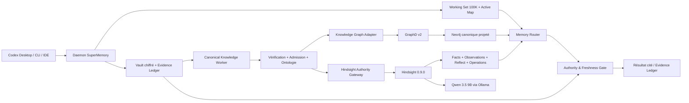

# SuperMemory Memory Fabric v2.1 — Hindsight-Native Memory Plane

| Champ | Valeur |
|---|---|
| Statut | **Prêt pour implémentation** |
| Version | 1.1 |
| Date | 2026-08-08 |
| Portée | Remplacement immédiat de Graphiti et `supermemory-improved` par les capacités natives de Hindsight |
| Déploiement | Remplacement atomique intégral ; `canary=false`, `progressive=false` |
| Documents parents | [Working Memory 100K](./supermemory-working-memory-100k-blueprint.md), [PRD V2](./prd-memoire-agentique-v2.md) |

## 1. Résumé exécutif

Cette tranche transforme Hindsight d'un simple index durable utilisé par `retain` et `recall` en **plan de mémoire apprise natif** de SuperMemory.

La cible supprime immédiatement du runtime :

- Graphiti ;
- le service `supermemory-improved` ;
- le modèle d'embedding et le job de téléchargement dédiés à Graphiti ;
- le proxy d'amélioration de GraphD ;
- les secrets, volumes, variables d'environnement et fallbacks associés.

La cible conserve :

- le vault chiffré comme source de vérité ;
- le Working Set 100K, l'Active Map et l'Evidence Ledger ;
- l'admission, la révocation, la fraîcheur et la politique de réponse locales ;
- le graphe temporel canonique ;
- Neo4j et GraphD pour les requêtes typées, exactes, multi-hop et `as_of` ;
- l'extraction, la vérification indépendante, l'admission et l'évolution d'ontologie qui produisent ce graphe canonique.

Hindsight devient responsable des fonctions dérivées pour lesquelles il possède déjà des primitives complètes :

- projection asynchrone idempotente ;
- recall TEMPR hybride ;
- observations consolidées ;
- invalidation et reconsolidation des observations ;
- Reflect structuré ;
- opérations asynchrones, retries et suivi d'état ;
- configuration de banque versionnée ;
- audit moteur et détection secondaire de données sensibles.

La règle structurante est :

> **Hindsight apprend et synthétise ; SuperMemory autorise, date, cite et décide.**

Il n'existe aucun flux Hindsight vers le vault canonique. Une observation, un score ou une réponse Reflect ne peut ni activer une mémoire, ni modifier le graphe canonique, ni changer l'ontologie, ni déclencher une action externe.

## 2. État de départ vérifié

### 2.1 Code et runtime actuels

L'index Codebase Memory du checkout `codex/memory-fabric-v2` contient 9 030 nœuds et 15 264 relations. Les vérifications dans le source établissent que :

- `hindsight-transport.mjs` n'émet que `retain/upsert`, `delete` et `recall` ;
- le recall actuel transmet seulement la requête, `trace=true`, des tags et `tags_match=all_strict` ;
- `product-hindsight.mjs` et `codex-hindsight.mjs` réduisent les réponses Hindsight à `memoryId + score` ;
- les observations sont explicitement désactivées dans les deux Compose ;
- `notifyImprove` n'a aucun appelant runtime ;
- `createMemoryImproveWorker` n'est instancié que par les tests ;
- GraphD écrit et lit directement Neo4j ;
- Graphiti reçoit seulement une notification best-effort après une projection Neo4j ;
- `supermemory-improved` ne participe pas à une lecture canonique et transmet ses épisodes à Graphiti.

Le retrait de Graphiti et de `supermemory-improved` ne coupe donc aucun chemin de lecture canonique actuel.

### 2.2 Version Hindsight réellement épinglée

Le digest actuel :

```text
sha256:f0f9e9a73d6aedde9eaf4010ab604c3e015494e494318b26f1011144856b8112
```

correspond exactement à **Hindsight 0.6.2**.

La documentation publique courante décrit Hindsight 0.9.0. Le runtime actuel reste donc traité comme incompatible jusqu'à reconstruction et validation de capacités.

La version cible est :

```text
Hindsight 0.9.0
ghcr.io/vectorize-io/hindsight@sha256:6364c3c5f1e551447976d6c3ab369040d0237c0980f10f911d76d981290913b6
```

Le tag officiel 0.9.0 et le manifeste OCI multi-architecture ont été inspectés directement. Ils contiennent les contrats nécessaires :

- `prefer_observations` ;
- `observation_scopes` personnalisés ;
- `source_fact_ids` et `include.source_facts` ;
- `tag_groups` ;
- `query_timestamp` ;
- `response_schema` pour Reflect ;
- opérations asynchrones avec `operation_id` fourni par le client ;
- consolidation ciblée ;
- bank templates et dry-run ;
- audit par banque ;
- webhooks et suivi des livraisons ;
- Memory Defense `sensitive_data` intégrée.

La 0.9.0, publiée le 2026-08-07, est retenue comme nouveau jalon fonctionnel majeur. Elle ajoute notamment les activations par banque des étages temporal, graph et reranking, ainsi qu'un `last_write_at` fiable. Elle corrige aussi des chemins directement critiques pour cette tranche : consolidation et rafraîchissement de mental models, fenêtre temporelle du graph recall, limites de tokens du recall interne, réconciliation des opérations worker, historique d'observation, index vectoriel et sécurité des webhooks. Ces apports réduisent le risque de construire la nouvelle tranche sur des défauts déjà corrigés en amont.

### 2.3 Limite vérifiée de Memory Defense

Dans Hindsight 0.9.0 self-hosted, l'extension intégrée effectue réellement le filtrage regex `sensitive_data`. Les autres noms de détecteurs nécessitent une extension dédiée et ne doivent pas être considérés comme des contrôles actifs.

Conséquences :

- SuperMemory reste seul responsable du prompt-injection screening ;
- l'intégrité des tags et métadonnées reste imposée par l'adaptateur local ;
- Hindsight applique une seconde redaction `sensitive_data`, jamais une politique d'autorité ;
- un test de capacité vérifie le comportement réel, pas seulement la présence d'un champ de configuration.

## 3. Résultat produit

### 3.1 Promesse

« SuperMemory se souvient de faits vérifiables, apprend des tendances entre sessions et peut produire une synthèse sourcée, tout en distinguant systématiquement l'histoire, l'état courant et les connaissances dérivées. »

### 3.2 Parcours nominal

1. Un événement est capturé, redacted, chiffré et versé dans l'Evidence Ledger.
2. Le pipeline canonique extrait un claim, ses entités et relations.
3. Un vérificateur indépendant contrôle la preuve et les conflits.
4. La politique locale active, limite par TTL, met en quarantaine ou rejette le claim.
5. Les claims autorisés sont projetés dans Neo4j par GraphD.
6. Les mémoires durables autorisées sont projetées de façon asynchrone dans la banque Hindsight du workspace.
7. À la fin d'une session ou d'un lot, SuperMemory demande une consolidation Hindsight ciblée.
8. Hindsight produit ou met à jour des observations dérivées.
9. Le Memory Router interroge en parallèle le Working Set, GraphD et Hindsight selon l'intention.
10. Toute réponse Hindsight est revalidée contre l'autorité locale avant d'entrer dans le résultat cité.
11. Pour une synthèse, Reflect est appelé en lecture seule et sa chaîne de faits est revalidée intégralement.

### 3.3 Exigences fonctionnelles

| ID | Exigence |
|---|---|
| HN-FR01 | Une banque Hindsight opaque et distincte existe par `workspace_id`. |
| HN-FR02 | Toute projection utilise un `document_id` stable et un `operation_id` idempotent. |
| HN-FR03 | Les observations sont activées, mais leur consolidation est déclenchée explicitement par SuperMemory. |
| HN-FR04 | Les scopes d'observation n'incluent jamais de tag volatil de session, de retry ou de statut. |
| HN-FR05 | Un recall courant peut préférer une observation aux faits qu'elle consolide sans perdre ses faits sources. |
| HN-FR06 | Un recall historique exclut les observations courantes et utilise GraphD comme arbitre `as_of`. |
| HN-FR07 | Toute observation retournée possède une chaîne complète vers des mémoires canoniques actives. |
| HN-FR08 | Toute synthèse Reflect est structurée et fondée sur des faits localement autorisés. |
| HN-FR09 | Une synthèse dont une source ne peut pas être revalidée échoue fermée. |
| HN-FR10 | Une révocation locale retire immédiatement l'autorité, avant la suppression dérivée Hindsight. |
| HN-FR11 | Le suivi des travaux Hindsight réutilise l'Operations API ; aucun nouveau service de queue n'est créé. |
| HN-FR12 | Le graphe canonique demeure reconstruisible depuis le vault et interrogeable sans Graphiti. |
| HN-FR13 | Le MCP expose une opération Reflect bornée et workspace-bound. |
| HN-FR14 | L'indisponibilité de Hindsight ne bloque jamais la capture, le Working Set ou GraphD. |
| HN-FR15 | L'interface et le doctor distinguent raw facts, observations, synthèses et preuves canoniques. |

### 3.4 Non-objectifs

- Utiliser le graphe interne Hindsight comme graphe canonique.
- Transformer automatiquement une observation en claim autorisé.
- Utiliser Reflect comme moteur d'action ou d'écriture.
- Conserver Graphiti comme fallback caché.
- Recréer une queue asynchrone concurrente à celle de Hindsight.
- Donner aux agents un accès direct à l'API ou au MCP Hindsight.
- Utiliser un score de retrieval comme niveau de confiance ou décision d'admission.
- Garantir un historique exact à partir de `query_timestamp` seul.
- Activer des mental models non re-groundés dans cette tranche.

## 4. Décisions structurantes

| ID | Décision | Motivation |
|---|---|---|
| HN-D01 | Graphiti, `supermemory-improved` et le modèle d'embedding associé sont retirés dans le premier lot. | Ils ne servent aucun chemin canonique et dupliquent le plan appris. |
| HN-D02 | Aucun feature flag, canary ou fallback Graphiti n'est conservé. | Le contrat runtime impose un remplacement intégral. |
| HN-D03 | Hindsight 0.9.0 est épinglé par digest. | Ce jalon majeur contient les correctifs de consolidation, recall, fraîcheur et opérations utiles à la tranche ; son contrat a été vérifié dans le source et le manifeste OCI. |
| HN-D04 | Le runtime Hindsight est reconstruit depuis le vault dans une nouvelle base dérivée. | Évite une migration sémantique opaque depuis 0.6.2. |
| HN-D05 | Neo4j est recréé dans un volume propre et reprojeté depuis le graphe canonique. | Élimine les nœuds Graphiti sans suppression sélective risquée. |
| HN-D06 | Une banque opaque est dérivée par workspace. | Isolation forte et scopes d'observation simples. |
| HN-D07 | Auto-consolidation Hindsight est désactivée. | Chaque consolidation possède une intention, un scope et un reçu d'opération. |
| HN-D08 | Les observations sont rappelables uniquement avec leurs faits sources. | Une croyance dérivée sans preuve est inutilisable par SuperMemory. |
| HN-D09 | Reflect est current-state only dans cette tranche. | Hindsight Reflect 0.9.0 n'est pas un moteur d'état historique canonique. |
| HN-D10 | Les mental models sont exclus de Reflect par défaut. | Leur provenance n'est pas assez forte pour l'Evidence Ledger final. |
| HN-D11 | Les webhooks Hindsight ne sont pas utilisés dans la topologie initiale. | Le client local ne doit pas exposer un callback entrant au serveur Portainer. |
| HN-D12 | L'Operations API est le statut d'exécution Hindsight ; le vault ne garde qu'un reçu chiffré minimal. | Réutilise la queue native sans céder l'intention canonique. |
| HN-D13 | Le worker canonique est séparé des enrichissements dérivés. | Claims, admission et ontologie restent locaux ; embeddings et synthèses vont à Hindsight. |
| HN-D14 | Toute invalidation d'autorité est fail-closed et synchrone localement. | Le lag de nettoyage d'une projection ne doit jamais réactiver une mémoire. |
| HN-D15 | Le contrat runtime passe de v3 à v4. | Le retrait du driver `graphiti-neo4j` et l'ajout du plan Hindsight sont des changements de schéma. |

## 5. Architecture cible



### 5.1 Plans de données

| Plan | Autorité | Contenu | Reconstruction |
|---|---|---|---|
| Evidence | Vault SuperMemory | événements, payloads, snapshots, citations | Canonique, jamais depuis Hindsight |
| Autorité | Vault SuperMemory | admission, statut, TTL, révocation, sensibilité, consumers | Canonique |
| Relationnel | Vault + projection Neo4j | entités, claims, relations, validité temporelle | Depuis les enregistrements graph chiffrés |
| Appris | Hindsight | facts, index TEMPR, observations, Reflect | Depuis les mémoires actives du vault |
| Session | Working Set | preuves adressables et carte active | Depuis les journaux de session |

### 5.2 Responsabilités des composants

#### Canonical Knowledge Worker

Ce composant reprend uniquement la partie autoritaire de `memory-improve-worker.mjs` :

- lecture et réouverture indépendante des épisodes ;
- validation des curseurs et hashes ;
- extraction de claims, entités et relations ;
- vérification indépendante ;
- appel de la politique d'admission ;
- mutation atomique du graphe canonique ;
- proposition et activation shadow-safe de l'ontologie ;
- synchronisation des tombstones et révocations.

Il ne produit plus :

- embeddings locaux ;
- triplets de retrieval dupliqués ;
- communautés et résumés dérivés locaux ;
- poids de feedback sur des artefacts dérivés ;
- projection vers Graphiti.

#### Hindsight Authority Gateway

Le gateway est une bibliothèque locale du daemon, pas un nouveau service :

- construit les requêtes Hindsight exactes ;
- refuse tout endpoint non-loopback ;
- dérive la banque depuis le workspace lié ;
- impose tags, scopes, timestamps, entités et métadonnées ;
- soumet retain et consolidation à l'Operations API ;
- conserve les reçus chiffrés minimaux ;
- réconcilie facts et observations avec le vault ;
- rend les erreurs et dégradations explicites.

#### GraphD v2

GraphD ne contient plus que :

- `POST /v2/project` ;
- `POST /v2/query` ;
- `GET /health` ;
- `GET /ready`.

Il ne contient plus :

- `GRAPHITI_URL` ;
- `IMPROVED_URL` ;
- `IMPROVED_TOKEN_FILE` ;
- `notifyGraphiti` ;
- `/v1/improve/notify` ;
- `/v1/improve/status` ;
- un healthcheck Graphiti.

## 6. Topologie Docker/Portainer cible

### 6.1 Services

La stack contient exactement six services :

1. `ollama` ;
2. `qwen-model` ;
3. `hindsight` ;
4. `neo4j` ;
5. `neo4j-migrate` ;
6. `supermemory-graphd`.

Services supprimés :

- `embedding-model` ;
- `graphiti` ;
- `supermemory-improved`.

### 6.2 Réseaux

| Réseau | Membres | Publication |
|---|---|---|
| `supermemory_ai` | Ollama, qwen-model, Hindsight | Hindsight loopback/tunnel seulement |
| `supermemory_graph` | Neo4j, neo4j-migrate, GraphD | réseau Docker interne ; GraphD loopback/tunnel seulement |

GraphD n'a plus besoin d'accéder au réseau IA. Hindsight n'a plus besoin d'accéder à Neo4j.

### 6.3 Secrets et volumes

Secrets conservés :

- `neo4j_auth` ;
- `graphd_token`.

Secrets supprimés :

- `improved_token` ;
- `improved_state_key`.

Volumes conservés ou recréés :

- `ollama_models` ;
- `hindsight_database` ;
- `hindsight_cache` ;
- `neo4j_data` ;
- `neo4j_logs` ;
- `neo4j_backups`.

Volume supprimé du Compose :

- `improved_state`.

Les anciens volumes ne sont jamais supprimés automatiquement par le déploiement. Ils sont renommés ou sauvegardés, conservés pendant la fenêtre de rollback, puis purgés avec confirmation exacte.

### 6.4 Budget libéré

La suppression retire les limites configurées suivantes :

- Graphiti : 3 GiB, 1,5 CPU ;
- `supermemory-improved` : 512 MiB, 0,5 CPU ;
- le téléchargement et le stockage du modèle `nomic-embed-text` dédié à Graphiti.

Il s'agit d'une réduction de capacité configurée, pas d'une mesure de consommation réelle.

## 7. Contrat Hindsight

### 7.1 Identité de banque

```text
bank_id = "smw_" + sha256(workspace_id)[0:40]
```

Invariants :

- le caller ne fournit jamais `bank_id` ;
- un workspace correspond à une seule banque ;
- la banque ne révèle ni chemin, ni nom de projet, ni utilisateur ;
- les environnements product et Codex d'un même workspace utilisent la même banque et des tags `consumer:*` distincts ;
- aucune requête multi-bank n'est autorisée.

### 7.2 Tags réservés

Tags émis uniquement par le gateway :

```text
workspace:<workspace_id>
consumer:<consumer>
sensitivity:<standard|personal|restricted>
domain:<domain_slug>
status:active
schema:<schema_version>
```

Les tags suivants sont interdits dans une entrée utilisateur :

- tout préfixe réservé ci-dessus ;
- `admission:*` ;
- `authority:*` ;
- `session:*` ;
- `retry:*` ;
- `operation:*`.

L'adaptateur construit une structure exacte avec `additionalProperties=false`. Hindsight Memory Defense ne remplace pas cette validation.

### 7.3 Scopes d'observation

Pour chaque consumer autorisé, le gateway émet un scope personnalisé :

```json
[
  ["consumer:codex", "sensitivity:standard", "domain:project"]
]
```

Si deux consumers sont autorisés, deux scopes distincts sont produits. Ne participent jamais au scope :

- workspace, déjà isolé par la banque ;
- statut, car seules les mémoires actives sont projetées ;
- session et event IDs ;
- version de schéma ;
- identifiants d'admission ou d'opération.

### 7.4 Retain v2

Chaque item Hindsight est dérivé d'une mémoire canonique active :

```json
{
  "content": "Titre\n\nContenu redacted",
  "timestamp": "2026-08-08T10:30:00.000Z",
  "context": "project memory / canonical claim",
  "document_id": "mem_...",
  "entities": [
    { "text": "SuperMemory", "type": "PROJECT" }
  ],
  "tags": [
    "workspace:ws_...",
    "consumer:codex",
    "sensitivity:standard",
    "domain:project",
    "status:active",
    "schema:memory-v3"
  ],
  "observation_scopes": [
    ["consumer:codex", "sensitivity:standard", "domain:project"]
  ],
  "update_mode": "replace",
  "metadata": {
    "memory_id": "mem_...",
    "project_id": "prj_...",
    "projection_hash": "sha256:...",
    "authority_revision": "12",
    "evidence_ids": "[\"wev_...\"]"
  }
}
```

Le body utilise :

```json
{
  "items": [],
  "async": true,
  "operation_id": "UUID déterministe"
}
```

L'UUID est dérivé de :

```text
workspace_id + sorted(document_id, projection_hash) + operation_kind
```

Une retransmission après timeout utilise donc le même `operation_id` et ne crée pas un nouveau travail.

### 7.5 Reçu local d'opération

Le vault conserve un reçu AEAD, pas une seconde queue :

```json
{
  "schema": "supermemory.hindsight-operation-receipt.v1",
  "workspace_id": "ws_...",
  "receipt_id": "UUID déterministe local",
  "hindsight_operation_id": "UUID Hindsight ou null pour un DELETE synchrone",
  "operation_kind": "retain|consolidation|delete|rebuild",
  "payload_hash": "sha256:...",
  "document_ids": ["mem_..."],
  "observation_scopes": [["consumer:codex", "sensitivity:standard", "domain:project"]],
  "submitted_at": "...",
  "last_observed_status": "pending|processing|completed|failed|cancelled",
  "last_checked_at": "...",
  "attempt": 1
}
```

Le reçu ne contient ni texte de mémoire, ni query, ni sortie LLM. Le payload est reconstruisible depuis le vault canonique. Pour `retain` et `consolidation`, l'identifiant Hindsight est suivi via Operations. Pour un `DELETE` synchrone, seul le `receipt_id` local est requis ; la reconsolidation qui suit possède sa propre opération Hindsight.

### 7.6 Recall v2

Recall courant :

```json
{
  "query": "...",
  "types": ["observation", "world", "experience"],
  "prefer_observations": true,
  "budget": "mid",
  "max_tokens": 4096,
  "trace": true,
  "query_timestamp": "2026-08-08T12:00:00.000Z",
  "include": {
    "entities": { "max_tokens": 512 },
    "source_facts": {
      "max_tokens": 4096,
      "max_tokens_per_observation": 1024
    }
  },
  "tag_groups": [
    {
      "tags": ["consumer:codex", "sensitivity:standard"],
      "match": "all_strict"
    },
    {
      "or": [
        { "tags": ["domain:project"], "match": "all_strict" },
        { "tags": ["domain:general"], "match": "all_strict" }
      ]
    }
  ]
}
```

La banque assure l'isolation workspace. Le filtre de recall utilise seulement les tags présents à la fois sur les facts et sur leur scope d'observation. Il n'exige donc ni `workspace:*`, ni `status:active`, ni `schema:*` : ces tags existent sur les facts bruts, mais pas nécessairement sur les observations dont les tags sont exactement leur scope de consolidation.

Recall historique :

```json
{
  "types": ["world", "experience"],
  "prefer_observations": false,
  "query_timestamp": "<as_of>"
}
```

Une requête `as_of` utilise simultanément Hindsight pour retrouver des faits candidats et GraphD pour déterminer l'état relationnel valide. Une observation courante n'est jamais utilisée comme preuve historique.

### 7.7 Réconciliation des résultats

Pour un raw fact :

1. `document_id` ou `metadata.memory_id` doit être présent ;
2. la mémoire doit exister dans le workspace lié ;
3. elle doit être active et non expirée ;
4. le consumer doit être autorisé ;
5. la sensibilité doit être compatible ;
6. la source et le snapshot doivent encore être utilisables ;
7. le resolver de fraîcheur doit accepter la mémoire pour l'intention courante.

Pour une observation :

1. `source_fact_ids` doit être non vide ;
2. chaque ID doit exister dans `source_facts` ou être récupérable par `GET /memories/{id}` ;
3. chaque source fact doit se résoudre vers une mémoire canonique ;
4. toutes les mémoires doivent réussir les contrôles du raw fact ;
5. une seule source invalide fait rejeter l'observation complète ;
6. les citations finales sont reconstruites depuis le vault, jamais copiées depuis le texte Hindsight.

Le score Hindsight ne franchit pas la frontière d'autorité. Le routeur peut l'utiliser pour ordonner des candidats du même tier, jamais comme probabilité de vérité.

### 7.8 Reflect v1

Le MCP expose :

```text
supermemory_reflect(
  working_set_id,
  query,
  format = summary|decision|risks|timeline,
  max_tokens = 2048
)
```

Le caller ne fournit pas de JSON Schema arbitraire. `format` sélectionne un schéma versionné local :

- `summary` : résumé, points clés, incertitudes ;
- `decision` : options, contraintes, recommandation, preuves ;
- `risks` : risques, probabilité qualitative, impact, mitigation, preuves ;
- `timeline` : événements ordonnés, dates, état courant, preuves.

Requête Hindsight :

```json
{
  "query": "...",
  "budget": "mid",
  "max_tokens": 2048,
  "include": { "facts": {} },
  "response_schema": {},
  "tag_groups": [
    {
      "tags": ["consumer:codex", "sensitivity:standard"],
      "match": "all_strict"
    }
  ],
  "fact_types": ["world", "experience", "observation"],
  "exclude_mental_models": true,
  "apply_all_directives": false
}
```

Réponse SuperMemory :

```json
{
  "schema": "supermemory.reflect-result.v1",
  "status": "grounded|partial|unavailable",
  "answer": "...",
  "structured_output": {},
  "evidence": [
    {
      "memory_id": "mem_...",
      "evidence_ids": ["wev_..."],
      "citation": "...",
      "source_type": "world|experience|observation"
    }
  ],
  "coverage": {
    "facts_used": 5,
    "facts_validated": 5,
    "facts_rejected": 0
  },
  "authoritative": false
}
```

Si `facts_rejected > 0`, le texte généré n'est pas retourné. Le résultat devient `reflect_grounding_failed_retryable`, la projection est réconciliée, puis le caller peut réessayer.

Reflect n'accepte pas `as_of` dans cette tranche. Les questions historiques passent par `supermemory_recall(strategy=temporal)` ou `supermemory_graph_query`.

## 8. Configuration Hindsight cible

### 8.1 Variables serveur explicites

```yaml
HINDSIGHT_API_ENABLE_OBSERVATIONS: "true"
HINDSIGHT_API_ENABLE_AUTO_CONSOLIDATION: "false"
HINDSIGHT_API_ENABLE_BANK_CONFIG_API: "true"
HINDSIGHT_API_AUDIT_LOG_ENABLED: "true"
HINDSIGHT_API_AUDIT_LOG_RETENTION_DAYS: "30"
HINDSIGHT_API_LLM_MAX_CONCURRENT: "1"
```

L'exécution reste dans le worker in-process Hindsight. Aucun conteneur worker supplémentaire n'est requis pour le volume initial.

### 8.2 Bank template v1

Un manifeste versionné est généré depuis l'ontologie et le runtime SuperMemory :

```json
{
  "version": "1",
  "bank": {
    "retain_mission": "Extract durable, explicit and temporally anchored facts from already-authorized SuperMemory memories. Preserve uncertainty and contradiction.",
    "retain_extraction_mode": "concise",
    "enable_observations": true,
    "observations_mission": "Consolidate recurring current-state patterns while preserving contradiction, temporal qualifiers and source facts.",
    "enable_temporal_retrieval": true,
    "enable_graph_retrieval": true,
    "enable_reranking": true,
    "reflect_mission": "Synthesize only retrieved evidence, surface uncertainty and never claim authority or execute actions.",
    "entities_allow_free_form": false,
    "consolidation_source_facts_max_tokens": 4096,
    "consolidation_source_facts_max_tokens_per_observation": 1024,
    "max_observations_per_scope": 128,
    "reflect_source_facts_max_tokens": 4096,
    "audit_log_enabled": true,
    "store_document_text": false,
    "mcp_enabled_tools": []
  },
  "mental_models": [],
  "directives": [
    {
      "name": "grounded-current-state",
      "content": "Use retrieved evidence only. State conflicts and uncertainty. Do not infer permission, authority or external action.",
      "priority": 100,
      "is_active": true,
      "tags": []
    }
  ]
}
```

`entity_labels` est ajouté au manifeste par génération depuis les types actifs de l'Ontology Registry. Les types shadow ne sont pas publiés.

Avant import :

1. récupérer `/v1/bank-template-schema` ;
2. valider localement le manifeste ;
3. appeler l'import avec `dry_run=true` ;
4. comparer le hash du manifeste attendu ;
5. importer ;
6. lire le config résolu et vérifier chaque invariant.

### 8.3 Memory Defense

Après l'import du template, le gateway applique :

```json
{
  "updates": {
    "memory_defense": {
      "enabled": true,
      "rules": [
        { "on": "sensitive_data", "action": "redact" }
      ]
    }
  }
}
```

Le choix `redact` est une défense en profondeur. La redaction SuperMemory reste première et canonique. `block` n'est pas retenu, car une détection secondaire ne doit pas faire disparaître silencieusement une projection ; elle doit être auditée et visible dans le doctor.

### 8.4 Contrat de capacités

Le preflight ne se limite pas à `/health`. Il échoue si l'un des contrôles suivants manque :

- digest d'image attendu ;
- schema de template version 1 ;
- champ `enable_observations` ;
- configuration par banque de `enable_temporal_retrieval`, `enable_graph_retrieval` et `enable_reranking` ;
- retain async et `operation_id` client ;
- `observation_scopes` personnalisé ;
- recall `types`, `prefer_observations`, `tag_groups`, `query_timestamp` ;
- `include.source_facts` ;
- Reflect `response_schema`, `include.facts`, `exclude_mental_models` ;
- endpoint de consolidation ciblée ;
- endpoints Operations get/retry/cancel ;
- exposition de `last_write_at` par banque ;
- configuration `memory_defense` acceptée ;
- comportement réel de redaction `sensitive_data` sur une fixture synthétique.

Le rapport est hashé et attaché au reçu de release.

## 9. GraphD contract v2

### 9.1 Contrat

```json
{
  "schema": "supermemory.graphd-contract.v2",
  "version": "2.0.0",
  "authority": {
    "canonical_source": "encrypted-local-vault",
    "backend_roles": ["candidate_projection", "candidate_path_search"],
    "backend_may_decide": []
  },
  "operations": {
    "replace": "replace_workspace_projection_v2",
    "query": "bounded_path_v2"
  },
  "backend": {
    "primary": "direct-neo4j",
    "fallback": null
  }
}
```

Les limites restent :

- 20 entités d'entrée ;
- 20 types de relation ;
- 1 à 5 hops ;
- 20 chemins maximum ;
- aucun Cypher brut ;
- token HMAC dérivé par workspace ;
- revalidation locale de chaque chemin.

### 9.2 Projection

`replaceProjection` écrit Neo4j puis retourne :

```json
{
  "ok": true,
  "projection_hash": "sha256:...",
  "backend": "direct-neo4j"
}
```

Le champ `graphiti` disparaît. Le readiness vérifie uniquement une requête Neo4j bornée.

### 9.3 Knowledge Graph Adapter

L'adaptateur supprime les paramètres synchrones `graphitiBackend` et `directNeo4jBackend`.

Il conserve :

- le moteur déterministe in-memory pour les tests et le mode sans serveur ;
- `remoteBackend` pour GraphD HTTP ;
- les hashes de projection ;
- les checkpoints ;
- la revalidation canonique ;
- le rebuild depuis les records chiffrés.

Les labels de résultat autorisés deviennent :

- `deterministic-memory` ;
- `graphd-neo4j` ;
- `none` ;
- `unavailable`.

## 10. Runtime config v4

```json
{
  "schema": "supermemory.codex-runtime.v4",
  "deployment": {
    "strategy": "full",
    "canary": false,
    "progressive": false,
    "activation": "full"
  },
  "knowledge_graph": {
    "enabled": true,
    "driver": "graphd-neo4j",
    "endpoint": "http://127.0.0.1:8080",
    "token_file": "...",
    "ontology_mode": "core_plus_learned",
    "ontology_shadow_min_support": 3
  },
  "hindsight": {
    "enabled": true,
    "minimum_version": "0.9.0",
    "bank_strategy": "workspace",
    "async_retain": true,
    "observations": {
      "enabled": true,
      "auto_consolidation": false,
      "require_source_facts": true
    },
    "reflect": {
      "enabled": true,
      "exclude_mental_models": true,
      "fail_on_unvalidated_fact": true
    },
    "operations": {
      "poll_interval_ms": 500,
      "timeout_ms": 120000,
      "max_retries": 3
    }
  },
  "continuous_improvement": {
    "enabled": true,
    "canonical_worker": "local",
    "learned_plane": "hindsight-native",
    "on_session_end": true
  }
}
```

Migration v3 → v4 :

- `knowledge_graph.driver=graphiti-neo4j` devient `graphd-neo4j` ;
- les paramètres improve server disparaissent ;
- `continuous_improvement` est séparé en worker canonique local et plan appris Hindsight ;
- les capacités Hindsight deviennent obligatoires lorsque `activation=full` ;
- aucune compatibilité Graphiti n'est conservée après écriture du v4.

## 11. Flux détaillés

### 11.1 Projection d'une mémoire active

1. Commit canonique de la mémoire et de son admission.
2. Calcul du `projection_hash`.
3. Écriture AEAD du reçu Hindsight `pending_submission`.
4. `POST /memories` avec `async=true` et UUID déterministe.
5. Enregistrement de l'`operation_id` retourné.
6. Poll borné de l'opération.
7. Après `completed`, lecture du document et vérification `memory_unit_count > 0`.
8. Marquage du reçu `completed`.
9. Ajout du scope à la prochaine consolidation ciblée.

Le commit canonique n'est jamais annulé si Hindsight tombe. Le tier durable devient `degraded_projection_pending`.

### 11.2 Consolidation de session

1. Le Canonical Knowledge Worker traite les nouveaux épisodes.
2. Les projections Hindsight manquantes sont soumises.
3. Quand leurs opérations sont terminales, le gateway groupe les scopes stables.
4. `POST /consolidate` soumet une opération de consolidation ciblée.
5. Le daemon ne bloque pas la fermeture de session ; il suit l'opération en arrière-plan.
6. Le SLO mesure `closed_at → consolidation.completed`.
7. En cas d'échec, le reçu reste retryable et le recall raw fact continue.

### 11.3 Révocation ou suppression

1. Le vault clôt l'autorité ou écrit le tombstone.
2. Le Working Set, le Memory Router et GraphD excluent immédiatement la mémoire.
3. Une intention `delete` Hindsight est enregistrée.
4. Le document Hindsight est supprimé de façon idempotente.
5. Hindsight invalide les observations qui dépendent de ses facts.
6. Une consolidation ciblée reconstruit les observations survivantes.
7. La suppression physique et les retries sont audités.

Une projection stale ne peut pas franchir l'étape 2.

### 11.4 Recall hybride courant

1. Classification déterministe de l'intention par le Memory Router.
2. Interrogation parallèle des tiers utiles.
3. Hindsight rappelle observations et facts avec source facts.
4. GraphD retourne les chemins exacts si l'intention est relationnelle.
5. La gateway d'autorité revalide chaque candidat.
6. Le routeur déduplique par identité canonique, jamais par texte seul.
7. L'Evidence Ledger reconstruit les citations.
8. La réponse expose couverture et tiers dégradés.

### 11.5 Question historique

1. `as_of` devient obligatoire et validé.
2. Hindsight est limité aux raw facts et ancré avec `query_timestamp`.
3. GraphD applique `valid_from <= as_of < valid_to`.
4. Le resolver local reconstruit l'état autorisé à cette date.
5. La réponse sépare explicitement : événements connus à la date, état à la date, état courant si demandé.

### 11.6 Reflect

1. Pre-recall local pour confirmer qu'un corpus autorisé existe.
2. Appel Reflect avec schéma local et mental models exclus.
3. Collecte de `based_on`.
4. Hydratation de chaque fact via `GET /memories/{id}` si nécessaire.
5. Pour une observation, hydratation récursive des facts sources.
6. Revalidation canonique complète.
7. Retour de la synthèse seulement si toutes les sources sont valides.
8. Journalisation de métriques et hashes, sans texte de requête.

## 12. Sécurité et confidentialité

### 12.1 Invariants

- Seul SuperMemory parle à Hindsight pour du contenu.
- Le MCP Hindsight est désactivé au niveau des banques.
- Les agents ne choisissent ni banque, ni workspace, ni tags d'autorité.
- Toute donnée est redacted avant Retain.
- Hindsight reçoit uniquement des mémoires déjà autorisées.
- Les documents Hindsight ne sont jamais une preuve canonique.
- Les réponses sont revalidées après le retrieval et avant la citation.
- Une erreur d'identité retourne une réponse indistinguable d'une absence.
- Le contenu des opérations n'apparaît pas dans les logs SuperMemory.
- Les ports Hindsight et GraphD restent loopback ou derrière un tunnel authentifié.
- `store_document_text=false` évite une seconde copie du texte source dans Hindsight ; les facts dérivés restent locaux au serveur.

### 12.2 Menaces et contrôles

| Menace | Contrôle |
|---|---|
| Injection de tags privilégiés | Construction exacte par le gateway ; aucun merge avec des tags utilisateur |
| Prompt injection dans une mémoire | Redaction/screening local, mémoire non exécutable, directive Reflect non autoritaire |
| Secret oublié | Redaction locale puis Memory Defense `sensitive_data=redact` |
| Observation issue d'un fait révoqué | Source facts obligatoires et revalidation all-or-nothing |
| Cross-workspace recall | Banque par workspace + liaison locale + refus d'argument de scope MCP |
| Réponse Reflect partiellement invalide | Échec fermé de la réponse entière |
| Opération rejouée | UUID client déterministe et payload hash |
| Hindsight compromis | Aucune capacité d'écriture canonique ou d'action externe |
| Neo4j compromis | Résultats candidats revalidés contre les records chiffrés |
| Score mal interprété | Aucun score n'alimente admission, TTL ou confiance utilisateur |

## 13. Résilience et modes dégradés

| Panne | Comportement attendu |
|---|---|
| Hindsight indisponible | Working Memory et GraphD continuent ; durable tier marqué indisponible ; Reflect indisponible |
| Opération retain bloquée | Reçu conservé ; status poll ; retry natif ; aucune duplication |
| Consolidation échouée | Raw facts restent rappelables ; observation tier marqué stale/degraded |
| Observation non revalidable | Observation rejetée ; raw facts valides peuvent rester |
| Reflect non groundé | Aucun texte Reflect retourné ; reconciliation demandée |
| Neo4j indisponible | Graphe distant marqué indisponible ; vault, Working Set et Hindsight restent utilisables |
| GraphD hash mismatch | Aucun checkpoint complet ; reprojection depuis records chiffrés |
| Vault indisponible | Aucun résultat Hindsight ou Neo4j ne peut être promu en réponse autorisée |
| Qwen indisponible | Retain/observations/Reflect échouent ou restent pending ; capture locale continue |

Il n'existe aucun fallback vers Graphiti.

## 14. Observabilité

### 14.1 État exposé

Le doctor et `/status` exposent sans contenu :

- version et digest Hindsight ;
- hash du schema de template live ;
- hash du template attendu et drift ;
- nombre d'opérations pending/processing/failed par workspace ;
- âge de la plus vieille projection pending ;
- `last_write_at` Hindsight et watermark local de dernière projection terminée ;
- date de dernière consolidation réussie ;
- nombre d'observations acceptées et rejetées au recall ;
- taux de couverture des source facts ;
- taux de Reflect entièrement groundé ;
- hash de projection GraphD ;
- état Neo4j ;
- tiers actifs et dégradés.

### 14.2 Métriques

```text
supermemory_hindsight_operation_total{type,status}
supermemory_hindsight_operation_age_seconds{type}
supermemory_hindsight_projection_lag_seconds
supermemory_hindsight_consolidation_seconds
supermemory_hindsight_recall_seconds{budget,types}
supermemory_hindsight_observation_total{decision}
supermemory_hindsight_source_fact_coverage_ratio
supermemory_hindsight_reflect_seconds{format,status}
supermemory_hindsight_reconciliation_total{reason}
supermemory_graphd_query_seconds{hops,status}
supermemory_router_tier_total{tier,status}
```

Les labels ne contiennent ni query, ni memory ID, ni project name, ni contenu.

### 14.3 SLO

| Mesure | Cible |
|---|---:|
| Capture locale p95 | ≤ 250 ms |
| Recall Working Set p95 | ≤ 150 ms |
| GraphD 3 hops p95 | ≤ 500 ms |
| Recall durable Hindsight p95 | ≤ 1 500 ms hors génération Reflect |
| Projection active → opération retain complétée p95 | ≤ 60 s |
| Fin de session → consolidation complétée p95 | ≤ 120 s |
| Reflect `summary` p95 sur Qwen local | ≤ 30 s |
| Source-fact coverage des observations retournées | 100 % |
| Synthèses Reflect retournées avec faits invalides | 0 |
| Fuite inter-workspace | 0 |
| Capture bloquée par Hindsight ou Neo4j | 0 |

## 15. Migration atomique

### 15.1 Préconditions

- suite actuelle verte ;
- backup vault vérifié ;
- dump Neo4j vérifié si une stack existe ;
- snapshot ou archive du volume Hindsight 0.6.2 si une stack existe ;
- digest 0.9.0 disponible pour les architectures déployées ;
- rapport de capacités 0.9.0 vert ;
- runtime config v4 généré et validé ;
- aucun job canonique en cours.

Si aucun runtime n'est déployé, les étapes de sauvegarde de données dérivées sont enregistrées comme `not_applicable`, pas simulées.

### 15.2 Séquence de bascule

1. Arrêter la stack complète existante.
2. Sauvegarder les volumes dérivés existants sans les supprimer.
3. Déployer le Compose cible sans Graphiti ni `supermemory-improved`.
4. Démarrer Hindsight 0.9.0 avec un nouveau volume de base.
5. Démarrer Neo4j avec un nouveau volume de données.
6. Exécuter `neo4j-migrate` puis GraphD v2.
7. Importer et vérifier le bank template pour chaque workspace actif.
8. Reprojeter le graphe canonique et vérifier chaque hash.
9. Reprojeter les mémoires Hindsight actives avec retain async.
10. Attendre les opérations terminales puis consolider les scopes.
11. Exécuter E2E recall raw, observation, temporal, graph et Reflect.
12. Activer runtime v4 intégralement.
13. Vérifier doctor, UI, MCP et métriques.

Il n'existe pas de période de double écriture Graphiti/Hindsight.

### 15.3 Rollback

Le rollback est une opération de release, pas un fallback runtime :

1. arrêter la stack cible ;
2. restaurer le commit de stack précédent ;
3. rattacher les anciens volumes sauvegardés ;
4. restaurer runtime v3 ;
5. vérifier les hashes canoniques et les accès ;
6. documenter le motif.

Le vault n'est jamais restauré depuis Hindsight ou Neo4j.

### 15.4 Nettoyage différé

Après la fenêtre de rollback :

- supprimer l'ancien volume Hindsight 0.6.2 avec confirmation exacte ;
- supprimer l'ancien volume Neo4j contenant Graphiti avec confirmation exacte ;
- supprimer l'ancien volume `supermemory-improved-state` ;
- supprimer les anciennes images Graphiti et improved si la politique opérateur l'autorise ;
- conserver les reçus de migration et hashes de backup.

## 16. Carte d'impact du code

### 16.1 Suppressions

- `services/supermemory-improved/Dockerfile`
- `services/supermemory-improved/package.json`
- `services/supermemory-improved/server.mjs`
- service `embedding-model` dans les Compose Portainer
- service `graphiti` dans les Compose Portainer
- service `supermemory-improved` dans les Compose Portainer
- secrets et volume improved
- appels Graphiti et proxy improve dans GraphD
- `notifyImprove` dans `graphd-http-backend.mjs`
- branches `graphitiBackend` dans `knowledge-graph-adapter.mjs`
- tests de fallback Graphiti
- fixtures qui exigent l'activation de Graphiti

### 16.2 Remplacements

| Actuel | Cible |
|---|---|
| `memory-improve-worker.mjs` monolithique | `canonical-knowledge-worker.mjs` + orchestration Hindsight native |
| `hindsight-transport.mjs` minimal | `hindsight-client-v2.mjs` typé et capability-aware |
| wrappers Codex/product divergents | `hindsight-authority-gateway.mjs` partagé |
| GraphD contract v1 | GraphD contract v2 direct-Neo4j |
| runtime config v3 | runtime config v4 |
| enrichments triplets/embeddings/communautés | facts/observations Hindsight |
| queue improved custom | Operations API + reçu AEAD minimal |
| tests `IM-AC*` locaux dérivés | tests canonical worker + Hindsight learning plane |

### 16.3 Ajouts

- `deploy/hindsight/supermemory-bank-template.v1.json`
- `scripts/lib/hindsight-client-v2.mjs`
- `scripts/lib/hindsight-authority-gateway.mjs`
- `scripts/lib/hindsight-operation-receipts.mjs`
- `scripts/lib/canonical-knowledge-worker.mjs`
- `scripts/verify-hindsight-native-plane.mjs`
- `tests/hindsight-client-v2.test.mjs`
- `tests/hindsight-authority-gateway.test.mjs`
- `tests/hindsight-operations.test.mjs`
- `tests/hindsight-observations.test.mjs`
- `tests/hindsight-reflect.test.mjs`
- `tests/hindsight-native-plane-e2e.test.mjs`
- `tests/fixtures/hindsight-native-plane/`

### 16.4 Documentation historique

Les anciens goal receipts ne sont pas réécrits. Ils restent des preuves historiques de l'architecture au moment de leur exécution. Les documents normatifs actifs reçoivent une note de supersession vers ce blueprint.

## 17. Plan d'implémentation

### Lot 0 — Contrats rouges et migration de configuration

Livrables :

- matrice `HN-AC01..HN-AC24` ;
- runtime config v4 ;
- GraphD contract v2 ;
- fixture de bank template ;
- tests rouges de topologie sans Graphiti ;
- test de correspondance digest/version ;
- preflight de capacités Hindsight 0.9.0.

Sortie : les tests décrivent intégralement la cible et échouent uniquement sur les composants encore présents.

### Lot 1 — Suppression physique de Graphiti et improved

Livrables :

- suppression des trois services ;
- suppression du service source `supermemory-improved` ;
- GraphD direct-Neo4j seulement ;
- adapter KG sans branche Graphiti ;
- secrets, volumes, env et runbooks nettoyés ;
- scripts backup/restore corrigés.

Sortie : Compose contient exactement six services et GraphD passe tous ses tests sans mock Graphiti.

### Lot 2 — Upgrade et configuration Hindsight

Livrables :

- image 0.9.0 épinglée par digest ;
- observations activées ;
- auto-consolidation désactivée ;
- étages temporal, graph et reranking explicitement activés par banque ;
- audit activé 30 jours ;
- template par workspace ;
- Memory Defense `sensitive_data=redact` ;
- dry-run, import et drift detection.

Sortie : une banque neuve satisfait le contrat de capacités et son config résolu correspond au template attendu.

### Lot 3 — Client v2 et opérations natives

Livrables :

- retain enrichi ;
- opération UUID idempotente ;
- status/retry/cancel ;
- reçus AEAD ;
- delete idempotent ;
- consolidation ciblée ;
- reprise après timeout ou crash.

Sortie : aucune queue custom ne transporte un payload Hindsight ; un retry perdu ne duplique pas le travail.

### Lot 4 — Canonical Knowledge Worker

Livrables :

- extraction de la partie autoritaire du worker actuel ;
- suppression des enrichissements dérivés locaux ;
- maintien des contrôles anti-tampering ;
- maintien admission, TTL, révocation, ontologie et graph commits ;
- wiring réel au daemon/session close.

Sortie : le pipeline canonique est actif au runtime et ne dépend ni de Hindsight, ni de Neo4j pour enregistrer son autorité.

### Lot 5 — Recall observations et fraîcheur

Livrables :

- recall types/budget/timestamp/tag_groups ;
- conservation des détails Hindsight ;
- source facts obligatoires ;
- revalidation raw/observation ;
- séparation current/historical ;
- dédup et citations du Memory Router.

Sortie : aucune observation stale, révoquée ou non sourcée n'entre dans une réponse.

### Lot 6 — Reflect borné

Livrables :

- schémas summary/decision/risks/timeline ;
- MCP `supermemory_reflect` ;
- endpoint daemon correspondant ;
- hydration des facts `based_on` ;
- échec fermé sur source invalide ;
- UI de provenance et couverture.

Sortie : 100 % des synthèses retournées possèdent une chaîne canonique complète.

### Lot 7 — Migration, E2E et release

Livrables :

- nouveaux volumes dérivés ;
- rebuild Neo4j et Hindsight ;
- opérations de consolidation complètes ;
- doctor et métriques ;
- tests Playwright ;
- release receipt et procédure de rollback.

Sortie : matrice existante remappée verte, matrice HN 24/24, suite complète verte, stack inspectée visuellement.

## 18. Critères d'acceptation

| ID | Critère vérifiable |
|---|---|
| HN-AC01 | Aucun service, secret, volume ou variable runtime Graphiti/improved n'existe dans le Compose cible. |
| HN-AC02 | GraphD ready et query fonctionnent avec Neo4j seul. |
| HN-AC03 | Aucun appel runtime ne référence `GRAPHITI_URL`, `IMPROVED_URL` ou `/v1/improve/*`. |
| HN-AC04 | Le digest Hindsight cible correspond à 0.9.0 sur toutes les architectures déployées. |
| HN-AC05 | Le preflight vérifie toutes les capacités requises sur le serveur live, dont les trois étages de recall et `last_write_at`. |
| HN-AC06 | Le bank template passe schema local, dry-run serveur, import et drift check, avec temporal, graph et reranking explicitement activés. |
| HN-AC07 | Les banques sont opaques, stables et distinctes entre workspaces. |
| HN-AC08 | Un retain rejoué avec le même payload utilise le même operation ID et ne duplique pas le document. |
| HN-AC09 | Timestamps, entités, tags, métadonnées et scopes sont présents dans la requête retain. |
| HN-AC10 | Une consolidation est ciblée par scopes stables et suivie via Operations. |
| HN-AC11 | Une observation retournée expose tous ses source facts. |
| HN-AC12 | Une observation avec une source révoquée est rejetée entièrement. |
| HN-AC13 | Une suppression canonique retire l'autorité avant le cleanup Hindsight. |
| HN-AC14 | Un recall `as_of` exclut les observations et respecte GraphD temporal. |
| HN-AC15 | `prefer_observations` supprime les doublons sans perdre les citations sources. |
| HN-AC16 | Les scores Hindsight ne modifient ni admission, ni TTL, ni autorité. |
| HN-AC17 | Reflect retourne un JSON conforme au schéma local avec toutes ses preuves validées. |
| HN-AC18 | Reflect ne retourne aucun texte si un seul fact `based_on` est invalide. |
| HN-AC19 | Le MCP Reflect refuse scope explicite, schéma arbitraire, `as_of` et token budget excessif. |
| HN-AC20 | Une panne Hindsight conserve capture, Working Set et GraphD avec couverture dégradée explicite. |
| HN-AC21 | Une panne Neo4j conserve capture, Working Set et Hindsight avec couverture dégradée explicite. |
| HN-AC22 | Le rebuild sur volumes propres reproduit les hashes GraphD attendus et toutes les mémoires actives Hindsight. |
| HN-AC23 | Le E2E couvre ingestion → admission → graphe → retain → consolidation → observation → recall/Reflect cité. |
| HN-AC24 | Release, specs, secrets, Compose, runtime, Codex, UI et rollback sont verts. |

### 18.1 Remapping de la matrice Memory Fabric v2

Les IDs existants restent stables :

- `IM-AC01` devient enrichissement Hindsight idempotent et cité ;
- `IM-AC02` devient consolidation Hindsight de session sous 120 secondes ;
- `IM-AC03` devient garantie qu'aucun signal dérivé — score, observation ou Reflect — ne change l'autorité.

Les tests du Canonical Knowledge Worker conservent séparément les preuves d'extraction, anti-tampering, admission, ontologie et révocation.

## 19. Stratégie de test

### 19.1 Unitaires

- dérivation de banque ;
- tags et scopes ;
- sérialisation metadata ;
- UUID d'opération ;
- schemas Reflect ;
- parsing des responses ;
- hydration des source facts ;
- authority/freshness gate ;
- migrations config v3 → v4 ;
- validation GraphD v2.

### 19.2 Contract tests Hindsight

Les tests se construisent contre le source et l'OpenAPI 0.9.0, puis s'exécutent contre le conteneur épinglé :

- retain async ;
- get/retry/cancel operation ;
- document upsert/delete ;
- observation scopes ;
- consolidate ;
- recall source facts ;
- Reflect structured output ;
- template schema/dry-run/import ;
- config et Memory Defense.

### 19.3 Sécurité

- cross-workspace ;
- tag injection ;
- metadata injection ;
- secret synthetic redaction ;
- prompt injection inerte ;
- source fact révoqué ;
- TTL expiré ;
- projection stale ;
- Hindsight response malformed ;
- operation ID collision ;
- payload hash mismatch.

### 19.4 E2E obligatoires

1. Mémoire standard actuelle consolidée en observation citée.
2. Contradiction qui clôt l'ancien état dans GraphD et met à jour l'observation.
3. Question « que savions-nous à la date T ? » sans observation courante.
4. Révocation après consolidation et disparition immédiate du recall.
5. Synthèse Reflect structurée avec preuves.
6. Source Reflect révoquée entre génération et revalidation : réponse rejetée.
7. Crash après submit avant ack : reprise sans doublon.
8. Hindsight arrêté : Working Set et graph recall restent opérationnels.
9. Neo4j arrêté : durable recall reste opérationnel.
10. Rebuild intégral depuis vault sur volumes vides.

## 20. Definition of Done

La tranche est terminée lorsque :

- Graphiti et `supermemory-improved` sont absents du runtime, du Compose et des images construites ;
- aucun fallback ou flag de compatibilité ne peut les réactiver ;
- Hindsight 0.9.0 est épinglé et son contrat de capacités est vert ;
- les observations sont actives et la consolidation automatique globale est désactivée ;
- toutes les opérations Hindsight sont idempotentes et suivies ;
- le Canonical Knowledge Worker est réellement branché au runtime ;
- le graphe temporel Neo4j/GraphD conserve ses garanties et hashes ;
- recall courant, historique et Reflect sont distincts et correctement routés ;
- toutes les observations et synthèses retournées sont revalidées et citées ;
- les trois anciens critères `IM-AC` sont remappés sans réduire la matrice 45/45 ;
- les 24 critères HN sont verts ;
- la suite complète, release, runtime, Codex, specs, secrets et Compose sont verts ;
- la vérification visuelle Playwright est réussie ;
- le runbook de migration et de rollback a été exécuté ou marqué `not_applicable` avec preuve ;
- aucun modèle, conteneur ou service n'est déployé localement par la seule production de ce blueprint.

## 21. Risques résiduels acceptés

| Risque | Décision |
|---|---|
| Hindsight 0.9.0 est une release très récente | Accepté explicitement ; digest immuable, rebuild propre, preflight live et contract tests bloquent la release en cas de dérive |
| Observations éventuellement en retard | Accepté ; raw facts restent disponibles et le statut est explicite |
| Reflect peut être lent avec Qwen 9B | Accepté avec SLO 30 s et timeout borné |
| Pas de webhooks serveur → client | Accepté ; polling Operations local, sans exposition entrante |
| Mental models non utilisés | Accepté jusqu'à disponibilité d'une provenance re-groundable suffisante |
| Deux graphes existent, Neo4j et graphe interne Hindsight | Accepté : Neo4j est exact/canonique projeté, Hindsight est retrieval dérivé |

Aucune question ouverte n'empêche l'implémentation.

## 22. Références

- [Hindsight Retain](https://hindsight.vectorize.io/developer/api/retain)
- [Hindsight Recall](https://hindsight.vectorize.io/developer/api/recall)
- [Hindsight Observations](https://hindsight.vectorize.io/developer/observations)
- [Hindsight Reflect](https://hindsight.vectorize.io/developer/api/reflect)
- [Hindsight Operations](https://hindsight.vectorize.io/developer/api/operations)
- [Hindsight Bank Templates](https://hindsight.vectorize.io/developer/api/bank-templates)
- [Hindsight Memory Banks](https://hindsight.vectorize.io/developer/api/memory-banks)
- [Hindsight 0.9.0 source](https://github.com/vectorize-io/hindsight/tree/v0.9.0)
- [Hindsight 0.9.0 release](https://github.com/vectorize-io/hindsight/releases/tag/v0.9.0)
- [Hindsight releases](https://github.com/vectorize-io/hindsight/releases)
- [Built-in Memory Defense 0.9.0](https://github.com/vectorize-io/hindsight/blob/v0.9.0/hindsight-api-slim/hindsight_api/extensions/builtin/memory_defense_regex.py)

## 23. Décision finale

La prochaine tranche est **Hindsight-Native Memory Plane**.

Elle retire immédiatement Graphiti, `supermemory-improved` et leur modèle d'embedding. Elle conserve Neo4j/GraphD comme graphe temporel exact et transforme Hindsight en unique plan dérivé pour facts, retrieval hybride, observations, consolidation et Reflect.

Le déploiement est atomique, sans coexistence et sans fallback Graphiti. La frontière d'autorité locale demeure inchangée et devient plus explicite : tout résultat dérivé doit prouver sa chaîne vers l'état canonique courant avant d'être montré ou cité.
