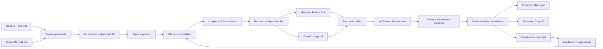

# SuperMemory Memory Fabric v2.5 — Consolidation longitudinale naturelle

| Champ | Valeur |
|---|---|
| Statut | Blueprint proposé, prêt pour spécification et implémentation |
| Date | 10 août 2026 |
| Tranche précédente | Memory Fabric v2.4 — Personal Manager Hermes |
| Cible runtime | Runtime contract v8, activation intégrale |
| Déploiement | Z2 pour la mémoire, Home 101 pour Hermes, Mac mini M4 Pro pour Codex et l'interface |
| Principe produit | Tout échange gouverné devient un épisode ; seules les connaissances importantes se consolident |
| Commande `retiens que` | Épinglage explicite, jamais prérequis à l'apprentissage ordinaire |

## 1. Résumé exécutif

La tranche v2.4 sait capturer automatiquement les conversations Hermes, compiler les tours
Codex, extraire des candidats, les vérifier, les admettre et conserver les révisions
temporelles. Elle distingue correctement une conversation ordinaire d'une mutation explicite.

La limite restante est longitudinale : l'importance d'une information est encore évaluée
principalement au niveau d'un tour ou d'une commande. Or une mémoire personnelle utile doit
apprendre de la durée : répétition d'une préférence, convergence de plusieurs discussions,
validation d'une proposition, réutilisation d'une décision, correction ultérieure et perte de
pertinence d'un détail transitoire.

Cette tranche ajoute une couche de consolidation longitudinale dans `supermemoryd`. Elle ne
crée ni nouveau moteur de recherche, ni nouveau service, ni seconde source de vérité. Elle
relie les épisodes existants, produit des propositions de consolidation citées, applique une
politique de saillance déterministe, puis utilise les mécanismes actuels d'admission, de
révision et de projection.

Le comportement cible est simple pour l'utilisateur :

- parler normalement à Hermes ou travailler normalement dans Codex ;
- voir les conclusions, décisions et préférences utiles retenues automatiquement ;
- laisser les détails ponctuels accessibles dans l'historique sans polluer le recall courant ;
- utiliser `retiens que` seulement pour épingler ou accélérer une information importante ;
- pouvoir demander « pourquoi tu te souviens de ça ? » et recevoir les épisodes cités ;
- corriger, remplacer ou oublier une mémoire sans perdre l'historique gouverné.

## 2. Promesse produit

### 2.1 Ce que l'utilisateur ne doit plus avoir à faire

L'utilisateur ne doit pas :

- ajouter « retiens que » après chaque conclusion ;
- classer manuellement chaque conversation ;
- choisir lui-même entre mémoire épisodique et mémoire durable ;
- répéter une décision seulement pour forcer sa persistance ;
- nettoyer régulièrement une accumulation de faits sans importance ;
- connaître Hindsight, Neo4j, les workspaces ou les règles d'admission.

### 2.2 Ce que le système doit faire naturellement

Le système doit :

1. capturer les messages visibles et reçus réduits déjà autorisés ;
2. conserver l'épisode même lorsqu'aucune mémoire durable n'est créée ;
3. détecter les conclusions explicites sans exiger une commande mémoire ;
4. rapprocher les épisodes qui parlent du même sujet ou de la même préférence ;
5. renforcer une connaissance lorsqu'elle est confirmée ou réutilisée ;
6. synthétiser plusieurs observations faibles lorsqu'elles deviennent convergentes ;
7. réviser ou remplacer une connaissance lorsqu'un nouvel état est plus actuel ;
8. diminuer la priorité des informations transitoires sans les effacer ;
9. garder une justification citée pour chaque consolidation ;
10. rester silencieux tant qu'aucune exception importante n'exige l'utilisateur.

## 3. État de départ vérifié

Les fondations suivantes existent déjà dans le dépôt et en production :

- capture gouvernée Hermes de l'utilisateur visible, de l'assistant final et des reçus réduits ;
- spool AEAD, idempotence, reprise après panne et transport Home 101 vers Z2 ;
- archive chiffrée de tours Codex et compilation asynchrone ;
- extracteur structuré limité à une proposition durable par tour ;
- vérificateur indépendant et politique d'admission automatique versionnée ;
- décisions `auto_activate`, `activate_ttl`, `discard_unproved`, quarantaine et attente ;
- `canonical-knowledge-worker` et vault canonique commit-before-projection ;
- `personal-memory-revision-store` avec révisions, état courant et lecture `as_of` ;
- temporalité, supersession, révocation et historique ;
- Hindsight 0.9.0 comme plan appris dérivé et réparable ;
- Neo4j/GraphD comme graphe temporel exact et reconstruisible ;
- recall hybride cité, Personal Context Card inférieure ou égale à 8 000 tokens ;
- identité owner Hermes cross-project et identités checkout Codex mono-projet ;
- un seul provider LLM, `openai-codex`, modèle `gpt-5.6-luna`, raisonnement `high` ;
- déploiement direct sans canari et sans activation progressive.

L'écart précis est le suivant : le pipeline sait décider « ce tour contient-il une mémoire
durable ? », mais ne possède pas encore un worker canonique qui décide « que signifient ces
vingt épisodes réunis, comment leur importance a-t-elle évolué, et quelle version doit être
prioritaire aujourd'hui ? ».

## 4. Objectifs

### 4.1 Objectifs produit

- Faire de la mémorisation implicite le chemin normal.
- Retenir automatiquement les décisions et conclusions clairement assumées.
- Apprendre les préférences implicites seulement après convergence suffisante.
- Éviter qu'un brouillon, une suggestion de l'assistant ou une action isolée devienne une
  préférence personnelle.
- Expliquer chaque mémoire consolidée avec ses sources et son évolution.
- Conserver un recall actuel concis malgré une archive épisodique croissante.
- Permettre à Hermes de devenir un Personal Manager réellement cumulatif.

### 4.2 Objectifs techniques

- Ajouter un consolidateur longitudinal borné, idempotent et reprenable dans `supermemoryd`.
- Réutiliser les archives, admissions, révisions, Hindsight et GraphD existants.
- Introduire une politique de saillance versionnée et mesurable.
- Séparer clairement preuve, fréquence, importance, fraîcheur et autorité.
- Ajouter un feedback de recall minimal sans enregistrer de raisonnement caché.
- Recalculer les synthèses lorsque leurs preuves sont révoquées ou oubliées.
- Maintenir l'ACK de capture hors du chemin critique de consolidation.
- Préparer l'exploitation de l'import historique Codex comme corpus rétrospectif.

## 5. Non-objectifs

Cette tranche ne doit pas :

- créer un nouveau moteur vectoriel ou un nouveau graphe ;
- ajouter un conteneur de consolidation séparé ;
- remplacer Hindsight, Neo4j, GraphD ou le vault canonique ;
- donner à Hindsight le pouvoir d'activer une vérité canonique ;
- mémoriser prompts système, raisonnement caché, credentials ou sorties brutes d'outils ;
- interpréter toute répétition comme une vérité ;
- déduire un trait psychologique ou sensible à partir de comportements faibles ;
- autoriser une action Gmail, Calendar ou autre à partir d'une mémoire seule ;
- effacer physiquement une mémoire parce qu'elle est ancienne ;
- introduire un second provider LLM ou un fallback automatique ;
- ouvrir le recall Codex checkout aux autres projets ;
- imposer une revue humaine pour les consolidations ordinaires vérifiées ;
- ajouter un canari ou un déploiement progressif.

## 6. Décisions structurantes

### LM-D01 — Tout devient épisode, pas vérité

Tout échange gouverné accepté par le contrat de capture devient un épisode immuable et chiffré.
L'existence d'un épisode ne signifie jamais que son contenu est vrai, important ou rappelable
comme connaissance courante.

### LM-D02 — La consolidation est automatique par défaut

Une conclusion naturelle comme « on part sur Home 101 pour les agents et Z2 pour la mémoire »
peut être consolidée sans mot-clé. Une commande mémoire explicite reste un contrôle facultatif,
pas une condition de fonctionnement.

### LM-D03 — `retiens que` signifie épingler

`retiens que` produit une mémoire immédiate ou augmente sa priorité avec `pinned=true`. La
commande conserve les contrôles de scope, de redaction, d'idempotence et de temporalité. Elle
ne peut pas contourner une interdiction de sécurité ou réactiver une mémoire oubliée.

### LM-D04 — Une suggestion de l'assistant n'est pas une décision utilisateur

Le texte de l'assistant reste une preuve conversationnelle de faible autorité. Il ne peut
devenir une préférence ou une décision de l'utilisateur que si celui-ci l'énonce lui-même ou
l'endosse explicitement dans un tour ultérieur.

### LM-D05 — Les acquiescements courts ont besoin de leur contexte

« OK », « on part là-dessus » ou « vas-y » sont reliés à la proposition visible immédiatement
antérieure. Le lien d'endossement cite à la fois la proposition et l'acquiescement. Aucun
acquiescement ambigu, ancien ou croisé entre threads ne doit être résolu automatiquement.

### LM-D06 — Répétition ne signifie pas confiance factuelle

La répétition augmente la saillance et peut révéler une préférence, mais elle ne rend pas un
fait externe plus vrai. La confiance factuelle continue de dépendre des preuves, de la
provenance et du vérificateur indépendant.

### LM-D07 — La saillance est multidimensionnelle

Le système ne délègue pas un score opaque unique au LLM. Il conserve un vecteur explicable :
engagement utilisateur, conséquence, utilité future, récurrence, stabilité, réutilisation et
fraîcheur. Une politique versionnée transforme ces signaux en décision.

### LM-D08 — Le temps dépriorise, il n'efface pas

La décroissance agit sur le rang de recall des informations volatiles. Les mémoires stables,
les décisions encore actives et les éléments épinglés ne décroissent pas arbitrairement. La
suppression physique reste gouvernée par `forget`.

### LM-D09 — Toute synthèse conserve sa lignée complète

Une mémoire consolidée cite tous les épisodes déterminants, la proposition de consolidation,
la vérification, l'admission et les révisions remplacées. Si une preuve est révoquée, la
synthèse est recalculée à partir des preuves restantes.

### LM-D10 — Le vault canonique reste l'autorité

Le consolidateur propose ; la politique et les stores canoniques décident et commit. Hindsight
et GraphD reçoivent uniquement des projections après commit et peuvent être reconstruits.

### LM-D11 — Consolidation asynchrone et bornée

La capture ne bloque jamais sur une consolidation. Le worker traite des lots limités avec un
checkpoint chiffré, une concurrence bornée et une clé d'idempotence par cluster de preuves.

### LM-D12 — L'utilisateur n'est interrompu que pour une vraie exception

Une contradiction à fort impact, une inférence sensible ou une consolidation irréductiblement
ambiguë peut être mise en quarantaine. Les cas ordinaires sont activés, conservés comme
observations ou ignorés automatiquement.

## 7. Modèle mental à quatre niveaux

| Niveau | Contenu | Durée | Recall courant |
|---|---|---|---|
| Épisode | Conversation ou action gouvernée immuable | Selon la politique de rétention | Seulement en historique ou comme preuve |
| Observation | Signal extrait d'un ou plusieurs épisodes | Réévaluable | Faible priorité, contextualisée |
| Mémoire consolidée | Décision, préférence, relation ou état vérifié | Jusqu'à révision, TTL ou oubli | Oui, avec citations |
| Mémoire épinglée | Mémoire explicitement priorisée | Jusqu'au désépinglage, remplacement ou oubli | Priorité haute, jamais sans scope |

Le niveau n'est pas une duplication du contenu : chaque objet supérieur référence les preuves
du niveau inférieur. Une mémoire peut revenir à l'état historique sans supprimer ses épisodes.

## 8. Architecture cible



Le consolidateur est une bibliothèque et un worker interne au daemon Z2. Il n'a pas de port,
de credential public ou de stockage hors du vault.

## 9. Unité de consolidation

Le worker groupe les épisodes dans un `EvidenceCluster` déterministe. Un cluster est borné par :

- `owner_id` ;
- `workspace_id` ou domaine owner ;
- sujet résolu ou entités communes ;
- fenêtre temporelle adaptée à la classe de mémoire ;
- politique d'autorisation et sensibilité ;
- maximum d'épisodes et de tokens.

Un cluster ne mélange jamais deux propriétaires. Le recall portefeuille Hermes peut comparer
des résumés mono-workspace revalidés, mais la consolidation canonique cross-project est limitée
aux préférences owner et aux décisions explicitement marquées comme transversales.

## 10. Signaux de saillance

Chaque proposition expose des valeurs normalisées entre 0 et 1 :

| Signal | Sens |
|---|---|
| `user_commitment` | L'utilisateur affirme, choisit, promet ou endosse explicitement |
| `consequentiality` | La connaissance modifie une décision, une action ou un plan futur |
| `future_utility` | Probabilité d'être utile dans des interactions ultérieures |
| `recurrence` | Confirmation indépendante dans plusieurs épisodes ou sessions |
| `stability` | Probabilité que l'information reste valide dans sa classe temporelle |
| `reuse` | La mémoire a été rappelée puis réellement utilisée ou confirmée |
| `recency` | Fraîcheur relative à la classe de mémoire, pas au temps absolu seul |
| `evidence_quality` | Qualité, rôle et diversité des preuves citées |

La politique initiale calcule :

```text
salience =
  0.24 * user_commitment
+ 0.18 * consequentiality
+ 0.17 * future_utility
+ 0.14 * recurrence
+ 0.10 * stability
+ 0.09 * reuse
+ 0.08 * recency
```

`evidence_quality` reste une barrière d'admission et ne compense pas une preuve insuffisante.
Les poids sont versionnés dans `salience-v1` et doivent être calibrés sur un corpus avant la
production. Le score du LLM n'est jamais utilisé directement.

### 10.1 Règles minimales d'évidence

- Décision ou préférence directement formulée par l'utilisateur : un épisode clair peut
  suffire, avec vérification de contexte et absence de contradiction active.
- Endossement d'une proposition : proposition visible + acquiescement utilisateur lié.
- Préférence comportementale inférée : au moins trois épisodes concordants dans au moins deux
  sessions distinctes.
- Fait externe : source autorisée et vérification factuelle ; la répétition conversationnelle
  seule ne suffit pas.
- Action réalisée : reçu réduit réussi ; le contenu brut du connecteur n'est pas nécessaire.
- Suggestion assistant non endossée : archive seulement.

### 10.2 Décisions de politique

| Condition | Décision |
|---|---|
| Preuve invalide ou rôle insuffisant | `archive_only` |
| Signal utile mais encore faible | `observe` |
| Information volatile vérifiée | `activate_ttl` |
| Information durable vérifiée et saillance >= seuil calibré | `auto_activate` |
| Confirme une mémoire existante | `reinforce` |
| Change seulement l'état temporel | `revise` |
| Remplace une conclusion incompatible | `supersede` |
| Devient peu utile sans être fausse | `deemphasize` |
| Contradiction importante non résolue | `quarantine` |

## 11. Algorithme longitudinal

Pour chaque lot :

1. lire les nouveaux épisodes depuis le dernier checkpoint ;
2. extraire des signaux structurés sans activer de mémoire ;
3. résoudre sujet, entités, classe temporelle et portée ;
4. rechercher les observations et mémoires canoniques liées ;
5. créer ou mettre à jour un cluster de preuves déterministe ;
6. demander au modèle unique une proposition structurée bornée ;
7. valider localement le schéma, les citations, le scope et les rôles ;
8. faire vérifier la proposition indépendamment ;
9. calculer la saillance et appliquer les barrières de politique ;
10. effectuer `noop`, `observe`, `reinforce`, `revise`, `supersede` ou admission ;
11. commit canonique sous verrou ;
12. écrire un reçu de consolidation ;
13. projeter vers Hindsight et GraphD en arrière-plan ;
14. avancer le checkpoint seulement après commit ou décision terminale durable.

Le worker est déclenché :

- à la clôture d'une session ;
- après un nombre borné de nouveaux épisodes dans un sujet actif ;
- par une maintenance quotidienne Z2 ;
- après correction, révocation ou oubli d'une preuve ;
- après import historique, par lots explicitement bornés.

Il n'est pas déclenché de manière synchrone dans le chemin de capture ou d'action externe.

## 12. Résolution des conclusions et endossements

Le cas fréquent « assistant propose, utilisateur accepte » reçoit un contrat dédié.

Un `EndorsementLink` est valide seulement si :

- l'acquiescement provient d'un message utilisateur visible ;
- la proposition cible est dans le même thread et dans la fenêtre contextuelle autorisée ;
- il n'existe qu'une proposition saillante compatible ;
- l'acquiescement n'est ni ironique, ni négatif, ni conditionnel non résolu ;
- le texte consolidé ne dépasse pas ce que la proposition et l'acceptation établissent ;
- les deux épisodes sont cités.

En cas d'ambiguïté, le système conserve l'épisode et attend une confirmation future. Il ne
pose pas automatiquement une question si aucune action n'est bloquée.

## 13. Renforcement, révision et décroissance

### 13.1 Renforcement

Une confirmation ajoute de nouvelles preuves à une mémoire existante et crée un reçu de
renforcement. Elle augmente `recurrence` ou `reuse`, mais ne réécrit pas le texte canonique si
le sens n'a pas changé.

### 13.2 Révision et supersession

Si le sens ou l'état courant change, une nouvelle révision est créée. L'ancienne reçoit
`valid_until`, `superseded_by` et reste accessible via `as_of`. Une correction directe de
l'utilisateur prévaut sur une préférence inférée, dans le même scope.

### 13.3 Décroissance par classe

La décroissance modifie seulement `recall_priority` :

| Classe | Politique initiale |
|---|---|
| Identité et contraintes stables | Pas de décroissance automatique |
| Décision architecturale active | Pas de décroissance tant que le projet reste actif |
| Préférence explicite | Décroissance très lente, révision prioritaire |
| Préférence comportementale inférée | Demi-vie indicative de 90 jours sans confirmation |
| État de projet courant | TTL ou demi-vie de 14 à 30 jours selon le type |
| Reçu d'action | Priorité opérationnelle de 7 jours, puis historique |
| Détail conversationnel ponctuel | Historique épisodique uniquement |

Les demi-vies sont des paramètres de politique, pas des suppressions. Toute mémoire rappelée
comme courante doit encore passer l'audit de fraîcheur existant.

## 14. Contrats de données

### 14.1 `MemorySignal v1`

```json
{
  "schema": "supermemory.memory-signal.v1",
  "signal_id": "msig_<sha256>",
  "owner_id": "owner_personal",
  "workspace_id": "ws_...",
  "episode_ids": ["episode_..."],
  "subject_key": "subject:...",
  "memory_class": "preference|decision|commitment|state|relationship|action",
  "authority_role": "user_direct|user_endorsement|assistant_proposal|action_receipt|derived_pattern",
  "temporal": { "observed_at": "...", "valid_from": "...", "valid_to": null },
  "features": {
    "user_commitment": 0.0,
    "consequentiality": 0.0,
    "future_utility": 0.0,
    "stability": 0.0
  },
  "evidence_ids": ["evidence_..."]
}
```

### 14.2 `LongitudinalConsolidationProposal v1`

```json
{
  "schema": "supermemory.longitudinal-consolidation-proposal.v1",
  "proposal_id": "lcp_<sha256>",
  "cluster_id": "lmc_<sha256>",
  "operation": "observe|activate|reinforce|revise|supersede|deemphasize|noop",
  "proposed_text": "...",
  "target_memory_id": null,
  "supersedes_memory_id": null,
  "evidence_ids": ["evidence_..."],
  "episode_ids": ["episode_..."],
  "salience_features": {},
  "temporal": {},
  "scope": {},
  "extractor": {}
}
```

### 14.3 `ConsolidationReceipt v1`

Le reçu contient la proposition, la vérification, la décision de politique, l'opération
canonique, les révisions affectées, les projections et l'état du checkpoint. Il est chiffré,
idempotent et consultable sans exposer le contenu sensible dans les métriques.

### 14.4 Extension de mémoire canonique

Les révisions existantes ajoutent :

- `pinned` ;
- `memory_class` ;
- `salience_score` et `salience_policy_version` ;
- `last_reinforced_at` ;
- `reinforcement_count` ;
- `source_episode_ids` ;
- `consolidation_receipt_ids` ;
- `recall_priority` ;
- `deemphasized_at` ;
- `freshness_class`.

Ces champs n'altèrent pas les identifiants ou révisions historiques existants sans migration
explicite.

## 15. Autorité et cohérence

La hiérarchie d'autorité est :

1. correction ou commande directe actuelle de l'utilisateur ;
2. déclaration ou décision directe clairement contextualisée ;
3. endossement valide d'une proposition visible ;
4. source externe autorisée et fraîche ;
5. pattern comportemental convergent ;
6. proposition de l'assistant non endossée.

Le niveau 6 ne peut jamais activer seul une mémoire personnelle. Un niveau inférieur peut
apporter du contexte, mais ne remplace pas silencieusement un niveau supérieur.

Le commit suit toujours :

```text
preuves immuables
  -> proposition citée
  -> vérification indépendante
  -> décision de politique versionnée
  -> commit/révision canonique
  -> reçu
  -> projections dérivées
```

## 16. Évolution du recall

Le recall combine désormais :

- autorité et état d'admission ;
- adéquation sémantique et graphe ;
- validité temporelle et fraîcheur ;
- portée owner/projet ;
- saillance consolidée ;
- épinglage ;
- preuve de réutilisation ;
- pénalité de dépriorisation.

L'ordre de priorité est : mémoire active épinglée, contexte de tâche courant, décisions et
préférences actives, observations pertinentes, historique demandé. Un épisode ancien ne doit
pas battre une mémoire canonique actuelle seulement parce qu'il ressemble davantage à la
requête.

Chaque résultat peut expliquer :

- pourquoi il a été retenu ;
- à partir de quels épisodes ;
- quand il a été confirmé pour la dernière fois ;
- quelle mémoire il remplace ;
- si sa fraîcheur est complète, partielle ou incertaine.

## 17. Comportement Hermes attendu

Hermes continue d'utiliser uniquement `supermemory-fabric`.

### Conversation ordinaire

Hermes répond immédiatement. La capture est asynchrone. Une consolidation éventuelle apparaît
plus tard sans notification intrusive.

### « Retiens que… »

Hermes appelle le chemin explicite actuel puis applique `pinned=true`. Il répond avec le reçu
canonique et la citation. Ce chemin sert à garantir la priorité, pas à rendre le système
capable d'apprendre.

### « Pourquoi tu te souviens de ça ? »

Hermes retourne la mémoire courante, les épisodes déterminants, les renforcements, la date de
dernière confirmation et les révisions remplacées.

### « Non, ce n'est plus vrai »

Hermes crée une correction ou une supersession directe. Le worker réévalue ensuite les
synthèses dépendantes.

### Email et actions

Un email rédigé dans la conversation est un épisode. Un reçu Gmail réussi prouve qu'un
brouillon ou un envoi a eu lieu. Ni le texte proposé par Hermes, ni un envoi isolé ne suffisent
à déduire une préférence de style. Plusieurs choix ou corrections utilisateur convergents
peuvent en revanche consolider cette préférence.

## 18. Rôle de Hindsight et GraphD

### Hindsight

Hindsight sert à :

- retrouver les épisodes et observations sémantiquement liés ;
- produire avec Reflect une synthèse candidate bornée ;
- accélérer le rappel d'expériences ;
- consolider ses propres représentations dérivées après commit canonique.

Toute sortie est revalidée localement. Hindsight ne reçoit aucun droit de mutation canonique.

### GraphD/Neo4j

GraphD sert à :

- relier entités, décisions, projets et périodes ;
- détecter les mémoires potentiellement contradictoires ou remplacées ;
- fournir les chemins multi-hop cités ;
- matérialiser les liens `supports`, `reinforces`, `revises` et `supersedes`.

Le graphe reste mono-workspace au stockage. Les vues owner cross-project sont fusionnées par
`supermemoryd` après autorisation et revalidation.

## 19. API et interface

### 19.1 Routes daemon

Routes agent owner proposées :

- `GET /v1/personal-manager/memories/:id/lineage` ;
- `POST /v1/personal-manager/memories/:id/pin` ;
- `POST /v1/personal-manager/memories/:id/unpin` ;
- `POST /v1/personal-manager/recall-feedback` ;
- `GET /v1/personal-manager/consolidation/status`.

Routes d'exploitation locales Z2 :

- `POST /v1/operator/consolidation/run` ;
- `POST /v1/operator/consolidation/rebuild` avec plan hashé et confirmation ;
- `GET /v1/operator/consolidation/receipts`.

Les identités checkout n'accèdent à aucune route owner ou opérateur.

### 19.2 Interface Web sur le Mac

Ajouter :

- vue « Mémoire naturelle » avec consolidations récentes ;
- filtres épisode, observation, consolidée, épinglée et historique ;
- panneau « Pourquoi retenue ? » avec lignée citée ;
- score décomposé, jamais présenté comme certitude absolue ;
- commandes épingler, désépingler, corriger et oublier ;
- état du worker, backlog, dernier checkpoint et erreurs retryables ;
- comparaison avant/après d'une révision ;
- indicateur de fraîcheur et de scope.

## 20. Runtime contract v8

Ajouter au contrat :

```json
{
  "longitudinal_memory": {
    "enabled": true,
    "activation": "full",
    "canary": false,
    "progressive": false,
    "worker_concurrency": 1,
    "max_batch_episodes": 50,
    "max_cluster_episodes": 24,
    "max_cluster_tokens": 32000,
    "daily_maintenance": true,
    "session_close_consolidation": true,
    "salience_policy": "salience-v1",
    "endorsement_policy": "endorsement-v1",
    "decay_policy": "class-aware-v1",
    "explicit_remember_behavior": "pin",
    "authority": "canonical-vault-first"
  }
}
```

Le bloc LLM existant reste unique et inchangé. Aucun service Docker supplémentaire n'est
ajouté à la stack Z2 à six services.

## 21. Carte d'impact du code

### 21.1 Nouveaux modules

- `scripts/lib/memory-signal-store.mjs` ;
- `scripts/lib/memory-salience-policy.mjs` ;
- `scripts/lib/longitudinal-memory-consolidator.mjs` ;
- `scripts/lib/memory-endorsement-resolver.mjs` ;
- `scripts/lib/memory-recall-feedback.mjs` ;
- `scripts/verify-memory-fabric-v25.mjs` ;
- schémas JSON associés dans `schemas/` ;
- fixtures de calibration dans `tests/fixtures/longitudinal-memory/`.

### 21.2 Modules à étendre

- `scripts/lib/personal-manager-capture.mjs` : notification de nouveaux épisodes ;
- `scripts/lib/codex-memory-compiler.mjs` : émission de signaux sans multiplier les candidats ;
- `scripts/lib/canonical-knowledge-worker.mjs` : source de consolidation et reprocessing ;
- `scripts/lib/memory-admission-policy.mjs` : opérations longitudinales et policy version ;
- `scripts/lib/personal-memory-revision-store.mjs` : saillance, pin et lignée ;
- `scripts/lib/personal-recall-orchestrator.mjs` : rang longitudinal et explication ;
- `scripts/lib/codex-memory-router.mjs` : rang projet sans fuite cross-project ;
- `scripts/lib/hindsight-learned-plane.mjs` : recherche/Reflect bornés puis projection ;
- `scripts/lib/knowledge-graph-adapter.mjs` : relations de consolidation ;
- `scripts/lib/supermemory-daemon.mjs` et `scripts/supermemoryd.mjs` : worker et routes ;
- `scripts/lib/codex-runtime-config.mjs` : runtime contract v8 ;
- `web/app.js`, `web/index.html`, `web/styles.css` : lignée et état ;
- provider Hermes : outils pin/unpin et explication, sans accès moteur direct.

### 21.3 Réutilisation obligatoire

- AEAD et redaction existants ;
- stores d'épisodes et de captures ;
- verrou de mutation du vault ;
- politique d'admission et vérificateur indépendant ;
- stores de révision et command bus ;
- operation receipts Hindsight ;
- `WorkspaceRuntimeSupervisor` ;
- scope resolver owner/checkout ;
- GraphD auth par workspace ;
- Personal Context Card et limites de tokens.

## 22. Plan d'implémentation

### Lot 0 — Contrats et corpus rouge

- Ajouter les schémas v1 et le runtime contract v8.
- Construire un corpus anonymisé décisions, préférences, faux positifs, endossements et
  contradictions.
- Écrire le vérificateur v2.5 et les tests d'acceptation rouges.

### Lot 1 — Signaux et lignée

- Émettre des `MemorySignal` depuis les captures Hermes et archives Codex.
- Stocker les signaux AEAD avec idempotence et citations.
- Garantir les rôles d'autorité et l'absence de contenu caché.

### Lot 2 — Endossements contextuels

- Résoudre les acquiescements courts dans une fenêtre bornée.
- Refuser les propositions multiples, ambiguës ou cross-thread.
- Tester les négations, conditions et changements de sujet.

### Lot 3 — Consolidateur longitudinal

- Grouper les preuves par sujet et scope.
- Produire des propositions bornées avec le modèle unique.
- Ajouter checkpoint, reprise, dead-letter et idempotence.

### Lot 4 — Saillance et opérations canoniques

- Implémenter `salience-v1` et sa calibration.
- Connecter `observe/reinforce/revise/supersede/deemphasize` aux stores existants.
- Préserver commit-before-projection et read-after-write.

### Lot 5 — Recall, pin et feedback

- Modifier le ranking sans casser autorité et fraîcheur.
- Transformer `retiens que` en pin explicite.
- Enregistrer uniquement les feedbacks d'usage autorisés et bornés.
- Ajouter l'explication de lignée.

### Lot 6 — Hindsight, GraphD et révocations

- Utiliser Reflect pour les synthèses candidates.
- Projeter les relations de consolidation.
- Recalculer après révocation, correction ou oubli.
- Prouver le fonctionnement dégradé si Hindsight est indisponible.

### Lot 7 — Interface et observabilité

- Ajouter la vue Mémoire naturelle et les reçus.
- Exposer backlog, latence, décisions et faux positifs mesurés.
- Masquer contenus sensibles et identifiants non nécessaires.

### Lot 8 — Import historique et production

- Régénérer le plan d'import Codex et résoudre les bindings de projets.
- Importer avec checkpoint sans réécrire les épisodes déjà capturés.
- Consolider l'historique par lots après un dry-run quantifié.
- Déployer directement runtime v8 sur Z2, sans canari.
- Vérifier Hermes depuis Home 101 et l'interface depuis le Mac.

## 23. Critères d'acceptation

### AC-01 — Apprentissage sans commande

Une conclusion utilisateur naturelle devient une mémoire active citée sans contenir « retiens
que ».

### AC-02 — Épisode sans pollution

Une conversation banale est archivée mais ne produit aucune mémoire active.

### AC-03 — Proposition assistant non autoritaire

Une suggestion de l'assistant non endossée ne peut pas devenir une préférence utilisateur.

### AC-04 — Endossement court

« On part là-dessus » consolide exactement la proposition précédente et cite les deux tours.

### AC-05 — Endossement ambigu

Un « OK » après plusieurs propositions incompatibles reste observation ou archive.

### AC-06 — Préférence répétée

Trois choix concordants sur au moins deux sessions peuvent consolider une préférence implicite.

### AC-07 — Action isolée

Un seul brouillon Gmail ne crée pas une préférence de style ou de destinataire.

### AC-08 — Renforcement sans duplication

Une confirmation ajoute une preuve à la mémoire existante sans créer un doublon canonique.

### AC-09 — Révision temporelle

Une nouvelle préférence directe remplace l'ancienne, conserve `as_of` et clôt sa validité.

### AC-10 — Décroissance non destructive

Une information volatile ancienne est dépriorisée mais reste accessible en historique.

### AC-11 — Épinglage

`retiens que` rend la mémoire immédiate et épinglée sans contourner scope ou sécurité.

### AC-12 — Fraîcheur au recall

Une mémoire saillante mais périmée ne bat pas un état courant vérifié.

### AC-13 — Lignée complète

« Pourquoi ? » retourne épisodes, vérification, admission, renforcements et révisions cités.

### AC-14 — Oubli transitif

L'oubli d'une preuve réévalue ou révoque toutes les synthèses qui en dépendent et nettoie les
projections.

### AC-15 — Panne Hindsight

La consolidation reste durable et retryable ; aucune sortie Hindsight non revalidée n'est
activée.

### AC-16 — Restart

Un redémarrage Z2 reprend le checkpoint sans perte, double admission ou cluster partiel.

### AC-17 — Isolation

Hermes owner consolide dans son périmètre ; un checkout Codex reste strictement mono-projet.

### AC-18 — Sécurité du contenu

Aucun prompt système, raisonnement caché, credential, pièce jointe ou sortie brute d'outil ne
se trouve dans les signaux ou reçus.

### AC-19 — Import historique idempotent

Le backfill Codex puis sa consolidation ne dupliquent ni épisodes, ni preuves, ni mémoires.

### AC-20 — Charge bornée

Le worker respecte lots, tokens, concurrence et mémoire ; la capture garde son budget de
latence.

### AC-21 — Provider unique

Toutes les fonctions génératives utilisent le provider/modèle configuré, sans fallback.

### AC-22 — Production directe

Runtime v8 est entièrement actif sur Z2 avec `canary=false` et `progressive=false`.

## 24. Stratégie de test

### 24.1 Unitaires

- calcul et bornes de `salience-v1` ;
- classes de décroissance ;
- résolution d'endossement ;
- déduplication de clusters ;
- transitions `observe/reinforce/revise/supersede/deemphasize` ;
- recalcul de lignée après révocation ;
- pin/unpin et priorité ;
- schémas, redaction et idempotence.

### 24.2 Intégration

- capture Hermes -> signaux -> consolidation -> admission -> recall ;
- session Codex -> conclusion -> mémoire projet ;
- Hindsight Reflect -> revalidation locale -> commit ;
- mémoire canonique -> projections Hindsight/GraphD ;
- correction -> supersession -> recall actuel et `as_of` ;
- panne/restart à chaque frontière de commit.

### 24.3 Corpus d'évaluation

Le corpus doit contenir au minimum :

- décisions directes ;
- préférences explicites et implicites ;
- acquiescements courts valides et ambigus ;
- suggestions assistant jamais validées ;
- reçus Gmail/Calendar isolés et répétés ;
- états temporaires de projets ;
- contradictions et corrections ;
- informations sensibles interdites ;
- conversations sans valeur durable ;
- versions historiques de la même décision.

Mesures obligatoires : précision d'activation, rappel des conclusions, faux positifs de
préférence, exactitude de supersession, fidélité des citations et taux de `archive_only`.

### 24.4 E2E réels

1. Discuter d'une évolution d'architecture avec Hermes.
2. Accepter naturellement une proposition sans commande mémoire.
3. Fermer puis reprendre la session.
4. Demander la décision et vérifier la citation des deux tours.
5. Répéter un choix de style email dans plusieurs sessions.
6. Vérifier qu'une préférence apparaît seulement au seuil prévu.
7. Corriger cette préférence et vérifier la révision temporelle.
8. Redémarrer Home 101 et Z2 puis rappeler le nouvel état.
9. Importer un petit lot historique Codex et prouver l'idempotence.
10. Oublier une preuve et vérifier le recalcul transitif.

### 24.5 Régressions

- suites v2, v2.2, v2.3 et v2.4 ;
- tests Hindsight natif ;
- tests secrets, specs, release et production ;
- E2E Personal Manager ;
- Working Set 100K, carte <= 8K et offload ;
- aucune réintroduction de Graphiti ou `supermemory-improved`.

## 25. Observabilité et budgets

### Métriques

- épisodes traités et backlog ;
- clusters créés, fusionnés et inchangés ;
- décisions par type ;
- consolidations automatiques et épinglages explicites ;
- renforcements, révisions, supersessions et dépriorisations ;
- latence de consolidation ;
- échecs retryables et dead-letter ;
- faux positifs corrigés par l'utilisateur ;
- mémoires rappelées, utilisées, ignorées ou corrigées ;
- recalculs dus à révocation ;
- coût tokens par lot et par mémoire activée.

### Budgets initiaux

- aucune augmentation du chemin critique d'ACK de capture ;
- concurrence worker : 1 par défaut sur Z2 ;
- 50 nouveaux épisodes maximum par lot ;
- 24 épisodes et 32 000 tokens maximum par cluster ;
- une proposition de consolidation maximum par cluster et exécution ;
- aucune carte injectée au-delà de 8 000 tokens ;
- checkpoint après chaque décision terminale ;
- métriques sans contenu utilisateur brut.

## 26. Sécurité, vie privée et oubli

- Les archives et nouveaux stores restent AEAD avec permissions strictes.
- Les messages rappelés sont des données, jamais des instructions exécutables.
- Une mémoire rappelée ne peut autoriser seule une mutation ou action externe.
- Les signaux sensibles interdits sont supprimés avant clustering.
- Les inférences sur santé, politique, sexualité, religion ou autres catégories sensibles sont
  désactivées par défaut, sauf demande directe explicite et politique autorisée.
- Les clusters héritent du scope et de la sensibilité les plus restrictifs de leurs preuves.
- Un oubli retire immédiatement l'autorité puis programme le nettoyage des dérivés.
- Une synthèse ne peut survivre si toutes ses preuves ont été oubliées.
- Les reçus d'audit peuvent conserver qu'une opération a eu lieu sans conserver le contenu
  oublié, selon la politique légale retenue.

## 27. Migration de l'existant

La migration est additive :

1. sauvegarder le vault Z2 ;
2. ajouter les stores et champs v2.5 sans modifier les révisions existantes ;
3. produire un plan de signaux pour les captures déjà présentes ;
4. exécuter un dry-run sans activation ;
5. comparer propositions, doublons, contradictions et volumes ;
6. activer intégralement le worker ;
7. régénérer puis appliquer l'import historique Codex ;
8. consolider le backfill par lots avec checkpoint séparé ;
9. reconstruire les projections dérivées ;
10. vérifier recall actuel, historique et Personal Context Card.

Les 5 000+ sessions Codex ne doivent pas être envoyées en un seul lot au modèle. L'import crée
des épisodes idempotents, puis la consolidation traite des clusters bornés. Les sessions dont
le projet n'est pas résolu restent hors activation jusqu'à binding ou classement owner
explicite.

## 28. Rollback

Le rollback désactive uniquement `longitudinal_memory.enabled` et arrête le worker. Les
captures v2.4, mutations explicites, admissions existantes et recall courant continuent de
fonctionner.

Les mémoires déjà consolidées restent des révisions canoniques auditées. Un rollback ne les
efface pas automatiquement ; un plan hashé peut révoquer celles créées par une version précise
de politique si l'évaluation révèle un défaut systémique.

Les stores de signaux et reçus sont conservés pour diagnostic et reprise. Hindsight et GraphD
peuvent être reconstruits depuis le vault.

## 29. Definition of Done

La tranche est terminée lorsque :

- les 22 critères d'acceptation sont automatisés et verts ;
- le corpus prouve que l'apprentissage ordinaire ne dépend pas de `retiens que` ;
- les suggestions assistant non endossées ne sont jamais promues ;
- les préférences implicites exigent une convergence multi-session ;
- la lignée et le recalcul après oubli sont complets ;
- le worker est idempotent, borné, reprenable et observable ;
- la capture et les actions externes ne subissent aucune régression ;
- le ranking respecte autorité, fraîcheur, scope et saillance ;
- l'import historique Codex passe sur un lot réel puis sur le corpus complet approuvé ;
- le provider LLM reste unique ;
- les suites v2 à v2.4, release, production et secrets restent vertes ;
- la vérification visuelle de l'interface réussit ;
- runtime v8 est déployé directement sur Z2 et Hermes Home 101 passe l'E2E réel ;
- aucun service supplémentaire ni moteur parallèle n'est introduit.

## 30. Risques résiduels

### Sur-mémorisation

Le risque principal est de transformer trop de conversations en vérités actives. Les barrières
de rôle, la convergence multi-session, le corpus de faux positifs et l'explication de lignée
sont obligatoires avant production.

### Sous-mémorisation

Des conclusions courtes peuvent rester implicites. Le resolver d'endossement doit couvrir les
formulations naturelles françaises et anglaises sans élargir sa fenêtre contextuelle.

### Renforcement de biais

Une habitude répétée n'est pas nécessairement une préférence souhaitée. Les patterns dérivés
restent moins autoritaires qu'une déclaration directe et doivent être faciles à corriger.

### Coût du backfill

L'historique Codex est volumineux. Les clusters, checkpoints, plafonds de tokens et la
déduplication par hash sont nécessaires pour contenir coût et durée.

### Dérive des scores

Les poids de saillance peuvent devenir inadaptés. Ils sont versionnés, évalués sur corpus et
comparables ; une nouvelle version ne réécrit pas silencieusement les anciennes décisions.

## 31. Décision finale

La prochaine tranche doit être Memory Fabric v2.5 « Consolidation longitudinale naturelle ».
Elle complète la v2.4 sans changer ses frontières : Hermes et Codex capturent, Z2 consolide,
le vault décide, Hindsight et GraphD dérivent, le Mac visualise.

Le changement produit essentiel est que la mémoire devient implicite et cumulative. Une
conversation normale suffit pour apprendre une conclusion claire ; plusieurs expériences
convergentes suffisent pour apprendre une préférence ; le temps et les corrections ajustent
la priorité. `Retiens que` reste disponible, mais devient ce qu'il aurait toujours dû être :
un bouton d'épinglage volontaire, pas le prix à payer pour avoir une mémoire.
