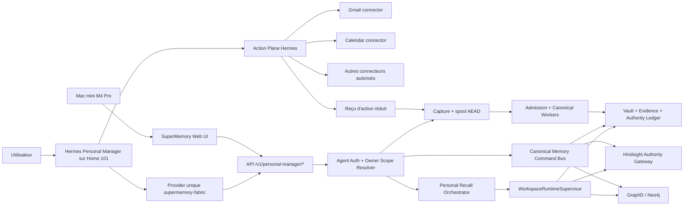

# SuperMemory Memory Fabric v2.4 — Personal Manager Hermes

| Champ | Valeur |
|---|---|
| Statut | Déployé : mémoire sur Z2, agent Hermes sur Home 101 |
| Date | 2026-08-10 |
| Cas d'usage prioritaire | Personal Manager omniscient pour le propriétaire unique |
| Runtime agent | Hermes natif sur Home 101 |
| Provider mémoire Hermes | `supermemory-fabric`, unique |
| Moteur appris | Hindsight 0.9.0+, derrière SuperMemory uniquement |
| Autorité | vault SuperMemory + ledger temporel + Neo4j/GraphD |
| Interface | Web UI sur le Mac mini M4 Pro, mémoire sur Z2, agent sur Home 101 |
| Déploiement | Activation intégrale ; `canary=false`, `progressive=false` |
| Document parent | [Memory Fabric v2.3 — Multi-Project Codex & Session Sync](./multi-project-codex-session-sync-blueprint.md) |

## État d'implémentation — 10 août 2026

La tranche est implémentée dans le dépôt : runtime v7, identité agent dédiée, API Personal
Manager, recall owner/projets, contexte cité ≤8K, révisions temporelles, mutations et oubli à
preuve de tour, capture Hermes gouvernée, spool AEAD, admission automatique, canonical worker,
projections Hindsight réparables, provider Hermes officiel, interface Web et stack Z2 à six
services. Hermes et ses connecteurs restent dans l'installation native Home 101. Le choix LLM
provient d'un unique bloc `llm` partagé par Hermes, Hindsight et le
pipeline canonique ; seules les valeurs `openai-codex` et `openrouter` sont acceptées et aucun
fallback n'est permis.

Les validations locales, statiques, unitaires, d'intégration et Compose font partie de
`npm run verify:memory-fabric-v24`. Le smoke avec les vrais credentials et connecteurs Hermes,
ainsi que le redéploiement Z2, restent des validations d'exploitation et ne sont pas exécutés
depuis le poste de développement.

## 1. Résumé exécutif

Cette tranche transforme la mémoire multi-projet existante en mémoire complète d'un agent
personnel Hermes. Le Personal Manager peut connaître les préférences du propriétaire, ses
projets, décisions, engagements, personnes, événements et sujets actifs. Il peut rechercher
dans tous les projets autorisés, expliquer ses réponses avec des citations et, lorsqu'une
demande explicite de l'utilisateur le lui demande, ajouter ou modifier immédiatement un
élément canonique.

La décision centrale est de ne pas connecter Hermes directement à Hindsight. Hermes charge un
seul provider mémoire externe nommé `supermemory-fabric`. Ce provider reprend les mécanismes utiles du
provider Hindsight officiel — lifecycle, prefetch, synchronisation de tours, changement de
session, file d'écriture et cohérence lecture-après-écriture — mais remplace tous les appels
Hindsight par des appels authentifiés à `supermemoryd`.

```text
Hermes
  -> provider unique supermemory-fabric
  -> API Personal Manager gouvernée
  -> autorité, redaction, admission, temporalité et citations SuperMemory
  -> Hindsight 0.9.0+ comme projection apprise
  -> Neo4j/GraphD comme graphe exact et reconstruisible
```

Le provider Hindsight natif n'est donc pas activé en production. Hindsight reste pleinement
utilisé, mais derrière la frontière d'autorité de SuperMemory. Il n'existe qu'un chemin de
lecture, un chemin d'écriture et un reçu canonique par opération.

## 2. Résultat produit attendu

Le propriétaire peut parler naturellement à son Personal Manager et obtenir les comportements
suivants.

### 2.1 Comprendre et rappeler

- « Où en sont mes projets et qu'est-ce qui est bloqué ? »
- « Qu'avons-nous décidé pour l'architecture de SuperMemory ? »
- « Retrouve la source exacte de cette décision. »
- « Qu'est-ce qui a changé depuis la semaine dernière ? »
- « Quels engagements ai-je pris envers cette personne ? »
- « Cette préférence est-elle toujours actuelle ? »

Le manager effectue un recall propriétaire et multi-projet, distingue état courant et
historique, indique la couverture de sa recherche et cite les preuves utilisées.

### 2.2 Ajouter et modifier sur demande

- « Ajoute que je préfère les réunions l'après-midi. »
- « Mets à jour le statut du projet X : en attente du retour de Paul. »
- « Cette décision remplace l'ancienne. »
- « Résous la contradiction : la date correcte est le 18 août. »
- « Cette information ne doit plus être utilisée. »

Une instruction utilisateur directe, singulière, autorisée et réversible est appliquée
immédiatement. La réponse contient le reçu de mutation et les citations de l'état créé et de
l'état remplacé. Une mise à jour ne réécrit jamais silencieusement l'histoire : elle crée une
nouvelle révision et clôt la validité de la précédente.

### 2.3 Apprendre sans sur-interpréter

Une conversation ordinaire peut produire des observations et candidats en arrière-plan, mais
elle ne crée pas directement une vérité active. Le pipeline d'admission existant vérifie la
preuve, le scope, la temporalité et le risque. Les inférences incertaines restent candidates,
provisoires ou en quarantaine.

## 3. État de départ vérifié dans le dépôt

La tranche v2.3 a déjà livré les fondations nécessaires :

- registre propriétaire, projets, workspaces et checkouts stables ;
- credential de checkout hashé et capacités bornées ;
- résolution du scope côté serveur ;
- `WorkspaceRuntimeSupervisor` multi-projet avec contextes bornés ;
- recall projet + préférences propriétaire ;
- une banque Hindsight déterministe par workspace ;
- GraphD et Neo4j partitionnés par workspace ;
- redaction des secrets et fichiers sensibles ;
- files chiffrées et reprises idempotentes ;
- Working Sets, Topic Dossiers et cartes citées ;
- interface Web multi-projet ;
- runtime v6 en activation intégrale.

Les écarts restant à combler sont précis :

1. il n'existe pas de provider mémoire Hermes `supermemory-fabric` ;
2. le credential checkout est lié à un projet et ne convient pas à un agent propriétaire ;
3. le superviseur fusionne propriétaire + projet courant, mais ne possède pas encore de
   recall portefeuille sur tous les projets ;
4. le store propriétaire actuel gère surtout des préférences promues, pas les cinq domaines
   opérationnels complets du Personal Manager ;
5. il manque un bus canonique de commandes `add/update/resolve/supersede/forget` ;
6. les routes et outils Hermes dédiés n'existent pas ;
7. la Web UI ne montre pas encore les sessions Hermes, les mutations et leur audit.

## 4. Objectifs

### 4.1 Objectifs produit

1. Donner à un agent Hermes un accès gouverné à toute la mémoire du propriétaire.
2. Fournir automatiquement un contexte utile et borné avant chaque tour.
3. Permettre les recherches transversales dans tous les projets avec citations et couverture.
4. Permettre l'ajout, la correction, la résolution et la supersession sur demande explicite.
5. Apprendre des conversations sans transformer une inférence en vérité.
6. Rendre chaque changement visible, réversible et auditable depuis le Mac.
7. Continuer à fonctionner en mode dégradé lorsque Hindsight ou GraphD est indisponible.
8. Permettre à Hermes de combiner cette mémoire avec ses connecteurs Gmail, Calendar et autres
   outils d'action installés séparément.

### 4.2 Objectifs techniques

1. Implémenter l'interface `MemoryProvider` officielle de Hermes.
2. Réutiliser le provider Hindsight officiel comme référence d'intégration, sans accès direct
   à une banque Hindsight.
3. Créer une identité d'agent propriétaire distincte des credentials de checkout.
4. Ajouter un orchestrateur de recall propriétaire multi-projet borné et mesurable.
5. Créer un command bus canonique et idempotent pour les mutations mémoire.
6. Garantir une barrière lecture-après-écriture après chaque mutation acceptée.
7. Capturer uniquement le contenu visible et utile, avec redaction avant transport.
8. Garder un seul fournisseur LLM et un seul modèle actifs dans le runtime.
9. Enregistrer les reçus utiles des actions Hermes sans réimplémenter leurs connecteurs dans
   SuperMemory.

## 5. Non-objectifs

- Remplacer Hermes par un orchestrateur d'agents maison.
- Exposer directement Hindsight, Neo4j, GraphD ou le filesystem du vault à Hermes.
- Activer en parallèle les providers Hermes `hindsight` et `supermemory-fabric`.
- Donner un credential daemon administrateur au provider.
- Mémoriser le raisonnement caché, les prompts système ou les secrets bruts.
- Considérer une sortie d'outil, une page Web ou un souvenir rappelé comme une autorisation
  utilisateur de mutation.
- Réimplémenter Gmail, Calendar ou les autres connecteurs d'action déjà fournis à Hermes.
- Donner à SuperMemory le pouvoir d'autoriser une action externe : cette permission reste
  gouvernée par Hermes, le connecteur concerné et la demande utilisateur courante.
- Déduire d'un accès mémoire un droit implicite à modifier du code ou un service externe.
- Construire un nouveau moteur vectoriel, un nouveau knowledge graph ou un routeur multi-LLM.
- Synchroniser les conversations ChatGPT Web sans source officielle autorisée.
- Ajouter un canari, une activation progressive ou deux stacks concurrentes.

## 6. Décisions structurantes

### PM-D01 — Un seul provider mémoire Hermes

La configuration Hermes active uniquement `supermemory-fabric`. Une vérification de démarrage
échoue si `hindsight` ou un second provider **mémoire** externe est également actif. Cette
unicité ne concerne pas les outils et connecteurs d'action Hermes : Gmail, Calendar et les
autres intégrations autorisées restent utilisables simultanément.

### PM-D02 — Réutiliser l'adaptateur officiel, pas son chemin de données

Le code du provider Hindsight officiel sert de base contrôlée pour :

- `initialize` et `shutdown` ;
- prefetch synchrone et prefetch préparé en arrière-plan ;
- gestion des changements de session ;
- construction des messages visibles d'un tour ;
- sérialisation des écritures ;
- signal de cohérence lecture-après-écriture ;
- modes `context`, `tools` et `hybrid`.

Le client Hindsight, les outils `hindsight_*`, l'auto-upgrade de dépendances et l'accès aux
banques sont retirés. La dépendance upstream est épinglée par version et commit dans la release ;
aucune mise à niveau réseau ne se produit au démarrage.

### PM-D03 — SuperMemory reste l'unique autorité

Le provider parle seulement à `supermemoryd`. Le daemon résout l'identité propriétaire, les
projets autorisés, l'état canonique, la fraîcheur et les citations. Hindsight ne décide jamais
si une mémoire est vraie, actuelle, modifiable ou visible.

### PM-D04 — Une identité dédiée au Personal Manager

Hermes reçoit un credential `agent` propre au Personal Manager, lié à :

- `owner_id` ;
- `agent_id` stable ;
- `device_id=z2` ;
- capacités explicites ;
- audience `supermemoryd` ;
- dates d'émission, expiration, rotation et révocation.

Ce credential ne réutilise ni le bearer daemon global, ni un token de checkout. Le serveur
calcule la liste des projets appartenant au propriétaire ; le client ne peut pas élargir cette
liste en fournissant un workspace arbitraire.

### PM-D05 — Omniscient signifie complet dans le périmètre du propriétaire

Le Personal Manager peut rechercher la mémoire propriétaire et tous les projets actifs du
propriétaire. Cela ne désactive pas les frontières internes : chaque sous-requête reste liée à
un workspace, Hindsight et GraphD sont interrogés séparément, puis les résultats sont fusionnés
au niveau applicatif avec leur scope d'origine.

### PM-D06 — Les demandes explicites peuvent muter immédiatement

Une demande directe de l'utilisateur peut créer ou modifier une mémoire sans file de revue si
elle est :

- comprise dans les capacités de l'agent ;
- singulière ou bornée ;
- suffisamment précise ;
- non destructive ou facilement réversible ;
- rattachée à un scope canonique résolu ;
- conservée avec la preuve exacte de l'instruction.

Les changements déduits automatiquement ne bénéficient jamais de cette voie rapide.

### PM-D07 — Les mutations risquées demandent confirmation

Une confirmation distincte reste nécessaire pour :

- purge ou oubli physique ;
- mutation massive ou wildcard ;
- élargissement de `project` vers `owner` ;
- déclassement de sensibilité ;
- fusion d'identités ou de projets ;
- suppression d'une preuve source ;
- action difficilement réversible hors de la mémoire.

La confirmation porte sur un plan hashé et expirant. Elle n'est jamais extraite d'un souvenir
rappelé ni d'un contenu tiers.

### PM-D08 — Toute correction conserve l'historique

`update`, `resolve` et `supersede` créent une nouvelle révision. L'ancien état reçoit
`valid_until` et un lien vers son remplaçant. `forget` retire d'abord l'autorité et les
projections ; la purge physique reste un workflow séparé.

### PM-D09 — Capture automatique et commande explicite sont deux chemins distincts

`sync_turn` écrit des épisodes redactés dans une file durable. Il ne produit pas directement
une mémoire active. Une commande `pm_add` ou `pm_update` possède au contraire une attestation
de demande utilisateur directe et passe par le command bus canonique.

### PM-D10 — Un seul provider LLM à la fois

Hermes et les fonctions d'intelligence serveur utilisent la configuration de production
retenue pour un seul fournisseur et un seul modèle. Aucun fallback automatique vers un autre
provider n'est permis. Le choix concret entre un accès OpenAI autorisé et OpenRouter reste une
configuration de déploiement, pas une bifurcation d'architecture.

### PM-D11 — Home 101 exécute l'agent, Z2 sert la mémoire, le Mac visualise

Home 101 héberge l'installation native Hermes, ses sessions et ses connecteurs d'action. Z2
héberge `supermemoryd`, Hindsight, Neo4j/GraphD, le vault et les workers. Un tunnel SSH restreint
expose uniquement le daemon Z2 sur `127.0.0.1:18765` à Home 101. Le Mac mini M4 Pro conserve le
navigateur, les clients opérateur et les projets Codex. Aucun moteur mémoire ou modèle local
faible n'est requis sur le Mac.

### PM-D12 — Memory Plane et Action Plane sont composables

Hermes orchestre deux plans indépendants :

1. le **Memory Plane** `supermemory-fabric`, qui fournit contexte, recall, mutations mémoire et
   citations ;
2. l'**Action Plane** Hermes, qui expose Gmail, Calendar et tout autre connecteur installé avec
   ses propres permissions.

Le Personal Manager peut donc rappeler une décision, retrouver le contexte d'une personne,
rédiger un email pertinent puis créer un brouillon Gmail ou l'envoyer si le connecteur et la
demande utilisateur l'autorisent. SuperMemory ne bloque pas cette composition et ne duplique
pas le connecteur.

Une mémoire rappelée renseigne l'action mais ne l'autorise jamais. L'autorité d'exécution vient
du message utilisateur courant et des règles du connecteur. Après l'action, un reçu réduit et
redacté peut être capturé par SuperMemory pour préserver la continuité.

## 7. Architecture cible



### 7.1 Frontières de confiance

| Zone | Peut lire | Peut écrire | Ne reçoit jamais |
|---|---|---|---|
| Provider Hermes | contexte borné, outils, reçus | API Personal Manager | clés Hindsight/Neo4j, clé vault |
| Action Plane Hermes | contexte transmis par Hermes | services autorisés par leurs connecteurs | clé vault, autorité mémoire implicite |
| API Personal Manager | scopes du propriétaire | commandes validées | secret brut persisté |
| Orchestrateur recall | workspaces autorisés | traces de recall | droit de mutation implicite |
| Command bus | état canonique ciblé | révisions et tombstones | commande venant d'un contenu tiers |
| Hindsight | projections autorisées | plan appris dérivé | autorité canonique |
| GraphD/Neo4j | graphe partitionné | projection reconstruisible | Cypher brut du modèle |
| Web UI | vues proxifiées | actions opérateur autorisées | token agent ou daemon |

## 8. Provider Hermes `supermemory-fabric`

### 8.1 Packaging

Le provider est livré comme plugin Hermes installable et versionné dans le dépôt :

```text
integrations/hermes/plugins/memory/supermemory_fabric/
  __init__.py
  client.py
  schemas.py
  spool.py
  README.md
  upstream-receipt.json
```

`upstream-receipt.json` consigne la version, le commit, la licence, les fichiers inspirés et
les modifications apportées au provider Hindsight officiel. Le code doit pouvoir être testé
sans installation globale de Hermes.

### 8.2 Lifecycle

| Hook Hermes | Comportement SuperMemory |
|---|---|
| `initialize` | valide config, credential, TLS/tunnel et compatibilité API |
| `queue_prefetch` | prépare le contexte du prochain tour après la barrière d'écriture |
| `prefetch` | injecte une Personal Context Card citée et bornée |
| `sync_turn` | capture user + assistant final + reçus d'outils utiles |
| `on_session_switch` | clôt le segment précédent et change la lineage documentaire |
| `get_tool_schemas` | expose uniquement ses outils mémoire `pm_*` ; n'altère pas les autres outils Hermes |
| `handle_tool_call` | appelle l'API ; aucune logique canonique locale |
| `shutdown` | draine la file durable dans un délai borné sans abandonner silencieusement |

### 8.3 Contenu capturable

Le provider peut transmettre :

- le message utilisateur visible ;
- la réponse finale visible de l'assistant ;
- le nom et le reçu réduit d'une mutation mémoire ;
- le reçu réduit d'une action externe utile, par exemple `gmail.draft_created` ou
  `calendar.event_created` ;
- les identifiants de session, plateforme, thread et agent ;
- un timestamp et un identifiant déterministe.

Il exclut :

- prompts système et instructions internes ;
- raisonnement caché ;
- variables d'environnement et credentials ;
- sorties brutes de shell, navigateur ou connecteurs ;
- pièces jointes non explicitement ingérées ;
- contexte préchargé, afin d'éviter les boucles d'auto-rétention.

La redaction locale est appliquée avant la mise en file et avant tout transport.

### 8.4 File et cohérence

La file mono-écrivain du provider upstream est remplacée ou enveloppée par le spool AEAD
durable de SuperMemory. Les garanties sont :

- ordre causal par session ;
- identifiant déterministe et idempotency key ;
- retry exponentiel borné ;
- reprise après redémarrage Hermes ou Z2 ;
- dead-letter chiffrée ;
- barrière lecture-après-écriture pour les mutations explicites ;
- capture asynchrone non bloquante pour les tours ordinaires.

Une mutation explicite est acquittée seulement après commit canonique. Ses projections
Hindsight/GraphD peuvent finir en arrière-plan ; le recall immédiat lit l'état canonique et ne
dépend donc pas de leur fraîcheur instantanée.

## 9. Identité et autorisation de l'agent

### 9.1 `AgentCredentialRecord v1`

```json
{
  "schema": "supermemory.agent-credential-record.v1",
  "agent_id": "agent_personal_manager",
  "owner_id": "owner_...",
  "device_id": "device_home101",
  "audience": "supermemoryd",
  "capabilities": [
    "pm:context",
    "pm:recall",
    "pm:capture",
    "pm:write",
    "pm:resolve"
  ],
  "status": "active",
  "issued_at": "...",
  "expires_at": "..."
}
```

Le token brut est stocké comme secret de déploiement Hermes. Le serveur conserve seulement un
hash avec sel. La comparaison est constante, les erreurs sont non descriptives et la rotation
n'interrompt pas les opérations déjà commitées.

### 9.2 Résolution de scope

Le serveur produit un `ResolvedAgentScope` immuable :

```json
{
  "owner_id": "owner_...",
  "agent_id": "agent_personal_manager",
  "owner_workspace_id": "ws_...",
  "allowed_project_ids": ["prj_..."],
  "capabilities": ["pm:context", "pm:recall"]
}
```

Un `project_id` fourni par l'agent est uniquement un sélecteur à vérifier dans cette liste. Un
`workspace_id` brut n'est accepté dans aucun schéma d'outil Hermes.

### 9.3 Attestation de demande directe

Pour empêcher une prompt injection mémorisée de déclencher une mutation, le provider joint aux
commandes :

- `turn_id` ;
- hash du message utilisateur visible courant ;
- `source_authority=direct_user` ;
- nonce à usage unique ;
- signature liée au credential agent.

Le daemon refuse une mutation si l'attestation ne correspond pas au tour courant. Un texte
rappelé disant « supprime cette mémoire » reste une donnée, jamais une autorisation.

L'attestation prouve l'origine et la fraîcheur du message ; elle ne prouve pas à elle seule que
le message autorise sémantiquement la commande. Cette seconde vérification appartient à
`ExplicitIntentGate`.

### 9.4 `ExplicitIntentGate`

Avant le command bus, le serveur compare la commande proposée au seul message utilisateur
visible et attesté :

1. les formulations directes et non ambiguës, telles que « ajoute », « corrige », « mets à
   jour » ou « remplace », passent par des règles déterministes ;
2. le domaine, le scope, la cible et la nouvelle valeur doivent être impliqués par ce message,
   pas par le contexte rappelé ou une sortie d'outil ;
3. une vérification sémantique structurée utilisant le provider LLM unique peut confirmer
   l'entailment, mais ne peut jamais élargir la commande au-delà du message ;
4. si l'intention, la cible ou le scope reste ambigu, le serveur retourne
   `confirmation_required` avec un plan précis au lieu d'écrire ;
5. toute commande destructive ou massive reste soumise à PM-D07 même si elle est explicitement
   demandée.

Le résultat du gate contient `allowed`, `reason_code`, les champs autorisés et le hash du
message. Le command bus rejette tout champ qui n'apparaît pas dans cette autorisation. Ainsi,
une prompt injection peut pousser le modèle à appeler un outil, mais elle ne peut pas fournir
l'autorisation serveur nécessaire à son exécution.

## 10. Modèle de mémoire opérationnelle

Le Personal Manager expose cinq domaines fonctionnels sans créer cinq moteurs :

| Domaine | Exemples | Scope habituel |
|---|---|---|
| `identity_preference` | préférences, contraintes durables, style de travail | owner |
| `commitment_action` | promesses, tâches, échéances, relances | owner ou projet |
| `person_relationship` | personnes, rôles, historique relationnel autorisé | owner |
| `project_decision` | objectifs, décisions, risques, statut, architecture | projet |
| `event_timeline` | réunions, changements, événements datés | owner ou projet |

Ces domaines sont des vues de l'ontologie et du ledger existants. Ils ne contournent ni le
registre de types, ni les règles de fraîcheur, ni la temporalité bitemporelle.

## 11. Personal Context Card

Avant chaque tour, le provider demande une carte bornée. Valeurs initiales :

- budget total : 8 000 tokens maximum ;
- préférences et contraintes durables : 1 000 ;
- engagements urgents : 1 500 ;
- projets actifs pertinents : 2 000 ;
- continuité de session/topic : 2 000 ;
- personnes et événements pertinents : 1 000 ;
- réserve citations et incertitude : 500.

La carte contient uniquement des éléments actifs et autorisés, avec :

- `memory_id` ou `evidence_id` ;
- scope `owner|project|topic|working` ;
- projet lisible lorsque pertinent ;
- état `current|provisional|disputed` ;
- validité temporelle ;
- citation ouvrable ;
- indicateur de couverture.

Le prefetch ne liste pas toute la vie du propriétaire. Il prépare ce qui est probablement
utile au tour ; les outils de recall rouvrent le reste à la demande.

## 12. Recall propriétaire multi-projet

### 12.1 Modes

| Mode | Usage | Exécution |
|---|---|---|
| `auto` | question ordinaire | owner + projets déterminés par indices explicites |
| `project` | projet ciblé | owner autorisé + un projet |
| `portfolio` | comparaison transversale | owner + tous les projets actifs |
| `historical` | évolution ou état à une date | plans temporels par workspace |

`auto` ne prétend jamais avoir recherché tous les projets. `portfolio` les parcourt tous avec
concurrence bornée et pagination complète. Le résultat annonce les projets cherchés, ignorés,
en erreur et la couverture obtenue.

### 12.2 Algorithme portefeuille

1. Résoudre côté serveur la liste canonique des projets actifs.
2. Construire un plan de recall déterministe.
3. Interroger le scope owner et les projets avec une concurrence initiale de 4.
4. Garder Hindsight, le vault et GraphD liés à chaque workspace.
5. Revalider localement autorité, fraîcheur et citations.
6. Fusionner, dédupliquer et reranker sans perdre le scope d'origine.
7. Réparer au maximum deux lacunes de couverture.
8. Retourner `complete`, `partial` ou `abstain`.

Les questions de comptage exhaustif utilisent `portfolio` avec pagination épuisée. Un top-k
Hindsight ne constitue jamais une preuve de complétude.

## 13. Outils Hermes

### 13.1 Outils mémoire SuperMemory

Le provider mémoire expose une surface courte et orientée intention. Cette liste ne remplace
pas le registre d'outils Hermes et n'empêche aucun connecteur d'action installé séparément.

### `pm_recall`

Recherche avec `query`, `mode`, projet optionnel, `as_of` optionnel et budget. Retourne réponse,
résultats, citations, couverture et incertitudes.

### `pm_get`

Ouvre une mémoire, preuve, décision ou citation par identifiant opaque. Aucun chemin arbitraire
n'est accepté.

### `pm_add`

Ajoute un élément explicitement demandé avec domaine, contenu, scope owner/projet et date
effective éventuelle. Le serveur peut inférer le projet seulement si la résolution est sans
ambiguïté ; sinon l'outil retourne une demande de précision sans mutation.

### `pm_update`

Crée une nouvelle révision d'un élément ciblé. Le patch est sémantique et borné ; il n'existe
pas d'édition libre de fichier du vault.

### `pm_resolve`

Résout une contradiction en choisissant ou fournissant l'état courant, avec les preuves et la
raison explicite de l'utilisateur.

### `pm_supersede`

Déclare qu'une nouvelle information remplace une ou plusieurs révisions antérieures. Les
anciennes révisions restent accessibles dans l'historique.

### `pm_forget`

Produit d'abord un plan d'oubli. L'application exige une confirmation liée au hash du plan.
Elle retire l'autorité et les projections avant la purge physique selon la politique de
rétention.

`pm_capture` reste un mécanisme interne du provider, pas un outil que le modèle appelle pour
promouvoir arbitrairement son propre texte.

### 13.2 Connecteurs d'action Hermes

Les connecteurs ne font pas partie du provider mémoire et restent gérés nativement par Hermes.
La composition attendue est :

| Demande | Memory Plane | Action Plane |
|---|---|---|
| « Rédige un email à Paul sur notre décision » | retrouve Paul, la décision et les preuves | rédige le contenu |
| « Crée le brouillon dans Gmail » | fournit le contexte utile | crée le brouillon Gmail |
| « Envoie-le » | n'accorde aucune permission supplémentaire | vérifie la demande et exécute selon la politique Gmail |
| « Ajoute une réunion à mon calendrier » | retrouve contraintes, participants et disponibilité connue | crée l'événement via Calendar |
| « Retiens que l'email a été envoyé » | ingère le reçu redacté et met à jour l'état | fournit le reçu d'envoi |

SuperMemory ne stocke pas automatiquement le corps complet, les pièces jointes, les tokens ou
les réponses brutes du connecteur. Le reçu normalisé contient au maximum :

- type d'action et connecteur ;
- statut `drafted|created|sent|updated|failed` ;
- identifiants externes opaques ;
- destinataires ou participants après politique de sensibilité ;
- sujet ou titre réduit ;
- timestamp ;
- relation aux projets, personnes, engagements et preuves utilisés ;
- hash d'idempotence et lien de provenance autorisé.

### 13.3 Contrat d'autorisation des actions externes

1. Le contexte SuperMemory est une donnée, jamais un ordre.
2. Le connecteur vérifie ses propres scopes OAuth et permissions.
3. Une action à effet externe doit être impliquée par le message utilisateur courant ou suivre
   le workflow de confirmation du connecteur.
4. Le mode exact — texte proposé, brouillon créé ou envoi — doit être respecté sans escalade.
5. Un reçu d'action ne devient mémoire active qu'après redaction et admission ou mise à jour
   explicite demandée par l'utilisateur.
6. L'échec du connecteur n'est jamais transformé en succès mémorisé.

Exemple : « rédige un email » autorise la rédaction du texte, mais pas nécessairement l'envoi.
« crée un brouillon Gmail » autorise la création du brouillon. « envoie cet email » autorise
l'envoi si Gmail est configuré pour cette opération et si sa politique d'exécution est satisfaite.

## 14. Command bus canonique

### 14.1 `PersonalMemoryCommand v1`

```json
{
  "schema": "supermemory.personal-memory-command.v1",
  "command_id": "pmc_...",
  "idempotency_key": "...",
  "operation": "update",
  "target": { "memory_id": "mem_..." },
  "scope": { "kind": "project", "project_id": "prj_..." },
  "patch": { "status_text": "en attente du retour de Paul" },
  "effective_at": "...",
  "user_instruction": {
    "turn_id": "...",
    "message_hash": "sha256:...",
    "source_authority": "direct_user",
    "nonce": "...",
    "signature": "..."
  }
}
```

### 14.2 Pipeline

```text
authenticate
  -> resolve owner and project
  -> verify direct-user attestation
  -> verify explicit intent entailment and allowed fields
  -> validate schema and capability
  -> redact and classify sensitivity
  -> resolve target and current revision
  -> detect conflict / precondition
  -> append evidence + canonical revision atomically
  -> close superseded validity windows
  -> enqueue Hindsight and graph projections
  -> issue signed operation receipt
  -> activate read-after-write barrier
```

Chaque commande accepte une précondition `expected_revision`. Une écriture concurrente retourne
`revision_conflict` avec l'état courant au lieu d'écraser une modification plus récente.

### 14.3 `PersonalMemoryMutationReceipt v1`

Le reçu contient :

- command et operation IDs ;
- statut `committed|duplicate|rejected|confirmation_required` ;
- scope résolu ;
- révision créée ;
- révisions superseded ;
- citations avant/après ;
- état des projections `queued|completed|failed_retryable` ;
- timestamp et hash d'audit ;
- action de rollback logique lorsque disponible.

## 15. API `supermemoryd`

Routes dédiées au credential agent :

- `POST /v1/personal-manager/context` ;
- `POST /v1/personal-manager/recall` ;
- `POST /v1/personal-manager/get` ;
- `POST /v1/personal-manager/capture` ;
- `POST /v1/personal-manager/commands` ;
- `GET /v1/personal-manager/operations/:operation_id` ;
- `POST /v1/personal-manager/forget/plan` ;
- `POST /v1/personal-manager/forget/apply` ;
- `GET /v1/personal-manager/status`.

Les routes ne sont pas ajoutées au MCP projet Codex. Les routes projet restent liées au checkout
et conservent leur interdiction de découverte cross-project. L'autorité omnisciente appartient
uniquement à l'identité Personal Manager.

Limites initiales :

- payload de commande : 64 KiB ;
- capture de tour : 256 KiB après redaction ;
- 4 workspaces interrogés simultanément ;
- 30 secondes pour un recall portefeuille ;
- 8 000 tokens de contexte injecté ;
- 20 mutations explicites par minute ;
- aucun wildcard de mutation.

## 16. Hindsight et GraphD

### 16.1 Hindsight

Le provider Hermes ne connaît aucun `bank_id`. `supermemoryd` utilise les clients et gateways
existants pour :

- retenir les projections de mémoires canoniques actives ;
- rappeler world, experience et observations ;
- utiliser Reflect pour les synthèses fondées ;
- filtrer strictement par tags et consumer ;
- supprimer ou remplacer les projections après revocation ;
- revalider toutes les réponses contre le vault courant.

Une panne Hindsight dégrade le recall appris, mais n'empêche pas une mutation canonique. La
projection est persistée dans la file d'opérations et reprise ultérieurement.

### 16.2 GraphD/Neo4j

Les requêtes cross-project sont un fan-out de requêtes mono-workspace. Il n'existe ni bearer
global GraphD, ni traversée Neo4j inter-workspace. Les chemins sont fusionnés après revalidation.
Le graphe reste une projection reconstruisible et ne reçoit jamais une commande libre de Hermes.

## 17. Interface Web

La Web UI accessible depuis le Mac ajoute une section **Personal Manager** :

- état Hermes et version du provider ;
- session courante et dernière synchronisation ;
- Personal Context Card réellement injectée ;
- projets inclus dans le dernier recall et couverture ;
- mutations récentes avec diff sémantique avant/après ;
- projections Hindsight/GraphD en attente ou en erreur ;
- timeline des révisions et liens de supersession ;
- plans d'oubli en attente de confirmation ;
- rotation et révocation du credential agent ;
- recherche manuelle avec les mêmes citations que Hermes.

Le navigateur utilise l'auth propriétaire Web existante. Il ne reçoit jamais le credential
Hermes, la clé de chiffrement du vault ou une clé Hindsight.

## 18. Runtime config v7

Le schéma cible est `supermemory.codex-runtime.v7`. Les sections v6 restent compatibles.

```json
{
  "schema": "supermemory.codex-runtime.v7",
  "deployment": {
    "strategy": "full",
    "activation": "enabled",
    "canary": false,
    "progressive": false
  },
  "personal_manager": {
    "enabled": true,
    "agent_id": "agent_personal_manager",
    "runtime": "hermes",
    "host": "z2",
    "memory_provider": "supermemory-fabric",
    "direct_hindsight_provider": false,
    "context_budget_tokens": 8000,
    "portfolio_concurrency": 4,
    "capture_mode": "governed",
    "explicit_mutations": true
  },
  "action_connectors": {
    "mode": "hermes_native",
    "supermemory_reimplements_connectors": false,
    "memory_context_available": true,
    "receipt_capture": "governed"
  },
  "llm": {
    "provider_mode": "single",
    "fallback_provider": null
  }
}
```

La validation échoue si :

- `memory_provider` diffère de `supermemory-fabric` lorsque la tranche est active ;
- un provider Hindsight direct est configuré dans Hermes ;
- plusieurs providers LLM sont actifs ;
- le token agent est présent dans le JSON au lieu d'un secret externe ;
- `canary` ou `progressive` vaut `true`.

## 19. Carte d'impact du code

### 19.1 Nouveaux modules proposés

- `integrations/hermes/plugins/memory/supermemory_fabric/*`
- `scripts/lib/agent-credential-store.mjs`
- `scripts/lib/agent-scope-resolver.mjs`
- `scripts/lib/personal-recall-orchestrator.mjs`
- `scripts/lib/personal-context-card.mjs`
- `scripts/lib/personal-memory-command-bus.mjs`
- `scripts/lib/personal-mutation-intent-gate.mjs`
- `scripts/lib/personal-memory-revision-store.mjs`
- `scripts/lib/personal-manager-api.mjs`
- `scripts/lib/personal-manager-capture.mjs`
- `scripts/lib/personal-action-receipt.mjs`
- `scripts/lib/personal-manager-audit.mjs`
- `scripts/verify-memory-fabric-v24.mjs`

### 19.2 Modules à étendre

- `scripts/lib/workspace-runtime-supervisor.mjs` : fan-out portefeuille borné ;
- `scripts/lib/project-registry.mjs` : résolution owner vers projets actifs ;
- `scripts/lib/supermemory-daemon.mjs` : routes agent et middleware dédié ;
- `scripts/supermemoryd.mjs` : construction des composants Personal Manager ;
- `scripts/lib/owner-preference-store.mjs` : migration vers les domaines owner versionnés ;
- `scripts/lib/memory-authority-policy.mjs` : révisions explicites et supersession ;
- `scripts/lib/hindsight-authority-gateway.mjs` : consumer Personal Manager et projections ;
- `scripts/lib/canonical-knowledge-worker.mjs` : ingestion des captures Hermes ;
- `scripts/lib/codex-redaction.mjs` : profil de redaction Hermes réutilisant les règles communes ;
- `scripts/lib/codex-runtime-config.mjs` : schéma v7 et migration v6 ;
- `web/app.js` et backend Web : vues Personal Manager et audit ;
- Compose/Portainer Z2 : services mémoire uniquement ; Home 101 : tunnel systemd, gateway Hermes natif et secret agent local.

### 19.3 Réutilisation obligatoire

| Besoin | Composant existant à réutiliser |
|---|---|
| contextes projet | `workspace-runtime-supervisor.mjs` |
| auth liée au serveur | patterns de `request-scope-resolver.mjs` |
| credentials hashés | patterns de `checkout-credential-store.mjs` |
| redaction et AEAD | `codex-redaction.mjs` |
| admission | `memory-admission-policy.mjs` |
| état courant | `memory-authority-policy.mjs` |
| recall Hindsight | `hindsight-authority-gateway.mjs` |
| graphe exact | `knowledge-graph-adapter.mjs` |
| preuves et citations | workspace/vault stores existants |
| continuité | Topic Dossier et Working Set existants |

## 20. Plan d'implémentation

### Lot 0 — Upstream, contrats et tests rouges

- Épingler le provider Hindsight Hermes de référence et produire son reçu de provenance.
- Vérifier licence et compatibilité avec la version Hermes retenue.
- Écrire les schémas agent, contexte, commande, reçu et runtime v7.
- Ajouter le vérificateur `verify:memory-fabric-v24` et les fixtures multi-projet.

### Lot 1 — Identité Personal Manager

- Implémenter émission, rotation, révocation et stockage hashé du credential agent.
- Implémenter `ResolvedAgentScope` et les capacités `pm:*`.
- Ajouter les protections anti-rejeu et l'attestation de demande directe.
- Implémenter `ExplicitIntentGate` avec règles déterministes et vérification structurée bornée.

### Lot 2 — Recall portefeuille et Context Card

- Étendre le superviseur avec un fan-out owner + projets.
- Ajouter modes `auto`, `project`, `portfolio` et `historical`.
- Produire couverture, citations et Personal Context Card <= 8K.
- Garder les recalls Hindsight et GraphD mono-workspace.

### Lot 3 — Command bus et révisions

- Implémenter `add`, `update`, `resolve`, `supersede` et le plan/apply de `forget`.
- Ajouter idempotence, preconditions de révision et commit atomique.
- Fermer les fenêtres temporelles sans effacer l'historique.
- Émettre reçus et jobs de projection persistants.

### Lot 4 — API Personal Manager

- Ajouter middleware agent et routes `/v1/personal-manager/*`.
- Appliquer limites de payload, rate limits et erreurs fail-closed.
- Isoler totalement ces routes du MCP projet Codex.

### Lot 5 — Provider Hermes

- Porter le lifecycle du provider officiel.
- Brancher client API, prefetch et outils `pm_*`.
- Ajouter spool AEAD durable, session lineage et read-after-write.
- Interdire les appels Hindsight directs et les upgrades runtime.

### Lot 6 — Capture gouvernée

- Normaliser les tours visibles Hermes en événements idempotents.
- Exclure contexte préchargé, raisonnement et sorties d'outils brutes.
- Normaliser les reçus utiles des connecteurs Hermes sans capturer credentials, pièces jointes
  ou payloads bruts.
- Brancher admission, canonical worker et déduplication.
- Tester redémarrage, offline et dead-letter.

### Lot 7 — Interface et exploitation

- Ajouter statut agent, context card, recalls et mutations dans la Web UI.
- Ajouter rotation du credential et confirmation des plans d'oubli.
- Ajouter métriques, traces, dashboards et alertes sans contenu sensible.

### Lot 8 — Production Z2 + Home 101

- Installer le provider dans Hermes natif sur Home 101 et le relier au daemon Z2 par tunnel SSH restreint.
- Injecter les secrets sans les écrire dans les manifests.
- Migrer runtime v6 vers v7 et sauvegarder le vault avant activation.
- Exécuter toutes les suites, le smoke Hermes réel et la restauration.
- Déployer directement en production, sans canari ni mode progressif.

## 21. Critères d'acceptation

### AC-01 — Provider unique

Hermes démarre avec `supermemory-fabric` uniquement. Toute configuration contenant aussi le
provider `hindsight` échoue avant le premier tour.

### AC-02 — Aucun accès direct aux moteurs

Une vérification statique et réseau prouve que le provider ne connaît ni URL/clé Hindsight,
ni credential Neo4j/GraphD, ni chemin de vault.

### AC-03 — Prefetch utile et borné

Le premier tour reçoit une carte citée <= 8K contenant préférences, engagements et contexte
pertinent, sans mémoire inactive ou non autorisée.

### AC-04 — Recall multi-projet

Une requête `portfolio` portant sur trois projets retrouve et cite les éléments des trois. La
réponse liste tous les projets parcourus et annonce une couverture complète.

### AC-05 — Pas de fausse complétude

Si un projet, Hindsight ou GraphD est indisponible, la réponse est `partial` ou `abstain` et ne
prétend pas être exhaustive.

### AC-06 — Isolation conservée pour Codex

Le Personal Manager voit les projets du propriétaire, mais une session Codex du projet A ne
peut toujours ni découvrir ni rappeler le projet B.

### AC-07 — Ajout explicite immédiat

Après « ajoute que je préfère X », `pm_add` commite une révision citée. Un recall dans le même
tour après la barrière d'écriture et un nouveau tour retrouvent X.

### AC-08 — Mise à jour sans réécriture

`pm_update` crée une nouvelle révision, clôt l'ancienne et conserve les deux dans la timeline.
Le recall courant retourne uniquement la nouvelle valeur.

### AC-09 — Résolution de contradiction

`pm_resolve` marque la résolution, conserve les preuves opposées et explique pourquoi l'état
courant a été choisi.

### AC-10 — Supersession

`pm_supersede` relie nouvelle et anciennes révisions. Une requête `as_of` antérieure retrouve
l'ancien état ; une requête actuelle retrouve le nouveau.

### AC-11 — Inférence non autoritaire

Une conversation sans demande explicite peut créer un épisode ou candidat, mais jamais une
mémoire active par le seul `sync_turn`.

### AC-12 — Résistance à la prompt injection mémoire

Un souvenir ou contenu externe contenant une instruction de mutation ne peut produire aucune
commande valide sans attestation du message utilisateur courant.

### AC-13 — Oubli confirmé

`pm_forget` sans confirmation retourne un plan sans mutation. Seule l'application du hash exact
retire l'autorité et les projections.

### AC-14 — Idempotence

Le même `idempotency_key` rejoué dix fois produit une seule révision et le même reçu logique.

### AC-15 — Conflit concurrent

Deux updates sur la même `expected_revision` ne s'écrasent pas. Une seule commit ; l'autre
retourne `revision_conflict`.

### AC-16 — Panne Hindsight

Une mutation explicite reste committée et rappelable depuis le canon lorsque Hindsight est
indisponible. La projection reprend après rétablissement sans doublon.

### AC-17 — Restart durable

Un redémarrage Hermes et Z2 conserve les captures en attente, les reçus et la barrière de
cohérence sans perdre ni dupliquer un tour.

### AC-18 — Redaction

Secrets, tokens, chemins sensibles et sorties brutes interdites ne sont présents ni dans le
spool, ni dans le vault normalisé, ni dans Hindsight, ni dans les traces.

### AC-19 — Révocation agent

Après révocation, context, recall, capture et mutation échouent tous en `not_authorized` sans
révéler le détail du binding.

### AC-20 — Interface Mac

La Web UI montre le contexte injecté, les projets cherchés, les citations, les mutations et
leur timeline sans exposer de secret au navigateur.

### AC-21 — Provider LLM unique

Le diagnostic de production prouve qu'un seul provider et un seul modèle sont configurés et
qu'aucun fallback n'est actif.

### AC-22 — Production directe

Le runtime v7 final expose `activation=enabled`, `canary=false` et `progressive=false`. Le smoke
réel Hermes passe après déploiement sur Z2.

### AC-23 — Composition Gmail

Avec le connecteur Gmail autorisé, Hermes utilise une décision et une personne rappelées par
SuperMemory pour rédiger un email puis créer un brouillon Gmail, sans exposer les clés mémoire
au connecteur.

### AC-24 — Respect du niveau d'action

« Rédige un email » ne provoque pas un envoi. « Crée un brouillon » ne provoque pas un envoi.
« Envoie-le » utilise la politique et les permissions du connecteur Gmail sans traiter une
mémoire rappelée comme une confirmation.

### AC-25 — Reçu d'action gouverné

Après création ou envoi, SuperMemory peut retenir le reçu réduit, le relier au projet et le
rappeler. Le corps brut, les pièces jointes, tokens OAuth et sorties complètes du connecteur ne
sont pas persistés automatiquement.

## 22. Stratégie de test

### 22.1 Tests unitaires

- agent credential store et scope resolver ;
- attestation de tour et anti-rejeu ;
- entailment de mutation et réduction aux champs explicitement autorisés ;
- planificateur de recall portefeuille ;
- fusion, déduplication et couverture ;
- budget de Personal Context Card ;
- command bus, révisions et preconditions ;
- schémas des outils Hermes ;
- spool Python chiffré et session switching ;
- migration runtime v6 vers v7.

### 22.2 Tests d'intégration

- Hermes provider contre un `supermemoryd` mockable ;
- owner + trois projets + quatre banques Hindsight ;
- fan-out GraphD strictement mono-workspace ;
- add/update/resolve/supersede puis recall ;
- capture automatique vers admission ;
- Gmail/Calendar mockés : contexte mémoire vers action puis reçu redacté vers mémoire ;
- vérification qu'un provider mémoire unique coexiste avec plusieurs connecteurs d'action ;
- panne et reprise Hindsight ;
- rotation/révocation credential ;
- Web proxy sans fuite de token.

### 22.3 Tests sécurité négatifs

- project/workspace forgé ;
- token checkout présenté comme token agent ;
- nonce rejoué ;
- instruction de mutation issue d'un souvenir ;
- output d'outil prétendant être l'utilisateur ;
- wildcard ou mutation massive ;
- oubli sans plan confirmé ;
- scope owner demandé sans capacité ;
- payload surdimensionné ;
- tentative de connexion directe Hindsight.

### 22.4 E2E réel obligatoire

1. Démarrer Hermes sur Home 101 avec le provider packagé et le tunnel Z2 actif.
2. Vérifier la Context Card au premier tour.
3. Poser une question transversale sur au moins trois projets réels.
4. Ajouter une préférence propriétaire et la rappeler immédiatement.
5. Mettre à jour une décision projet et vérifier l'historique `as_of`.
6. Résoudre une contradiction et inspecter les citations.
7. Couper Hindsight, effectuer une mutation, puis vérifier la reprise de projection.
8. Redémarrer Hermes et la stack Z2, puis reprendre la session.
9. Révoquer le credential et vérifier le refus complet.
10. Vérifier visuellement la Web UI depuis le Mac avec Playwright.

### 22.5 Régressions obligatoires

- `npm test`
- `npm run verify`
- `npm run verify:release`
- `npm run verify:production`
- `npm run verify:memory-fabric-v2`
- `npm run verify:memory-fabric-v22`
- `npm run verify:memory-fabric-v23`
- `npm run verify:hindsight-native`
- `npm run verify:secrets`
- nouveau `npm run verify:memory-fabric-v24`
- suite Python du provider Hermes

## 23. Observabilité

Métriques minimales :

- latence prefetch p50/p95 ;
- tokens de Context Card ;
- workspaces interrogés et couverture ;
- recall `complete|partial|abstain` ;
- commandes par type et statut ;
- conflits de révision ;
- captures en file, retries et dead letters ;
- délai commit canonique vers projection ;
- rejets d'auth, anti-rejeu et prompt injection ;
- fraîcheur Hindsight/GraphD ;
- version Hermes/provider/API.

Les labels utilisent des identifiants hashés à cardinalité bornée. Aucun contenu de message,
secret ou texte de mémoire n'est exporté dans les métriques.

## 24. Migration et rollback

La migration v6 vers v7 est additive :

1. backup cohérent du vault, registres, credentials, files et bases ;
2. ajout des schémas et stores Personal Manager ;
3. émission du credential agent ;
4. installation de Hermes et du provider inactif ;
5. validation complète hors trafic utilisateur ;
6. activation intégrale de v7 ;
7. smoke réel ;
8. conservation du backup jusqu'à validation opérateur.

Le rollback arrête le gateway Hermes et son tunnel sur Home 101, désactive les routes Personal
Manager, restaure le runtime v6 et laisse les révisions v7 inactives mais auditables. Il ne
supprime pas les preuves ni ne tente de réécrire l'historique. Les projections postérieures au
rollback peuvent être reconstruites à partir du canon restauré.

## 25. Definition of Done

La tranche est terminée uniquement lorsque :

- le provider Hermes est installé, épinglé et unique ;
- aucune connexion directe Hermes vers Hindsight/GraphD/vault n'existe ;
- l'identité agent propriétaire est rotatable et révocable ;
- la Context Card citée reste <= 8K ;
- le recall portefeuille fonctionne sur tous les projets avec couverture explicite ;
- `add/update/resolve/supersede` sont immédiatement utilisables sur demande directe ;
- l'oubli suit plan + confirmation ;
- l'historique temporel et les citations survivent aux corrections ;
- la capture automatique reste gouvernée par admission ;
- les connecteurs Hermes restent utilisables avec le provider mémoire unique ;
- un scénario Gmail réel ou sandboxé prouve `recall -> rédaction -> brouillon -> reçu` ;
- aucun contenu rappelé ne peut autoriser seul une action externe ;
- le spool survit aux redémarrages ;
- les pannes Hindsight/GraphD ne corrompent pas le canon ;
- la Web UI permet de visualiser contexte, recherches et mutations depuis le Mac ;
- toutes les suites Node, Python, sécurité, release et production sont vertes ;
- le smoke Hermes réel passe depuis Home 101 vers Z2 et le test de restauration passe sur Z2 ;
- la production est activée intégralement sans canari ni progression ;
- aucun secret ou contenu live sensible n'est commité.

## 26. Risques résiduels

### Sur-confiance dans l'agent

Un modèle performant peut tout de même mal comprendre une instruction. Les preconditions,
reçus, diffs, historique et confirmations ciblées réduisent l'impact sans rendre chaque action
pénible.

### Coût d'un recall portefeuille

Un fan-out sur tous les projets coûte davantage. Les modes `auto` et `project` couvrent le cas
ordinaire ; `portfolio` est explicite, borné, paginé et annonce sa couverture.

### Évolution de Hermes

L'interface provider upstream peut changer. Le code est vendored, contract-testé et accompagné
d'un reçu de provenance ; une mise à jour Hermes ne modifie jamais automatiquement le provider
de production.

### Mémoire personnelle trop large

Le Personal Manager possède volontairement un périmètre plus large que Codex projet. Ce pouvoir
est limité à l'identité propriétaire, aux projets du registre, aux capacités `pm:*`, à la
machine Home 101 et à un journal complet.

### Compromission du canal agent

La rotation courte, l'audience, le device binding, les nonces, les rate limits et l'absence de
secrets moteurs dans Hermes limitent le blast radius. Une révocation du credential agent ne
touche pas les credentials des projets Codex.

## 27. Décision finale

La prochaine tranche est **Memory Fabric v2.4 — Personal Manager Hermes**.

Elle ne remplace ni Hindsight ni les composants déjà construits. Elle réutilise l'intégration
Hermes éprouvée du provider Hindsight, tout en conservant la valeur propre de SuperMemory :
identité propriétaire multi-projet, vérité canonique, temporalité, redaction, permissions,
citations, audit et mutations réversibles. Hermes conserve parallèlement son Action Plane :
Gmail, Calendar et les autres connecteurs peuvent consommer ce contexte et restituer des reçus
gouvernés, sans être réimplémentés dans SuperMemory.

Le chemin critique est : contrats et identité agent, recall portefeuille, command bus,
API, provider Hermes, capture, interface, puis déploiement mémoire sur Z2 et agent sur Home 101. Le provider ne doit
jamais être branché à Hindsight avant que l'API gouvernée et les tests de mutation soient verts.

## 28. Références upstream auditées

- [Provider Hindsight natif dans Hermes](https://github.com/NousResearch/hermes-agent/blob/v2026.7.7.2/plugins/memory/hindsight/README.md)
- [Source du provider Hermes audité](https://github.com/NousResearch/hermes-agent/blob/v2026.7.7.2/plugins/memory/hindsight/__init__.py)
- [Annonce de l'intégration native par Hindsight](https://hindsight.vectorize.io/blog/2026/04/06/hermes-native-memory-provider)

Ces liens documentent la référence analysée, pas une dépendance flottante. L'implémentation doit
épingler son propre reçu upstream et repasser les contract tests avant toute mise à jour.
