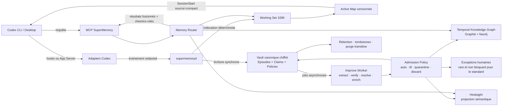
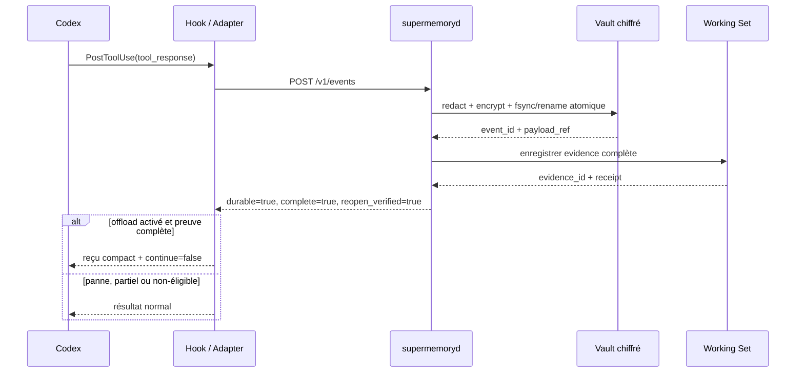
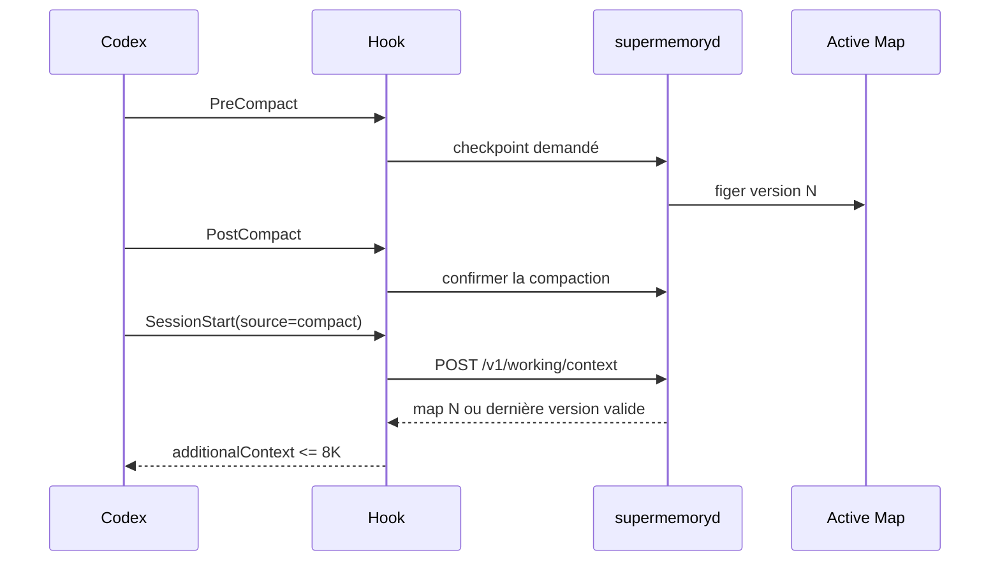
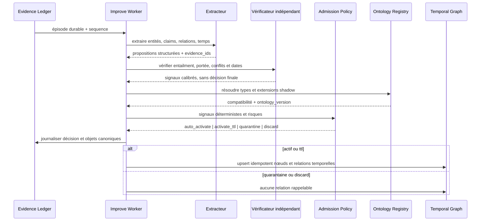
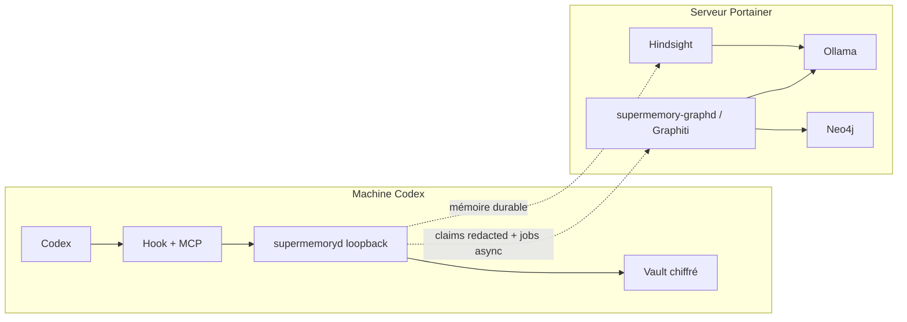

# SuperMemory Memory Fabric — Working Memory 100K et Knowledge Graph

| Champ | Valeur |
|---|---|
| Statut | **Prêt pour implémentation** |
| Version | 2.0 |
| Date | 2026-08-04 |
| Portée | Working Memory, mémoire durable, graphe temporel, routage hybride et consolidation automatique |
| Déploiement | Chemin critique local ; Knowledge Graph et enrichissement asynchrone sur serveur Docker/Portainer |
| Document parent | [Design technique Codex–SuperMemory](./codex-supermemory-technical-design.md) |

## 1. Résumé exécutif

Nous allons construire **SuperMemory Memory Fabric**, un système de mémoire agentique à plusieurs vitesses. Il rend jusqu’à **100 000 tokens de preuves récentes adressables par une session Codex**, sans les réinjecter à chaque requête, et transforme continuellement les épisodes vérifiables en connaissances relationnelles, temporelles et interrogeables en plusieurs sauts.

Le produit repose sur cinq niveaux distincts :

1. **Active Map** : une carte structurée de 4 000 tokens cible, 8 000 maximum, automatiquement réinjectée après une compaction Codex.
2. **Working Set 100K** : un index session-scoped contenant jusqu’à 100 000 tokens de preuves sélectionnées et réouvrables à la demande via MCP.
3. **Evidence Ledger** : les épisodes complets, redacted, chiffrés et gouvernés ; ils constituent la preuve canonique et ne sont pas limités à 100K.
4. **Temporal Knowledge Graph** : entités, claims et relations typées avec provenance, fenêtres de validité, contradictions et chemins multi-hop.
5. **Durable Recall** : souvenirs et projections sémantiques autorisés, retrouvés via Hindsight et fusionnés avec le graphe par un routeur unique.

La règle structurante est :

> **100K est une capacité adressable, pas une taille de prompt.**

Le chemin critique Working Memory reste déterministe et n’a besoin ni de Qwen, ni d’Ollama, ni de Hindsight. L’extraction d’entités, la résolution de relations, l’induction d’ontologie et l’enrichissement s’exécutent en arrière-plan sur le serveur. Une panne du pipeline intelligent ne bloque jamais la capture, la réouverture d’une preuve ni Codex.

Le déchargement automatique d’un résultat d’outil ne sera activé que si son contenu complet, redacted et chiffré a été écrit durablement puis rouvert avec succès. En cas de panne, de capture partielle ou de doute, le système échoue ouvert : Codex reçoit son résultat normal.

La consolidation durable est **automatique par défaut**. L’IA ne s’auto-approuve pas : elle propose des claims structurés, un vérificateur indépendant contrôle les preuves et les conflits, puis une politique déterministe décide entre activation automatique, activation temporaire, quarantaine ou rejet. La revue humaine est une voie d’exception réservée aux risques élevés et aux ambiguïtés irréductibles.

## 2. Problème à résoudre

Sur une tâche longue, Codex accumule des sorties d’outils, des décisions, des fichiers lus, des erreurs et des résultats intermédiaires. Une partie de cette information reste utile, mais la conserver intégralement dans le contexte actif produit quatre effets :

- saturation plus rapide de la fenêtre de contexte ;
- compactions plus fréquentes ;
- relecture coûteuse de données déjà vues ;
- perte de détails vérifiables lorsque seule une synthèse subsiste.

Le système SuperMemory actuel sait déjà capturer des événements, archiver des conversations, produire des candidats de mémoire durable et retrouver des souvenirs approuvés. Il ne gère pas encore explicitement la **mémoire de travail réversible**, un **knowledge graph first-class**, un **routeur multi-mémoires** ni une **admission automatique gouvernée**.

La Working Memory comble cette lacune sans changer le rôle des composants existants :

- le vault reste la source canonique ;
- Hindsight reste une projection remplaçable de mémoire durable ;
- le vault reste l’autorité des épisodes, claims, décisions d’admission et mutations d’ontologie ;
- les stores Hindsight et Knowledge Graph restent des projections reconstruisibles mais first-class pour le recall ;
- la Working Memory reste éphémère et les connaissances durables sont consolidées automatiquement sous politique.

## 3. Décisions irréversibles ou structurantes

| ID | Décision | Motivation |
|---|---|---|
| WM-D01 | 100K désigne le Working Set externe, jamais une injection systématique. | Préserve le contexte actif et le cache de prompt. |
| WM-D02 | L’Active Map vise 4K tokens et est plafonnée à 8K. | Suffisant pour l’état courant, borné pour éviter une nouvelle saturation. |
| WM-D03 | Le périmètre de confidentialité est `(workspace_id, project_id, session_id)`. | Les sorties brutes d’une autre tâche ne doivent pas apparaître automatiquement. |
| WM-D04 | La carte est un JSON structuré canonique ; Markdown et Mermaid ne sont que des rendus. | Validation, versionnement et tests déterministes. |
| WM-D05 | Chaque affirmation de la carte référence au moins un `evidence_id` valide. | Évite une synthèse invérifiable. |
| WM-D06 | Le chemin critique Working Memory n’utilise pas de LLM ; le graphe est enrichi asynchroniquement. | Latence prévisible sans renoncer à la structuration intelligente. |
| WM-D07 | Un résultat ne peut être déchargé de Codex qu’après capture complète et round-trip vérifié. | Réversibilité réelle et absence de perte silencieuse. |
| WM-D08 | L’éviction retire une preuve du Working Set mais ne supprime jamais son archive. | Capacité bornée sans destruction de données gouvernées. |
| WM-D09 | La Working Memory peut produire automatiquement des claims durables, mais jamais sans preuve, vérification indépendante et décision de politique enregistrée. | Éliminer la revue routinière sans laisser le LLM être sa propre autorité. |
| WM-D10 | Le MCP n’expose aucune liste globale de sessions ; chaque appel exige un `working_set_id` opaque. | Réduit le risque de mélange inter-session. |
| WM-D11 | Hindsight et Ollama sont hors du chemin critique. | Une indisponibilité ne doit pas bloquer Codex. |
| WM-D12 | Rétention par défaut : session active puis grâce de 7 jours après clôture. | Reprise possible sans maintenir indéfiniment un index éphémère. |
| WM-D13 | Un `Memory Router` unique interroge Working Set, graphe temporel et mémoire durable. | Éviter des appels séquentiels coûteux et des résultats contradictoires. |
| WM-D14 | Le graphe est first-class dans les contrats et APIs, mais reconstruisible depuis le vault. | Offrir le multi-hop sans créer une seconde vérité canonique. |
| WM-D15 | Chaque nœud, relation et résumé dérivé doit remonter à un ou plusieurs épisodes canoniques. | Provenance et suppression transitive. |
| WM-D16 | Le graphe est temporel : une contradiction clôt une fenêtre de validité au lieu d’effacer l’histoire. | Répondre à « maintenant » comme à « à cette date ». |
| WM-D17 | L’ontologie possède un noyau stable et des extensions apprises en mode shadow puis activées automatiquement. | Évolution continue sans mutation de schéma incontrôlée. |
| WM-D18 | Les changements d’ontologie additifs et compatibles sont automatisables ; merge, rename ou delete destructifs passent en quarantaine. | Automatiser le courant et isoler l’irréversible. |
| WM-D19 | L’enrichissement continu est idempotent, incrémental, versionné et asynchrone. | Équivalent gouverné de `improve`/`memify`. |
| WM-D20 | La revue humaine ne constitue jamais le happy path d’une mémoire standard. | Réduire la charge opérateur et accélérer l’apprentissage. |
| WM-D21 | Les actions externes, permissions élargies, secrets et conflits à fort impact conservent un gate explicite. | La suppression de la revue mémoire ne supprime pas les confirmations de sécurité. |
| WM-D22 | Le premier backend cible est un graphe temporel Neo4j via un adapter Graphiti isolé sur le serveur. | Réutiliser résolution d’entités, temporalité et hybrid retrieval sans céder l’autorité du vault. |

### 3.1 Rupture normative avec les contrats actuels

Cette version remplace explicitement, pour **l’activation d’une mémoire standard**, les règles actuelles « aucune activation sans revue » et `pending → approve|reject`. Elle ne prétend pas que le code actuel possède déjà ce comportement.

Le Lot 0 doit aligner avant tout code fonctionnel :

- `README.md`, dont le parcours actuel impose des approvals explicites ;
- `docs/codex-supermemory-technical-design.md`, dont le pipeline actuel contient `candidate → review → mémoire` ;
- `docs/prd-memoire-agentique-v2.md` et les fixtures gouvernance ;
- `codex-workspace-store.mjs` et `product-store.mjs`, dont `reviewCandidate` est aujourd’hui binaire ;
- les vérificateurs qui exigent `review_status=approved`.

Le remplacement est limité : confirmations de suppression, publication externe, permissions, secrets, production readiness et mutations destructives d’ontologie restent explicites. Le terme « reviewable » signifie désormais **auditable et réversible**, pas « obligatoirement lu par un humain ».

## 4. Objectifs et non-objectifs

### 4.1 Objectifs fonctionnels

- Maintenir jusqu’à 100 000 tokens estimés de preuves utiles par session.
- Restaurer l’état de travail après une compaction sans relire tout l’historique.
- Rechercher et rouvrir une preuve exacte en quelques centaines de millisecondes.
- Donner à chaque fait synthétique une provenance navigable.
- Extraire automatiquement entités, claims et relations depuis les épisodes.
- Répondre à des questions relationnelles et temporelles en 1 à 5 hops bornés.
- Gérer automatiquement une ontologie versionnée, avec activation shadow-safe.
- Enrichir en continu le graphe, les embeddings, communautés et poids de recall.
- Consolider les sessions en mémoire durable sans revue humaine routinière.
- Router une requête vers la bonne combinaison de mémoire et fusionner les résultats cités.
- Éliminer les sorties volumineuses du contexte actif lorsqu’elles sont récupérables.
- Résister aux pannes du daemon, de Hindsight, d’Ollama et du générateur de carte.
- Hériter des garanties existantes de chiffrement, redaction, tombstone et purge.
- Rendre l’état observable et administrable depuis l’interface locale SuperMemory.

### 4.2 Non-objectifs du MVP

- Remplacer le mécanisme de compaction interne de Codex.
- Injecter 100K tokens à chaque tour ou après chaque compaction.
- Déployer TencentDB-Agent-Memory ou Cognee comme nouvelle source canonique.
- Construire une mémoire partagée multi-utilisateur ou une gestion d’ACL d’équipe.
- Fusionner automatiquement les working sets de plusieurs sessions.
- Laisser un LLM activer seul une connaissance sur la base de sa confiance déclarée.
- Exécuter un modèle ou un graphe distant dans le chemin critique de capture.
- Garantir la capture intégrale d’une sortie que Codex lui-même ne transmet pas au hook.
- Autoriser le modèle à exécuter du Cypher arbitraire.
- Modifier automatiquement de façon destructive une classe ou relation d’ontologie active.

## 5. Expérience produit

### 5.1 Promesse utilisateur

« Je peux travailler longtemps avec Codex. Il conserve un état compact, apprend automatiquement les entités et relations importantes, raisonne sur leur histoire et peut toujours montrer la preuve exacte — sans me demander de valider chaque souvenir. »

### 5.2 Parcours nominal

1. Une session Codex démarre dans un workspace approuvé.
2. SuperMemory crée ou reprend son `working_set_id` opaque.
3. Les prompts, résultats d’outils, changements de fichiers et réponses finales sont capturés comme aujourd’hui.
4. Les événements éligibles alimentent un Working Set borné à 100K.
5. La carte active est reconstruite à chaque changement significatif, de manière asynchrone.
6. Une grosse sortie d’outil peut être remplacée dans le contexte par un reçu compact si sa capture complète est vérifiée.
7. Codex utilise les outils MCP pour rechercher, ouvrir ou parcourir les preuves lorsque nécessaire.
8. Après une compaction, le hook `SessionStart` avec la source `compact` réinjecte la dernière carte valide.
9. En arrière-plan, les nouveaux épisodes sont transformés en entités, claims et relations temporelles.
10. L’admission policy active automatiquement les connaissances sûres, donne un TTL aux connaissances fragiles, met en quarantaine les exceptions et rejette le bruit.
11. Le pipeline `improve` recalcule les poids, triplets, communautés, résumés et extensions d’ontologie sans réingérer les sources.
12. Le `Memory Router` interroge Working Set, graphe et Hindsight en parallèle selon la question, puis fusionne et cite les résultats.
13. À la clôture, le working set reste disponible pendant 7 jours ; les épisodes et connaissances durables suivent leurs politiques propres.

### 5.3 Interface SuperMemory

Deux nouvelles vues **Travail** et **Graphe** seront ajoutées après stabilisation du backend. La vue **Exceptions** remplace la revue systématique : elle doit normalement rester presque vide.

Elle affiche :

- une carte par session avec `63K / 100K`, l’état, le niveau de couverture et le dernier checkpoint ;
- l’objectif courant, les décisions, les fichiers actifs, les erreurs, les prochaines actions et les questions ouvertes ;
- un catalogue de preuves filtrable ;
- la preuve exacte, sa citation et ses voisins temporels ;
- les entités, relations, chemins multi-hop et fenêtres de validité ;
- l’ontologie active, les extensions shadow et leur justification automatique ;
- les décisions `auto_activate`, `activate_ttl`, `quarantine` et `discard` avec facteurs explicatifs ;
- des actions locales : reconstruire, épingler, désépingler, clôturer, purger avec confirmation exacte.

Badges de couverture :

- **Rich** : App Server, éléments complets et ordonnés ;
- **Standard** : hooks, contenu complet dans les limites configurées ;
- **Partial** : aperçu et hash seulement ; contenu non déchargeable ;
- **Degraded** : index ou carte en retard, daemon indisponible ou incohérence détectée.

## 6. Modèle mental et budgets

| Niveau | Contenu | Budget par défaut | Injection automatique |
|---|---|---:|---|
| Active Map | État structuré et citations | cible 4K, maximum 8K tokens | Oui au démarrage/reprise et après compaction, jamais à chaque prompt |
| Working Set | Preuves sélectionnées | 100K tokens estimés | Non ; consultation MCP à la demande |
| Evidence Slice | Portion de preuve ouverte | 8K par défaut, 20K maximum par réponse | Seulement à la demande |
| Evidence Ledger | Épisodes complets chiffrés | Politique de rétention existante | Jamais directement |
| Knowledge Graph | Entités, claims, relations et temporalité | Borné par workspace et politique de rétention | Sous-graphe ciblé uniquement |
| Durable Memory | Claims actifs automatiquement ou exceptionnellement validés | Pipeline d’admission | Via routeur, jamais en vrac |

L’estimation MVP reste compatible avec le code actuel : `ceil(nombre_de_caractères / 4)`. Elle est conservatrice, stable et remplaçable ultérieurement par un tokenizer sans modifier les contrats externes.

### 6.1 Politique d’admission et d’éviction

Chaque preuve obtient un score déterministe :

```text
score =
  pin_weight
  + recency_weight
  + kind_weight
  + current_turn_weight
  + unresolved_weight
  + access_weight
  - redundancy_penalty
  - size_penalty
```

Priorité, de la plus forte à la plus faible :

1. preuves épinglées ;
2. objectif, contraintes et plan actif ;
3. erreurs non résolues, tests en échec et blocages ;
4. décisions et modifications de fichiers ;
5. éléments réouverts récemment ;
6. sorties réussies et répétitives ;
7. bruit de commande, logs et raisonnements non nécessaires.

Contraintes supplémentaires :

- une preuve épinglée peut dépasser temporairement la capacité, avec état `over_capacity` visible ;
- une seule famille d’événements ne peut occuper plus de 60 % du budget hors pins ;
- au moins les deux derniers tours restent sélectionnés tant qu’ils tiennent dans le budget ;
- une preuve évincée reste retrouvable dans l’archive, mais n’apparaît plus dans la recherche Working Set ;
- une preuve tombstonée ou purgée est immédiatement inaccessible, même si une carte ancienne la référence.

### 6.2 Admission automatique des connaissances

Le score d’admission n’est jamais la confiance déclarée par le modèle. Il agrège des signaux mesurés et auditables :

```text
admission_score = calibrated(
  evidence_entailment,
  source_trust,
  extraction_agreement,
  entity_resolution_confidence,
  temporal_consistency,
  ontology_compatibility,
  independent_support,
  sensitivity_risk,
  contradiction_risk
)
```

| Décision | Effet | Revue humaine |
|---|---|---|
| `auto_activate` | Claim durable actif, projeté et rappelable | Non |
| `activate_ttl` | Claim actif avec expiration courte et revalidation programmée | Non |
| `quarantine` | Claim non rappelable, visible dans Exceptions | Seulement si sa résolution apporte une valeur réelle |
| `discard` | Bruit ou claim non prouvé conservé uniquement dans l’épisode source | Non |

Règles par défaut, à calibrer sur le corpus d’évaluation :

- `auto_activate` exige une preuve exacte, un entailment vérifié, aucune fuite de scope, aucune contradiction active non résolue et une sensibilité autorisée ;
- une déclaration utilisateur explicite peut constituer une source primaire pour une préférence ou une décision personnelle, mais pas pour un fait externe à haut impact ;
- `activate_ttl` couvre les informations plausibles, temporaires ou mono-source à faible risque ;
- `quarantine` couvre conflits substantiels, permissions, contenu restreint, changements destructifs d’ontologie et faits à impact légal, médical ou financier ;
- `discard` couvre absence de preuve, faible entailment, fragments, duplicats exacts et contenu purement transitoire ;
- une quarantaine n’est pas immédiatement une tâche humaine : elle est réévaluée automatiquement lorsque de nouvelles preuves arrivent, puis expirée ou discarded si elle reste sans valeur ;
- elle n’est affichée dans Exceptions que si elle persiste, bloque une question utile, concerne une mutation destructive ou si l’utilisateur demande explicitement de la résoudre ;
- les seuils numériques sont issus d’une calibration offline et versionnés dans `admission_policy_version`, jamais choisis ad hoc par le LLM ;
- la cible produit est moins de 5 % des claims standards envoyés en exception humaine.

## 7. Architecture cible



### 7.1 Chemin critique d’écriture



### 7.2 Reprise après compaction

Codex expose un événement `contextCompaction` dans l’App Server, mais son schéma courant ne contient que `{id}`. Le système ne doit donc jamais dépendre d’un résumé fourni par cet élément.

Les hooks `PreCompact` et `PostCompact` servent uniquement à créer un checkpoint. Ils ne peuvent pas injecter de contexte. L’injection se fait au `SessionStart` suivant avec `source: "compact"`, exécuté avant la prochaine requête modèle, y compris lors d’une continuation automatique en cours de tour.



### 7.3 Enrichissement continu



L’extracteur et le vérificateur ne partagent ni sortie cachée ni décision. Le vérificateur reçoit les claims proposés et les passages de preuve, pas le raisonnement de l’extracteur. La policy est du code déterministe versionné ; elle ne demande jamais au modèle « faut-il s’approuver ? ».

Déclencheurs d’amélioration : fin de tour significatif, fin de session, modification de source, correction utilisateur, feedback de recall, seuil de 25 nouveaux épisodes et tâche planifiée de maintenance. Tous convergent vers une clé d’idempotence `(workspace_id, source_high_watermark, pipeline_version)`.

### 7.4 Recall unifié et multi-hop

Le routeur accepte `strategy=auto|working|durable|graph|hybrid|temporal` :

- `working` pour l’état exact de la session ;
- `durable` pour les souvenirs sémantiques actifs ;
- `graph` pour entités, relations et chemins ;
- `temporal` pour une question `as_of` ou une évolution ;
- `hybrid` pour exécuter Working, Hindsight et graphe en parallèle ;
- `auto` pour un routage par règles, avec fallback parallèle si l’intention est ambiguë.

Le modèle n’envoie jamais de Cypher. Il demande un motif typé : entités de départ, types de relations, direction, fenêtre temporelle et nombre de hops. Le serveur compile ce motif en requête paramétrée, applique la portée workspace avant l’exécution et plafonne à 3 hops par défaut, 5 maximum. Chaque arête retournée contient ses `evidence_ids`, son intervalle de validité et son statut d’admission.

## 8. Composants

### 8.1 `codex-working-set-store.mjs`

Responsabilités :

- créer, reprendre, clôturer et expirer un working set ;
- garantir l’isolation workspace/project/session ;
- stocker manifestes, entrées et cartes avec permissions `0700/0600` ;
- effectuer les écritures atomiques sous verrou mono-writer ;
- appliquer tombstones, purge et rétention ;
- reconstruire l’état à partir du journal source.

Il ne duplique pas les sorties complètes : une entrée référence le `payload_ref` déjà chiffré du capture store.

### 8.2 `codex-working-set-index.mjs`

Responsabilités :

- estimer les tokens ;
- classifier les événements par règles ;
- calculer les scores d’admission ;
- appliquer budgets, diversité, pins et évictions ;
- fournir une recherche lexicale déterministe avec filtres ;
- mettre à jour `last_accessed_at` sans perturber l’ordre source.

MVP : index mémoire + journal JSONL/état atomique, sans nouvelle dépendance SQLite. Une migration vers SQLite FTS pourra être évaluée lorsque les volumes réels le justifieront.

### 8.3 `codex-working-map.mjs`

Responsabilités :

- construire un `supermemory.working-map.v1` à partir des seules preuves sélectionnées ;
- borner chaque section et le budget global ;
- valider toutes les références ;
- chiffrer et versionner la carte ;
- rendre une version Markdown sûre pour `additionalContext` ;
- marquer tout contenu de preuve comme **donnée**, jamais comme instruction.

Le constructeur MVP utilise des règles : dernier objectif utilisateur, tâches/plan structurés, résultats de tests, erreurs, changements de fichiers, décisions explicites et état du dernier tour. Il n’invente pas de résumé libre.

Règles exactes du constructeur MVP :

| Section | Source déterministe | Règle |
|---|---|---|
| `goal` | dernier `prompt.submitted` non vide | Extrait borné du prompt, sans reformulation. |
| `constraints` | contraintes explicites déjà structurées dans le runtime ou marquées par l’utilisateur | Sinon section vide ; aucune déduction linguistique. |
| `current_state` | dernier snapshot de tour et dernière séquence capturée | IDs, statut et description technique bornée. |
| `completed` | items de plan passés à `completed`, commandes/tests exit 0 explicitement associés au plan | Ne pas inférer qu’une feature est terminée depuis une réponse libre. |
| `decisions` | événements structurés de décision ou marqueurs explicites SuperMemory | Sinon section vide dans le MVP. |
| `files` | `file.changed` / `fileChange` | Chemin relatif au workspace, action et dernière preuve. |
| `errors` | exit code non nul, erreur d’outil, test en échec | Rester actif jusqu’à une preuve structurée de résolution ou éviction. |
| `next_actions` | éléments `pending`/`in_progress` du plan | Ordre du plan conservé. |
| `open_questions` | demandes d’entrée utilisateur non résolues | Retirées lors de la réponse correspondante. |
| `evidence_catalog` | index sélectionné | Top preuves par score et diversité, sans contenu complet. |

Une source libre peut être affichée comme extrait cité, mais elle n’est jamais convertie en décision, contrainte ou état de complétion par simple heuristique. Cela réduit la richesse sémantique du MVP en échange d’une carte vérifiable.

### 8.4 `codex-working-recall.mjs`

Responsabilités :

- rechercher dans un seul `working_set_id` ;
- ouvrir une preuve par pages bornées ;
- fournir les voisins temporels ;
- résoudre une citation ;
- refuser les IDs inconnus, inter-workspace, tombstonés ou expirés.

### 8.5 `codex-working-offload.mjs`

Responsabilités :

- déterminer si un résultat est éligible au déchargement ;
- vérifier `durable`, `complete`, `reopen_verified` et `capture_coverage` ;
- produire un reçu compact et non ambigu ;
- laisser passer le résultat d’origine dans tous les cas dégradés.

Le reçu doit ressembler à ceci :

```text
[SuperMemory: sortie déchargée]
Preuve: wev_01J...
Nature: commandExecution
Taille: ~18 420 tokens
Résumé déterministe: tests complets, 2 échecs détectés
Pour relire: supermemory_working_open(working_set_id, evidence_id)
```

### 8.6 `codex-memory-router.mjs`

Responsabilités : classification déterministe de la requête, fan-out parallèle, budgets par moteur, fusion, déduplication, arbitrage temporel et génération d’un plan de citations. Il retourne les résultats partiels si un moteur dépasse son timeout et indique `coverage` par tier.

### 8.7 `memory-admission-policy.mjs`

Responsabilités : calculer une décision depuis des signaux calibrés, sans appel LLM ; expliquer les facteurs ; appliquer les règles de scope, sensibilité et risque ; versionner la policy ; produire une attestation d’admission signée par hash. Il remplace l’obligation `approve|reject` par `auto_activate|activate_ttl|quarantine|discard`, tout en conservant une action humaine optionnelle pour résoudre une quarantaine.

### 8.8 `memory-improve-worker.mjs`

Responsabilités : consommer les épisodes par high-watermark, appeler extracteur et vérificateur, résoudre les entités, détecter conflits et temporalité, enrichir triplets/communautés/poids, soumettre à la policy et mettre à jour les projections. Les retries sont idempotents et un job échoué ne bloque pas les suivants d’un autre workspace.

### 8.9 `ontology-registry.mjs`

Responsabilités : gérer le noyau, les extensions apprises, les versions, alias, contraintes de forme et migrations. États : `core`, `shadow`, `active`, `deprecated`, `quarantined`, `rejected`.

Noyau initial :

- entités : `Person`, `Organization`, `Project`, `Workspace`, `Session`, `Agent`, `Document`, `File`, `Tool`, `Requirement`, `Decision`, `Preference`, `Procedure`, `Event`, `Error`, `Topic`, `Claim`, `Evidence` ;
- relations : `MENTIONS`, `ABOUT`, `ASSERTS`, `SUPPORTS`, `CONTRADICTS`, `SUPERSEDES`, `DERIVED_FROM`, `OCCURRED_IN`, `DEPENDS_ON`, `CAUSES`, `MODIFIES`, `DECIDED_BY`, `PREFERS`, `AFFECTS`, `PART_OF`, `RELATED_TO`.

Une extension additive passe automatiquement de `shadow` à `active` lorsqu’elle est compatible, soutenue par au moins trois claims indépendants ou une source explicite de confiance élevée, et améliore l’évaluation de retrieval sans collision de scope. Ces valeurs sont des défauts configurables et calibrés. Un rename, merge ou delete d’un type actif reste `quarantined` jusqu’à une migration sûre ; cela constitue une exception légitime à l’absence de revue humaine.

### 8.10 `knowledge-graph-adapter.mjs` et `services/supermemory-graphd/`

Le client Node envoie des mutations canoniques et des motifs de lecture à un service serveur authentifié. `supermemory-graphd` encapsule Graphiti et Neo4j, applique les IDs SuperMemory, interdit le Cypher client, stocke les fenêtres temporelles et retourne des sous-graphes cités. Graphiti est un moteur d’extraction/résolution et Neo4j un store de projection ; aucun des deux ne décide de l’autorisation ni de la vérité canonique.

### 8.11 Modifications des composants existants

| Fichier | Changement requis |
|---|---|
| `scripts/lib/supermemory-daemon.mjs` | Indexer chaque événement éligible, ajouter routes Working Memory, états de santé et vérification round-trip. |
| `scripts/lib/codex-hook-adapter.mjs` | Fournisseur de carte, checkpoints de compaction, décision de déchargement, prise en charge du reçu durable. |
| `scripts/supermemory-hook.mjs` | Câbler config v3, client daemon Working Memory et limites de payload. |
| `scripts/lib/codex-app-server-adapter.mjs` | Exploiter les items complets, ne pas dépendre de `contextCompaction.summary`, qualifier la couverture. |
| `scripts/lib/codex-mcp-server.mjs` | Ajouter les outils Working Memory, le recall unifié et les lectures graphe bornées. |
| `scripts/supermemory-mcp.mjs` | Câbler le routeur et proxy Working/Graph vers les services authentifiés. |
| `scripts/lib/codex-memory-compiler.mjs` | Produire des épisodes/claims pour le worker, sans imposer une file de revue. |
| `scripts/lib/codex-workspace-store.mjs` | Ajouter `admitCandidate`; conserver `reviewCandidate` pour quarantaine et migration. |
| `scripts/lib/product-store.mjs` | Migrer le parcours approve/reject vers admission automatique et vue Exceptions. |
| `scripts/lib/codex-lifecycle.mjs` | Expiration, purge, tombstone et attestation des working sets. |
| vérificateurs de specs | Remplacer « aucune activation sans revue » par les invariants d’admission automatique, tout en gardant les gates sécurité. |
| installateur/config | Générer les runtimes v3 et les bindings graph/LLM, migration backward-compatible. |
| doctor | Vérifier daemon, graphd, Neo4j, clé/token, policy, ontology version et round-trip multi-hop. |
| web | Ajouter Travail, Graphe, Ontologie, Enrichissement et Exceptions. |

### 8.12 Éligibilité des événements

| Événement | Admis au Working Set | Contribue à la carte | Déchargeable |
|---|---:|---:|---:|
| `prompt.submitted` | Oui | objectif/questions | Non |
| `tool.completed` / `commandExecution` | Oui | erreurs, résultats structurés | Oui si complet et allowlisté |
| `file.changed` / `fileChange` | Oui | fichiers | Non dans le MVP |
| appel MCP read-only | Oui | résultat structuré éventuel | Opt-in après Bash |
| `assistant.completed` | Oui, avec poids modéré | état seulement si structuré | Non |
| `turn.completed` | Métadonnées | état/checkpoint | Non |
| `context.compacted` | Métadonnées | checkpoint | Non |
| reasoning interne | Non par défaut | Non | Non |
| événement hors portée ou non redacted | Non | Non | Non |

## 9. Contrats de données

### 9.1 Working Set manifest

```json
{
  "schema": "supermemory.working-set.v1",
  "working_set_id": "wset_01J...",
  "workspace_id": "ws_...",
  "project_id": "prj_...",
  "session_id": "codex-thread-id",
  "forked_from_working_set_id": null,
  "state": "ready",
  "capture_coverage": "standard",
  "capacity_tokens": 100000,
  "selected_tokens": 63124,
  "pinned_tokens": 11200,
  "map_version": 37,
  "source_sequence_high_watermark": 884,
  "created_at": "2026-08-03T10:00:00.000Z",
  "updated_at": "2026-08-03T12:10:00.000Z",
  "closed_at": null,
  "expires_at": null
}
```

États autorisés : `building`, `ready`, `degraded`, `over_capacity`, `closed`, `expired`, `purged`.

### 9.2 Evidence entry

```json
{
  "schema": "supermemory.working-evidence.v1",
  "evidence_id": "wev_01J...",
  "working_set_id": "wset_01J...",
  "event_id": "evt_01J...",
  "payload_ref": "00_inbox/codex-events/blobs/...",
  "workspace_id": "ws_...",
  "project_id": "prj_...",
  "session_id": "codex-thread-id",
  "turn_id": "turn-id",
  "item_id": "item-id",
  "kind": "tool.completed",
  "title": "npm test",
  "token_estimate": 18420,
  "byte_length": 72891,
  "content_hash": "sha256:...",
  "capture_coverage": "standard",
  "complete": true,
  "status": "selected",
  "priority": 72,
  "pinned": false,
  "redaction_profile": "default-v1",
  "created_at": "2026-08-03T11:59:00.000Z",
  "last_accessed_at": null,
  "expires_at": null
}
```

États autorisés : `eligible`, `selected`, `evicted`, `tombstoned`, `purged`.

### 9.3 Active Map

```json
{
  "schema": "supermemory.working-map.v1",
  "working_set_id": "wset_01J...",
  "version": 37,
  "workspace_id": "ws_...",
  "project_id": "prj_...",
  "session_id": "codex-thread-id",
  "generated_at": "2026-08-03T12:10:00.000Z",
  "source_sequence_high_watermark": 884,
  "coverage": "standard",
  "goal": {
    "text": "Implémenter Working Memory 100K",
    "evidence_ids": ["wev_goal"]
  },
  "constraints": [],
  "current_state": [],
  "completed": [],
  "decisions": [],
  "files": [],
  "errors": [],
  "next_actions": [],
  "open_questions": [],
  "evidence_catalog": [],
  "budget": {
    "working_set_tokens": 63124,
    "working_set_capacity_tokens": 100000,
    "map_tokens": 3860,
    "map_max_tokens": 8000
  }
}
```

Chaque élément de `constraints`, `current_state`, `completed`, `decisions`, `files`, `errors`, `next_actions` et `open_questions` a obligatoirement la forme :

```json
{
  "text": "La phrase rendue à Codex",
  "evidence_ids": ["wev_..."],
  "status": "active",
  "updated_at": "2026-08-03T12:10:00.000Z"
}
```

### 9.4 Identifiants et citations

- `working_set_id` : UUIDv7 avec préfixe `wset_`, opaque et non séquentiel.
- `evidence_id` : UUIDv7 avec préfixe `wev_` ; le hash de contenu reste un champ distinct.
- `map_id` implicite : `(working_set_id, version)`.
- Citation utilisateur : `supermemory://working/<working_set_id>/<evidence_id>`.
- Les chemins physiques ne sont jamais exposés au modèle.

### 9.5 Episode canonique

```json
{
  "schema": "supermemory.episode.v1",
  "episode_id": "epi_01J...",
  "workspace_id": "ws_...",
  "project_id": "prj_...",
  "session_id": "codex-thread-id",
  "source_event_ids": ["evt_01J..."],
  "evidence_ids": ["wev_01J..."],
  "kind": "interaction|document|tool_result|decision|correction",
  "observed_at": "2026-08-04T10:00:00.000Z",
  "content_hash": "sha256:...",
  "sensitivity": "standard",
  "status": "active"
}
```

L’épisode est la racine de provenance du graphe. Il est canonique dans le vault ; le texte complet reste dans le payload chiffré référencé.

### 9.6 Entity, claim et relation temporelle

```json
{
  "schema": "supermemory.graph-entity.v1",
  "entity_id": "ent_01J...",
  "workspace_id": "ws_...",
  "canonical_name": "SuperMemory",
  "entity_type": "Project",
  "ontology_version": 12,
  "aliases": ["super memory"],
  "evidence_ids": ["wev_..."],
  "status": "active"
}
```

```json
{
  "schema": "supermemory.graph-relation.v1",
  "relation_id": "rel_01J...",
  "workspace_id": "ws_...",
  "subject_entity_id": "ent_source",
  "predicate": "DEPENDS_ON",
  "object_entity_id": "ent_target",
  "claim_text": "SuperMemory utilise Hindsight comme projection de recall.",
  "valid_from": "2026-07-01T00:00:00.000Z",
  "valid_to": null,
  "observed_at": "2026-08-04T10:00:00.000Z",
  "evidence_ids": ["wev_..."],
  "episode_ids": ["epi_..."],
  "admission_id": "adm_...",
  "status": "active"
}
```

Les relations ne sont jamais des triplets nus : provenance, portée, temporalité, admission et statut sont obligatoires. `valid_to` est clôturé lors d’un supersede ; l’ancienne relation reste historique.

### 9.7 Admission decision

```json
{
  "schema": "supermemory.admission-decision.v1",
  "admission_id": "adm_01J...",
  "claim_id": "clm_01J...",
  "decision": "auto_activate",
  "policy_version": "admission-v1.0.0",
  "extractor": { "provider": "configured", "model": "extractor-id", "prompt_version": "kg-extract-v1" },
  "verifier": { "provider": "configured", "model": "verifier-id", "prompt_version": "kg-verify-v1" },
  "signals": {
    "evidence_entailment": 0.96,
    "source_trust": 1.0,
    "contradiction_risk": 0.0,
    "scope_valid": true,
    "ontology_compatible": true
  },
  "reason_codes": ["exact_evidence", "trusted_source", "no_active_conflict"],
  "decided_by": "policy:admission-v1.0.0",
  "decided_at": "2026-08-04T10:00:02.000Z",
  "expires_at": null
}
```

Les scores sont des sorties de composants calibrés ; ils ne sont pas copiés depuis une auto-évaluation libre du LLM.

### 9.8 Ontology change

```json
{
  "schema": "supermemory.ontology-change.v1",
  "ontology_change_id": "ontc_01J...",
  "workspace_id": "ws_...",
  "base_version": 12,
  "proposed_version": 13,
  "operation": "add_relation_type",
  "name": "IMPLEMENTS",
  "domain": ["Agent", "Project"],
  "range": ["Requirement", "Procedure"],
  "state": "shadow",
  "supporting_claim_ids": ["clm_1", "clm_2", "clm_3"],
  "compatibility": "additive",
  "evaluation_delta": 0.04,
  "admission_id": "adm_..."
}
```

Toute activation crée une nouvelle version immutable de l’ontologie. Le graphe indique la version sous laquelle chaque entité et relation a été validée.

## 10. Stockage

Disposition logique dans le vault :

```text
00_inbox/supermemory-product/codex-working-sets/
  <workspace_id>/
    <working_set_id>/
      manifest.json.aead
      entries.jsonl.aead
      checkpoints.jsonl.aead
      maps/
        00000037.json.aead
      tombstones.jsonl.aead
20_professional/memory-fabric/
  <workspace_id>/
    episodes/
    claims/
    entities/
    relations/
    admissions/
    ontology/
      versions/
      shadow/
    improve-jobs/
    projection-checkpoints/
```

Règles :

- répertoires `0700`, fichiers `0600` ;
- aucun contenu sensible dans un nom de fichier ;
- redaction avant chiffrement ;
- AEAD et gestion de clé identiques au capture store ;
- écriture temporaire, `fsync` si disponible, puis rename atomique ;
- verrou par working set et récupération des verrous orphelins ;
- le journal source reste l’autorité ; l’index et la carte sont reconstruisibles ;
- les records `Episode`, `Claim`, `Entity`, `Relation`, `AdmissionDecision` et `OntologyChange` du vault constituent les objets canoniques ;
- Neo4j, Graphiti, Hindsight, embeddings et résumés de communautés sont des projections first-class mais supprimables et reconstruisibles ;
- les fichiers `*.jsonl.aead` utilisent une frame AEAD indépendante par ligne, avec numéro de séquence et hash de la frame précédente ; ils ne chiffrent pas tout le journal comme un blob réécrit à chaque append ;
- la suppression d’un payload source invalide immédiatement les entrées dérivées ;
- la purge d’un épisode déclenche la fermeture ou suppression de chaque relation supportée uniquement par cet épisode, puis la reconstruction des résumés et embeddings concernés ;
- une carte chiffrée ancienne ne contourne jamais un tombstone courant.

## 11. API interne du daemon

Toutes les routes restent bindées en loopback et protégées par le bearer token existant. Les réponses ne doivent jamais contenir de chemin de vault ni de secret.

### 11.1 Capture étendue

`POST /v1/events`

La réponse existante est étendue sans rupture :

```json
{
  "event_id": "evt_01J...",
  "stored": true,
  "working": {
    "working_set_id": "wset_01J...",
    "evidence_id": "wev_01J...",
    "admitted": true,
    "durable": true,
    "complete": true,
    "reopen_verified": true,
    "capture_coverage": "standard",
    "offload_eligible": true
  }
}
```

La réponse HTTP ne vaut pas preuve durable si `stored`, `durable` et `reopen_verified` ne sont pas tous vrais.

### 11.2 Contexte de reprise

`POST /v1/working/context`

Requête :

```json
{
  "workspace_id": "ws_...",
  "project_id": "prj_...",
  "session_id": "codex-thread-id",
  "source": "compact",
  "max_tokens": 8000
}
```

Réponse :

```json
{
  "working_set_id": "wset_01J...",
  "map_version": 37,
  "coverage": "standard",
  "additional_context": "# SuperMemory Working Map...",
  "estimated_tokens": 3860,
  "stale": false
}
```

Si aucune carte valide n’existe, le daemon retourne un contexte minimal avec l’ID du working set et l’état dégradé. Le hook ne bloque pas Codex.

### 11.3 Recherche

`POST /v1/working/search`

Paramètres : `workspace_id`, `working_set_id`, `query`, `k` (défaut 8, maximum 20), filtres optionnels `kind`, `turn_id`, `after`, `before`.

Chaque résultat contient uniquement titre, score, type, date, taille, bref extrait borné et citation. Aucun contenu complet n’est retourné par cette route.

### 11.4 Ouverture paginée

`POST /v1/working/open`

Paramètres : `workspace_id`, `working_set_id`, `evidence_id`, `cursor`, `max_tokens`.

- défaut : 8 000 tokens ;
- maximum : 20 000 tokens par réponse ;
- curseur opaque signé ou lié au hash de contenu ;
- réponse avec `next_cursor`, `content_hash`, `complete`, citation et métadonnées ;
- refus si l’entrée est partielle, tombstonée, purgée, expirée ou hors workspace.

### 11.5 Voisins

`POST /v1/working/neighbors`

Retourne les métadonnées de 0 à 10 événements avant et après une preuve, sans ouvrir leur contenu. Utile pour reconstituer localement une séquence.

### 11.6 Administration locale

Routes réservées à l’application web locale : status, list sessions, rebuild, pin, unpin, close et purge avec confirmation exacte. Elles ne sont pas exposées comme outils MCP mutables dans le MVP.

### 11.7 Erreurs et idempotence HTTP

Les écritures acceptent `event_id` comme clé d’idempotence. Une répétition retourne le même reçu sans créer une nouvelle evidence.

Enveloppe d’erreur :

```json
{
  "error": {
    "code": "not_found_or_not_authorized",
    "message": "Working evidence is unavailable",
    "retryable": false,
    "request_id": "req_01J..."
  }
}
```

Codes : `400 invalid_request`, `401 unauthorized`, `404 not_found_or_not_authorized`, `409 stale_cursor`, `410 expired`, `413 payload_too_large`, `429 capacity_or_rate_limit`, `503 degraded`, `504 timeout`. Les erreurs 404 ne révèlent jamais si l’ID existe dans un autre périmètre.

### 11.8 Recall, graphe et amélioration

- `POST /v1/recall` : requête unifiée, stratégie, `working_set_id`, `as_of`, budgets et `max_hops` ;
- `POST /v1/graph/query` : motif typé borné compilé en Cypher paramétré côté serveur ;
- `POST /v1/graph/explain-path` : détail d’un chemin, score, validité et citations par arête ;
- `POST /v1/improve/notify` : route interne idempotente qui avance le high-watermark ;
- `GET /v1/improve/status` : backlog, dernière réussite, policy et ontology versions ;
- `GET /v1/ontology` : noyau, version active, extensions shadow et quarantaine ;
- `POST /v1/exceptions/:id/resolve` : action UI locale réservée à une exception, avec justification et audit.

`/v1/recall` retourne une enveloppe commune :

```json
{
  "strategy_used": "hybrid",
  "coverage": { "working": "complete", "graph": "complete", "durable": "timeout" },
  "results": [
    {
      "memory_tier": "graph",
      "text": "La décision D dépend de la contrainte C via le fichier F.",
      "score": 0.87,
      "entity_ids": ["ent_D", "ent_C", "ent_F"],
      "path_id": "path_01J...",
      "evidence_ids": ["wev_1", "wev_2"],
      "valid_from": "2026-07-01T00:00:00.000Z",
      "valid_to": null
    }
  ],
  "partial": true
}
```

Un timeout de Hindsight ne retire pas les résultats Working/Graph déjà vérifiés. Un timeout du graphe n’empêche pas le recall durable.

## 12. Outils MCP

Les outils sont read-only. Ceux de Working Memory requièrent toujours le `working_set_id` fourni dans la carte de la session. Il n’existe pas d’outil `list_working_sets`, d’outil Cypher, ni d’outil permettant au modèle d’activer une quarantaine.

### `supermemory_recall`

Outil principal :

```json
{
  "query": "Pourquoi avons-nous retenu Hindsight et de quels composants cette décision dépend-elle ?",
  "working_set_id": "wset_01J...",
  "strategy": "auto",
  "as_of": null,
  "max_hops": 3,
  "limit": 10
}
```

`supermemory_search` reste un alias backward-compatible de `strategy=durable` pendant la migration.

### `supermemory_working_map`

```json
{
  "working_set_id": "wset_01J..."
}
```

Retourne la dernière carte valide, dans la limite de 8K.

### `supermemory_working_search`

```json
{
  "working_set_id": "wset_01J...",
  "query": "échec test retention",
  "limit": 8
}
```

### `supermemory_working_open`

```json
{
  "working_set_id": "wset_01J...",
  "evidence_id": "wev_01J...",
  "cursor": null,
  "max_tokens": 8000
}
```

### `supermemory_working_neighbors`

```json
{
  "working_set_id": "wset_01J...",
  "evidence_id": "wev_01J...",
  "before": 3,
  "after": 3
}
```

### `supermemory_graph_query`

```json
{
  "query": "chaîne de décisions et dépendances autour de Hindsight",
  "entity_ids": [],
  "relation_types": ["DEPENDS_ON", "DECIDED_BY", "SUPPORTS"],
  "direction": "both",
  "max_hops": 3,
  "as_of": null,
  "limit": 20
}
```

### `supermemory_graph_explain_path`

```json
{
  "path_id": "path_01J..."
}
```

Retourne les arêtes, fenêtres de validité, admissions et citations exactes. Le `path_id` est court-lived et lié au workspace de la requête d’origine.

Le serveur MCP proxy ces opérations vers `supermemoryd` via son endpoint loopback et son token. Il ne reçoit pas la clé maître du vault. Le daemon vérifie que le `working_set_id` appartient au workspace auquel le MCP a été lié lors de l’installation.

## 13. Intégration Codex

### 13.1 Hooks

| Événement | Comportement |
|---|---|
| `SessionStart` | Créer/reprendre le working set ; injecter aperçu au démarrage et carte complète bornée après `source=compact`. |
| `UserPromptSubmit` | Capturer et indexer ; aucune réinjection de carte systématique. |
| `PostToolUse` | Capturer ; éventuellement remplacer le résultat par un reçu si et seulement si le round-trip est garanti. |
| `PreCompact` | Créer un checkpoint de la dernière séquence durable ; ne pas injecter. |
| `PostCompact` | Marquer la compaction ; ne pas injecter. |
| `Stop` | Capturer le dernier état assistant, programmer la carte et notifier l’enrichissement asynchrone. |
| `SessionEnd` | Clôturer logiquement, fixer `expires_at = now + 7 jours` et déclencher la consolidation de session. |

Codex limite par défaut les grands `additionalContext` issus des hooks et peut les externaliser. Le hook doit explicitement respecter notre plafond de 8K et ne jamais configurer une injection illimitée.

L’installateur crée deux matchers `SessionStart` :

- `startup|resume` avec `additionalContextLimit=2000` ;
- `compact` avec `additionalContextLimit=8000`.

Le budget `compact` est partagé ainsi : 6 500 tokens maximum pour la Working Map, 1 000 pour les connaissances durables actives et 500 pour les en-têtes/instructions de rappel. Si une section est absente, son budget inutilisé n’autorise jamais le total à dépasser 8K.

Pour le déchargement, l’adapter retourne exactement le mécanisme supporté par Codex :

```json
{
  "continue": false,
  "stopReason": "[SuperMemory: sortie déchargée] Preuve wev_01J... — utilisez supermemory_working_open pour la relire."
}
```

Il ne retourne ni `suppressOutput` ni `updatedMCPToolOutput`, qui sont parsés mais non supportés. Il n’utilise pas `decision: "block"` pour le parcours nominal. `continue: false` remplace le résultat visible par le reçu après exécution de l’outil ; il n’annule jamais les effets de l’outil.

### 13.2 App Server

L’App Server est le mode de capture privilégié quand il est disponible : `item/completed` est la notification autoritative. Les types `commandExecution`, `mcpToolCall`, `fileChange`, `agentMessage` et `contextCompaction` sont adaptés au journal canonique.

Le support doit rester compatible avec le mode hooks. Chaque working set expose son niveau de couverture plutôt que de prétendre à une fidélité identique.

### 13.3 Limites de capture

Valeurs MVP :

- payload complet admissible par événement : 512 KiB par défaut ;
- hard limit daemon : 4 MiB ;
- hard limit stdin du hook : aligné à 4 MiB dans le runtime v3 ;
- Working Set global : 100K tokens estimés ;
- événement au-delà de la limite : hash + aperçu de 8K caractères, état `partial` ;
- une capture `partial` n’est jamais déchargée du contexte Codex ;
- une preuve peut être paginée à l’ouverture sans être découpée dans le stockage.

Ces limites sont configurables, mais une hausse du hard limit exige un test mémoire et ne change pas le plafond Working Set.

Le client conserve un timeout de 250 ms pour la capture ordinaire. Un chemin distinct, activé seulement pour un résultat candidat à l’offload, peut attendre jusqu’à 750 ms afin d’obtenir la vérification durable. À l’expiration, il échoue ouvert.

### 13.4 Fork, reprise et concurrence

- reprise du même `session_id` : même working set ;
- fork : nouveau `working_set_id` avec `forked_from_working_set_id`, sans partage automatique des nouvelles preuves ;
- deux sessions dans le même workspace : working sets distincts ;
- appels concurrents : ordre par séquence source, verrou par working set ;
- événement dupliqué : idempotence sur `event_id` ;
- notification tardive : acceptée si sa séquence est nouvelle, puis carte reconstruite ;
- aucune recherche MCP sans `working_set_id` exact.

## 14. Configuration v3

Exemple de configuration runtime :

```json
{
  "schema": "supermemory.codex-runtime.v3",
  "working_memory": {
    "enabled": false,
    "capacity_tokens": 100000,
    "retention_after_session_days": 7,
    "map_target_tokens": 4000,
    "map_max_tokens": 8000,
    "startup_context_max_tokens": 2000,
    "compact_context_max_tokens": 8000,
    "open_default_tokens": 8000,
    "open_max_tokens": 20000,
    "max_complete_event_bytes": 524288,
    "offload": {
      "enabled": false,
      "fail_open": true,
      "threshold_tokens": 12000,
      "allowed_tools": ["Bash"],
      "require_reopen_verification": true
    }
  },
  "memory_router": {
    "enabled": false,
    "default_strategy": "auto",
    "working_timeout_ms": 150,
    "graph_timeout_ms": 500,
    "durable_timeout_ms": 1500,
    "max_hops": 3,
    "hard_max_hops": 5,
    "max_results": 20
  },
  "knowledge_graph": {
    "enabled": false,
    "driver": "graphiti-neo4j",
    "endpoint": "https://supermemory-graph.internal",
    "token_file": "/secure/path/graph.token",
    "ontology_mode": "core_plus_learned",
    "ontology_shadow_min_support": 3
  },
  "continuous_improvement": {
    "enabled": false,
    "on_session_end": true,
    "event_batch_size": 25,
    "extractor_profile": "server-default",
    "verifier_profile": "server-independent",
    "community_refresh_threshold": 100
  },
  "admission": {
    "mode": "automatic",
    "policy_version": "admission-v1.0.0",
    "human_review_default": false,
    "quarantine_categories": [
      "active_conflict",
      "restricted_permission",
      "high_impact_fact",
      "destructive_ontology_change"
    ]
  }
}
```

Migration :

- les configurations v1/v2 restent valides et équivalent aux nouvelles capacités désactivées ;
- l’installateur écrit v3 uniquement lors d’une nouvelle installation ou d’une migration explicitement déclenchée ;
- aucun hook existant n’est rendu plus agressif par défaut ;
- le mode automatique remplace le gate humain seulement après passage du corpus de calibration ;
- la migration v3 explicite active le contrat complet en une seule fois seulement après les gates hors ligne et le backup ; elle ne réécrit aucun artefact immuable du vault ;
- il n’existe ni canari de déploiement ni pourcentage progressif : l’unité de déploiement et de rollback est la stack complète.

### 14.1 Topologie Docker/Portainer

Le déploiement existant [Portainer](../deploy/portainer/README.md) devient le plan de contrôle des services lourds : Ollama/provider LLM, Hindsight, `supermemory-graphd` et Neo4j tournent sur le serveur via une extension de `deploy/portainer/supermemory-ai-stack.yml`. Aucun modèle supplémentaire n’est nécessaire pour le chemin critique Working Memory ; l’enrichissement continu utilise le profil serveur configuré.

Topologie recommandée :



Raisons de conserver `supermemoryd` près de Codex : latence de hook, accès au vault canonique, fonctionnement hors réseau et surface d’attaque réduite. Le serveur reçoit les épisodes redacted nécessaires à l’extraction et les mutations de projection, jamais la clé maître ni les payloads non autorisés. Une file chiffrée locale absorbe les pannes réseau.

Le réseau Mac→serveur exige TLS, token distinct par workspace, allowlist d’hôte et certificats vérifiés. Neo4j n’est pas publié directement vers le Mac ou Internet ; seul `supermemory-graphd` est joignable. Si un futur déploiement centralise aussi le daemon et le vault, il constitue un autre palier produit avec mTLS, ACL multi-utilisateur et sauvegardes serveur.

## 15. Sécurité, confidentialité et sûreté

### 15.1 Invariants obligatoires

1. Aucun appel sans périmètre explicite (`workspace_id` et `working_set_id` obligatoires).
2. Aucune affirmation de carte sans preuve valide.
3. Aucun déchargement avant capture complète, durable et réouverte.
4. Une éviction n’est jamais une suppression.
5. Une suppression source invalide toutes les projections immédiatement.
6. Une panne de Hindsight ou Ollama n’affecte pas la Working Memory.
7. Une capture partielle est explicitement marquée et jamais utilisée comme preuve complète.
8. Les données issues d’outils sont traitées comme données non fiables, pas comme instructions.
9. Le modèle ne peut ni pin, ni purger, ni étendre la rétention via MCP.
10. Une carte obsolète ne permet pas de rouvrir un élément tombstoné.
11. Aucun claim ou relation actif sans épisode, evidence, admission et ontology version valides.
12. L’extracteur et le vérificateur ne prennent jamais la décision finale d’admission.
13. Toute traversée graphe applique le scope avant expansion et à chaque hop.
14. Une contradiction ferme ou fragilise une validité ; elle n’efface jamais silencieusement l’historique.
15. Une extension d’ontologie shadow n’est pas utilisée comme type actif avant promotion compatible.
16. Une mutation destructive d’ontologie ne peut pas être auto-appliquée.
17. Les signaux de feedback modifient le ranking, pas la vérité ni l’autorisation d’un claim.
18. La revue humaine reste facultative pour les claims standards et obligatoire seulement selon les catégories d’exception explicites.
19. Les confirmations d’actions externes et destructives restent distinctes de la revue mémoire et ne sont pas supprimées.
20. La perte complète de la projection graphe doit être récupérable depuis les objets canoniques du vault.

### 15.2 Menaces et contrôles

| Menace | Contrôle |
|---|---|
| Prompt injection dans une sortie d’outil | Délimitation explicite des preuves ; aucune instruction de preuve copiée dans les consignes développeur. |
| Mélange de sessions | `working_set_id` opaque obligatoire, aucun listing MCP, contrôle workspace côté daemon. |
| ID halluciné ou deviné | UUID opaque, validation stricte et réponse neutre `not_found_or_not_authorized`. |
| Fuite de secret | Redaction avant persistance ; tests de secrets ; contenu partiel non offloadé. |
| Traversée de chemin / symlink | Identifiants résolus côté store, pas de chemin client, `lstat` et racine canonique. |
| DoS par très grosse sortie | limites 512 KiB/4 MiB, quota 100K, pagination, timeouts. |
| Altération du journal | hashes, AEAD, séquences, vérification au rebuild. |
| Cache empoisonné | carte dérivée reconstruisible, source sequence high-watermark et validation des citations. |
| Suppression incomplète | tombstone immédiat, purge attestée, invalidation des index et cartes. |
| MCP compromis | proxy sans clé maître, loopback, bearer token, outils Working Memory read-only. |
| Graph poisoning par un épisode hostile | Extraction comme donnée, vérification indépendante, evidence obligatoire et admission policy. |
| Traversée inter-workspace | Labels de scope obligatoires, filtre injecté côté serveur avant le motif et tests adversariaux multi-hop. |
| Ontology explosion | Namespace shadow, seuil de support, quotas par période, déduplication d’alias et compatibilité de forme. |
| Relation hallucinée | Entailment passage↔claim, support exact par arête et exclusion du recall si non admise. |
| Feedback manipulé | Poids bornés, provenance du feedback, décroissance et impossibilité de changer le statut de vérité. |
| Extracteur et juge corrélés | Prompts et contextes indépendants, profils séparés si disponibles, calibration sur erreurs communes. |
| Cypher injection / requête coûteuse | Aucun Cypher client, motifs typés paramétrés, hop/temps/résultats bornés. |
| Drift Neo4j/vault | Checkpoints, hashes de projection, audit périodique et rebuild intégral. |

## 16. Résilience et modes dégradés

| Panne | Comportement attendu |
|---|---|
| daemon indisponible | Spool chiffré existant ; aucun offload ; Codex continue normalement. |
| écriture vault échoue | Retour non durable ; résultat original conservé ; métrique d’erreur. |
| index Working Set échoue | Événement archivé ; état `degraded` ; reconstruction ultérieure. |
| carte échoue ou dépasse 8K | Dernière carte valide ou carte minimale ; jamais de blocage Codex. |
| MCP indisponible | Carte reste utile ; preuve non ouverte ; Codex peut relancer l’outil. |
| Hindsight indisponible | Aucun impact sur Working Memory. |
| Ollama indisponible | Aucun impact sur Working Memory ; le compilateur de mémoire durable peut retenter. |
| graphd ou Neo4j indisponible | Jobs conservés localement ; recall Working/Hindsight continue avec `graph=unavailable`. |
| extracteur indisponible | Épisodes canoniques conservés ; backlog amélioration visible ; aucun claim incomplet actif. |
| vérificateur indisponible | Aucune auto-activation ; propositions restent `pending_verification`, sans imposer une revue humaine. |
| policy invalide ou non calibrée | Auto-admission désactivée ; claims en attente machine, pas en file utilisateur. |
| ontology registry corrompu | Retour à la dernière version signée ; projections postérieures désactivées puis reconstruites. |
| community summary en échec | Relations et recall local restent disponibles ; résumé replanifié. |
| capture partielle | Marquage `partial`, aperçu disponible, aucun offload. |
| crash pendant écriture | Fichier temporaire ignoré/récupéré, dernier état atomique conservé. |
| working set >100K à cause des pins | état `over_capacity`, pas d’admission non épinglée, avertissement UI. |

## 17. Observabilité

Métriques minimales :

- `working_sets_active`, `working_sets_degraded`, `working_sets_over_capacity` ;
- `working_selected_tokens`, `working_pinned_tokens`, `working_evictions_total` ;
- `working_capture_complete_total`, `working_capture_partial_total` ;
- `working_offload_attempt_total`, `working_offload_success_total`, `working_offload_fail_open_total` ;
- `working_map_build_duration_ms`, `working_map_tokens`, `working_map_invalid_claim_total` ;
- `working_search_duration_ms`, `working_open_duration_ms` ;
- `working_rehydrate_duration_ms`, `working_rehydrate_tokens` ;
- `working_tombstone_denials_total`, `working_scope_denials_total`.
- `memory_router_duration_ms`, `memory_router_partial_total`, `memory_router_strategy_total` ;
- `graph_entities_active`, `graph_relations_active`, `graph_query_duration_ms`, `graph_hops_returned` ;
- `improve_backlog_episodes`, `improve_job_duration_ms`, `improve_retry_total` ;
- `admission_auto_total`, `admission_ttl_total`, `admission_quarantine_total`, `admission_discard_total` ;
- `admission_false_positive_total`, `admission_false_negative_total`, `human_exception_rate` ;
- `ontology_shadow_types`, `ontology_auto_promotions_total`, `ontology_quarantines_total` ;
- `graph_projection_drift_total`, `graph_rebuild_duration_ms`, `claim_conflict_total`.

Logs structurés : IDs techniques, états, tailles et durées seulement. Ne jamais logger le contenu des preuves ni les tokens d’authentification.

Le doctor affiche :

- config et flags actifs ;
- daemon joignable ;
- graphd, Neo4j et Hindsight joignables indépendamment ;
- permissions des clés/tokens ;
- working store lisible/écrivable ;
- round-trip synthétique ;
- requête multi-hop synthétique avec citations ;
- versions actives de policy, extracteur, vérificateur et ontologie ;
- taux d’exception humaine et backlog d’amélioration ;
- nombre de working sets dégradés ;
- dernière erreur sans données sensibles.

## 18. SLO et critères de succès

### 18.1 Performance

| Mesure | Cible |
|---|---:|
| Capture seule, p95 | ≤ 250 ms |
| Capture + vérification d’offload, p95 | ≤ 500 ms, hard timeout 750 ms |
| Recherche sur 100K, p95 | ≤ 150 ms |
| Ouverture d’une slice 20K, p95 | ≤ 250 ms |
| Construction déterministe de carte, p95 | ≤ 2 s asynchrone |
| Réhydratation hook, p95 | ≤ 750 ms |
| Injection après compaction | ≤ 8K tokens, 100 % des cas |
| Recall graphe 3 hops sans génération LLM, p95 | ≤ 500 ms |
| Premier résultat hybrid utile, p95 | ≤ 250 ms |
| Recall hybrid complet hors réponse LLM, p95 | ≤ 1 500 ms |
| Épisode → décision d’admission, p95 asynchrone | ≤ 60 s lorsque les services sont sains |
| Fin de session → consolidation graph, p95 | ≤ 2 min |
| Rebuild projection | débit mesuré et reprise checkpointée ; aucun objectif opaque |

### 18.2 Qualité et sécurité

- 100 % des sorties déchargées sont réouvrables et leur hash correspond.
- 100 % des affirmations de carte possèdent au moins une citation valide.
- 0 fuite inter-workspace et 0 ouverture inter-working-set non autorisée dans la suite de tests.
- 0 perte de données lorsque daemon, MCP ou constructeur de carte tombe en panne.
- 100 % des claims et arêtes rappelables possèdent une admission et au moins une preuve valide.
- 0 claim `quarantine` ou `discard` visible dans le recall normal.
- précision d’auto-activation des claims standards ≥95 % sur le corpus calibré ; le seuil est augmenté si cette cible n’est pas tenue.
- taux d’exceptions humaines <5 % des claims standards après calibration.
- exactitude des questions multi-hop supérieure d’au moins 15 points au recall durable sans graphe sur le corpus relationnel.
- 100 % des questions `as_of` excluent les relations non valides à la date demandée.
- 0 mutation destructive d’ontologie auto-appliquée.
- réduction d’au moins 40 % des tokens de résultats d’outils visibles par le modèle sur le corpus long-task.
- taux de réussite de tâche non inférieur de plus de 2 points au baseline sans Working Memory.
- précision du budget à ±5 % selon l’estimateur documenté.

## 19. Critères d’acceptation

| ID | Critère vérifiable |
|---|---|
| WM-AC01 | Une session neuve reçoit un `working_set_id` stable à la reprise. |
| WM-AC02 | Deux sessions du même workspace ont des IDs distincts et ne se recherchent pas mutuellement. |
| WM-AC03 | Le Working Set évince automatiquement des éléments non épinglés au voisinage de 100K. |
| WM-AC04 | Une éviction ne supprime pas le payload archivé. |
| WM-AC05 | Toute ligne factuelle de la carte contient un `evidence_id` valide. |
| WM-AC06 | Le rendu Markdown de carte ne dépasse jamais 8K estimés. |
| WM-AC07 | Après `source=compact`, Codex reçoit la dernière carte valide avant la requête modèle suivante. |
| WM-AC08 | Une sortie complète de plus de 12K tokens est déchargée lorsque le flag et l’allowlist l’autorisent. |
| WM-AC09 | La même sortie reste visible lorsque le daemon est arrêté. |
| WM-AC10 | Une capture partielle n’est jamais déchargée. |
| WM-AC11 | `working_open` restitue le contenu paginé dont le hash final correspond à l’original redacted. |
| WM-AC12 | Un `working_set_id` d’un autre workspace produit une réponse indistinguable d’un ID inconnu. |
| WM-AC13 | Un tombstone rend la preuve inaccessible immédiatement, y compris depuis une vieille carte. |
| WM-AC14 | La purge retire index, cartes et métadonnées dérivées, avec attestation, sans modifier une archive encore retenue sauf demande explicite. |
| WM-AC15 | Hindsight et Ollama peuvent être arrêtés sans dégrader la capture, la carte ou le recall Working Memory. |
| WM-AC16 | Une notification dupliquée ne crée pas deux preuves. |
| WM-AC17 | Une carte corrompue est rejetée et reconstruite depuis le journal. |
| WM-AC18 | Le MCP ne propose aucun outil de listing global, pin, purge ou prolongation de rétention. |
| WM-AC19 | Le doctor détecte token absent, permissions incorrectes et round-trip impossible. |
| WM-AC20 | Les flags désactivés reproduisent le comportement v1 actuel sans modification fonctionnelle. |
| KG-AC01 | Un épisode crée des entités et relations dont chaque objet cite l’épisode et ses evidence IDs. |
| KG-AC02 | Deux mentions alias résolues vers la même entité ne créent pas de doublon actif. |
| KG-AC03 | Deux entités homonymes de scopes ou attributs incompatibles restent distinctes. |
| KG-AC04 | Une contradiction clôt la relation précédente et conserve les deux preuves historiques. |
| KG-AC05 | Une requête `as_of` restitue uniquement les relations valides à cette date. |
| KG-AC06 | Une requête 3 hops retourne un chemin dont chaque arête est admise, dans le bon scope et citée. |
| KG-AC07 | Une tentative de 6 hops, de Cypher brut ou de relation interdite est refusée avant le backend. |
| KG-AC08 | La perte complète de Neo4j est réparée par rebuild depuis le vault avec hashes équivalents. |
| KG-AC09 | Un tombstone d’épisode retire ou requalifie transitivement ses claims, relations, résumés et embeddings. |
| KG-AC10 | Une extension additive suffisamment soutenue passe shadow→active sans intervention humaine et avec une nouvelle ontology version. |
| KG-AC11 | Un rename, merge ou delete d’un type actif reste quarantined et ne modifie pas le graphe actif. |
| KG-AC12 | Un workspace ne peut ni traverser ni inférer l’existence d’un nœud d’un autre workspace. |
| AD-AC01 | Un claim standard fortement prouvé devient actif sans clic ni attente humaine. |
| AD-AC02 | Un claim non prouvé est discarded et n’apparaît jamais au recall. |
| AD-AC03 | Un claim temporaire est activé avec TTL puis revalidé ou expiré automatiquement. |
| AD-AC04 | Un conflit actif à fort impact est quarantined sans bloquer l’ingestion des autres claims. |
| AD-AC05 | Une panne du vérificateur ne transforme jamais une proposition en claim actif. |
| AD-AC06 | La confiance auto-déclarée de l’extracteur ne peut pas changer seule une décision de policy. |
| AD-AC07 | Le taux d’exception humaine et la précision d’auto-activation sont calculés sur le corpus versionné. |
| RT-AC01 | `supermemory_recall(strategy=auto)` choisit Working, Graph, Durable ou Hybrid avec raison observable. |
| RT-AC02 | Une panne d’un tier retourne les autres résultats et une couverture partielle explicite. |
| RT-AC03 | Les doublons Working/Hindsight/Graph sont fusionnés sans perdre leurs citations ni leurs temporalités. |
| IM-AC01 | Rejouer le même job improve ne duplique aucun épisode, claim, entité ou relation. |
| IM-AC02 | Une session close est consolidée en moins de deux minutes lorsque les services sont sains. |
| IM-AC03 | Le feedback modifie un poids borné mais ne peut ni activer ni supprimer un claim. |

## 20. Plan d’implémentation

### Lot 0 — Contrats et banc d’évaluation

Livrables :

- schémas Working/Episode/Graph/Admission/Ontology v1 et validateurs ;
- fixtures Rich, Standard, Partial, fork, reprise et compaction ;
- corpus de tâches longues, questions temporelles, multi-hop, conflits et admissions ;
- calibration initiale extracteur/vérificateur/policy sur un jeu séparé du test final ;
- spike Graphiti + Neo4j : provenance, temporalité, isolation, rebuild et latence 3 hops ;
- images Docker résolues par digest, licences et SBOM contrôlées ;
- feature flags v3 désactivés par défaut.

Sortie : les schémas sont stables, les IDs d’acceptation sont exécutables, le baseline est archivé et le backend respecte les invariants. Si Graphiti échoue au spike, l’interface `GraphEngine` est conservée et le Lot 3 implémente l’adapter Neo4j sans Graphiti ; les contrats produit ne changent pas.

### Lot 1 — Store et index déterministe

Fichiers nouveaux :

- `scripts/lib/codex-working-set-store.mjs`
- `scripts/lib/codex-working-set-index.mjs`
- `tests/codex-working-set-store.test.mjs`
- `tests/codex-working-set-index.test.mjs`

Fonctions : création/reprise, idempotence, quota 100K, pins, éviction, chiffrement, atomicité, rebuild.

Sortie : WM-AC01 à 06, 13, 16 et 17 passent sans daemon.

### Lot 2 — Evidence Ledger, daemon et capture

Fichiers :

- nouveau `scripts/lib/codex-working-offload.mjs` ;
- modification de `supermemory-daemon.mjs`, du client daemon et des adapters ;
- tests d’intégration avec pannes injectées.

Fonctions : réponse capture étendue, épisode canonique, preuve complète/partielle, vérification de réouverture, high-watermark et état dégradé.

Sortie : toute preuve annoncée durable est réellement réouvrable ; le fail-open est démontré.

### Lot 3 — Knowledge Graph temporel first-class

Fichiers :

- `scripts/lib/knowledge-graph-adapter.mjs` ;
- `scripts/lib/ontology-registry.mjs` ;
- `services/supermemory-graphd/` ;
- extension Portainer avec graphd et Neo4j ;
- tests entités, relations, temporalité, scope et rebuild.

Sortie : KG-AC01 à 09 et KG-AC12 passent ; le graphe est reconstructible et aucune lecture inter-workspace n’est possible.

### Lot 4 — Improve pipeline et admission automatique

Fichiers :

- `scripts/lib/memory-improve-worker.mjs` ;
- `scripts/lib/memory-admission-policy.mjs` ;
- adapters extracteur/vérificateur ;
- migration additive de `codex-workspace-store.mjs` et `product-store.mjs` ;
- corpus de calibration et rapport de seuils.

Fonctions : extraction, entailment, résolution d’entités, détection de conflits, décision automatique, TTL, quarantaine exceptionnelle et idempotence.

Sortie : AD-AC01 à 07 et IM-AC01 passent. Le parcours standard n’appelle jamais `reviewCandidate`.

### Lot 5 — Ontologie apprise et enrichissement continu

Fonctions : noyau v1, extensions shadow, promotion additive automatique, triplet embeddings, communautés, résumés, feedback weights bornés, revalidation TTL et consolidation en fin de session.

Sortie : KG-AC10/11 et IM-AC02/03 passent ; toute mutation destructive reste quarantined.

### Lot 6 — Memory Router, recall et MCP

Fichiers :

- `scripts/lib/codex-working-recall.mjs` ;
- `scripts/lib/codex-memory-router.mjs` ;
- modification de `codex-mcp-server.mjs` et `supermemory-mcp.mjs` ;
- tests de fan-out, merge, temporalité, partial coverage et timeouts.

Sortie : WM-AC11/12/13/18 et RT-AC01 à 03 passent ; le premier résultat utile respecte le SLO.

### Lot 7 — Active Map, compaction et offload opt-in

Fichiers :

- `scripts/lib/codex-working-map.mjs` ;
- `scripts/lib/codex-working-offload.mjs` ;
- modification du hook adapter et du script hook ;
- fixtures `SessionStart(source=compact)`.

Fonctions : carte déterministe, validation des preuves, budgets, checkpoint, réhydratation et offload sécurisé.

Activation uniquement dans le contrat v3 complet explicitement confirmé :

- seuil 12K ;
- allowlist initiale `Bash` ;
- `fail_open=true` non configurable à `false` dans le MVP ;
- journal d’audit des décisions sans contenu.

Sortie : WM-AC05 à 10 et 17 passent ; 100 % des reçus sont réouvrables.

### Lot 8 — Lifecycle, doctor et interface produit

Fonctions : rétention 7 jours, purge transitive, rebuild Working/Graph/Hindsight, pin/unpin, Travail, Graphe, Ontologie, Enrichissement et Exceptions.

Sortie : WM-AC14/15/19, KG-AC08/09 et les métriques d’exception passent ; les actions destructives utilisent la confirmation exacte existante.

### Lot 9 — Évaluation hors ligne et déploiement intégral

Les anciens paliers de déploiement progressif sont supprimés. Avant toute
mutation du serveur, un seul gate hors ligne exécute la matrice des 45 critères,
le scénario E2E, le corpus long-task, la validation Compose, l’hygiène des
secrets, la vérification de capacité et la preuve d’un backup restaurable.
Lorsque tous ces contrôles passent, l’opérateur déploie la stack complète en
une action Portainer. Le raccordement du runtime v3 complet intervient après
les health checks de toutes les dépendances, sans exposition à un sous-ensemble
d’utilisateurs ou de sessions.

En cas d’échec, le rollback porte sur la stack complète et le contrat runtime
revient en flags-off. Un rollback d’auto-admission désactive le recall des
admissions concernées par `policy_version` sans effacer leurs preuves. Les
données dérivées restent compatibles, versionnées et purgeables.

## 21. Matrice exigences → composants → tests

| Exigence | Composants | Tests principaux |
|---|---|---|
| Capacité 100K | store, index | quota, pins, diversité, éviction |
| Preuves exactes | capture store, recall | hash round-trip, pagination |
| Carte ≤8K citée | map | budget, dangling IDs, rendu |
| Réhydratation | hook adapter, daemon | compact mid-turn, reprise |
| Isolation | daemon, MCP | cross-workspace, cross-set, IDs devinés |
| Fail-open | hook, daemon client | daemon down, timeout, partial |
| Suppression sûre | offload | durable false/true, reopen false/true |
| Suppression/purge | lifecycle, store | tombstone immédiat, attestation |
| Indépendance du chemin critique | capture, Working | graphd/Hindsight/Ollama arrêtés |
| Graphe temporel | graphd, adapter, vault | alias, homonymes, supersede, `as_of`, multi-hop |
| Admission automatique | extracteur, vérificateur, policy | entailment, désaccord, TTL, quarantaine, discard |
| Ontologie apprise | registry, improve worker | shadow, auto-promotion additive, mutation destructive refusée |
| Recall unifié | router, MCP | fan-out, merge, timeouts, partial coverage |
| Enrichissement continu | improve worker | replay, checkpoint, feedback borné, session bridge |
| Rebuild | vault, graph adapter | perte Neo4j/Hindsight, hashes et temporalité équivalents |
| Backward compatibility | config/installer | runtimes v1/v2, flags off |

## 22. Scénarios d’évaluation obligatoires

1. **Tâche dépôt 40 tours** : lecture, modifications, tests, corrections et demande finale sur une décision du tour 5.
2. **Sortie de commande volumineuse** : 20K tokens, capture, reçu, recherche et ouverture paginée.
3. **Compaction en cours de tour** : checkpoint, `SessionStart(source=compact)`, poursuite sans perte de l’objectif.
4. **Daemon arrêté** : spool/fail-open, aucune suppression du résultat Codex.
5. **Capture partielle** : payload au-dessus de la limite, hash/preview, offload interdit.
6. **Fork et reprise** : lignée enregistrée mais preuves nouvelles isolées.
7. **Rétention et suppression** : expiration à J+7, tombstone immédiat, purge attestée.
8. **Secrets** : clés factices, tokens et `.env` redacted avant preuve et carte.
9. **Sessions parallèles** : ordres indépendants, pas de mélange de carte.
10. **Attaque de portée** : IDs d’un autre workspace, curseur falsifié et preuve tombstonée.
11. **Prompt injection dans les logs** : texte hostile stocké comme donnée, jamais promu en consigne.
12. **Panne LLM/vector store** : arrêt Ollama/Hindsight sans impact sur le MVP.
13. **Question multi-hop** : retrouver la chaîne contrainte → décision → fichier → incident, avec preuve sur chaque arête.
14. **Question temporelle** : répondre différemment avant et après une décision supersédée.
15. **Alias et homonymes** : fusionner deux alias prouvés, séparer deux personnes portant le même nom.
16. **Contradiction** : conserver l’ancienne relation, fermer sa validité et activer la nouvelle si elle est vérifiée.
17. **Ontologie additive** : apprendre un nouveau type soutenu, l’évaluer shadow puis l’activer sans clic.
18. **Ontologie destructive** : proposer un merge de types actifs et vérifier qu’il reste quarantined.
19. **Auto-admission sûre** : activer une préférence utilisateur explicite standard sans revue.
20. **Auto-admission temporaire** : activer avec TTL une information mono-source à faible risque puis la revalider.
21. **Désaccord extracteur/vérificateur** : empêcher l’activation sans router automatiquement l’utilisateur vers une revue.
22. **Fait à haut impact** : mettre en quarantaine un conflit légal/médical/financier sans bloquer le reste du batch.
23. **Graph backend perdu** : supprimer la projection de test, reconstruire et comparer nœuds, arêtes, dates et hashes.
24. **Recall hybride dégradé** : provoquer séparément les timeouts Working, Graph et Hindsight.
25. **Feedback hostile** : multiplier les signaux positifs sans pouvoir transformer un faux claim en vérité active.
26. **Consolidation de session** : produire automatiquement les claims durables standards sans interaction humaine.

## 23. Commandes de vérification attendues

Pendant chaque lot, exécuter les tests ciblés avant la suite complète :

```bash
node --test tests/codex-working-set-store.test.mjs
node --test tests/codex-working-set-index.test.mjs
node --test tests/codex-working-map.test.mjs
node --test tests/codex-working-recall.test.mjs
node --test tests/codex-working-offload.test.mjs
node --test tests/codex-memory-router.test.mjs
node --test tests/memory-admission-policy.test.mjs
node --test tests/memory-improve-worker.test.mjs
node --test tests/ontology-registry.test.mjs
node --test tests/knowledge-graph-adapter.test.mjs
python -m pytest services/supermemory-graphd/tests
npm run verify:codex
npm run verify:specs
npm test
npm run verify:release
git diff --check
```

Les tests qui dépendent d’un service externe doivent distinguer clairement `skipped`, `unavailable` et `failed`. La suite déterministe Working Memory et Admission Policy doit passer sans Ollama, Hindsight, Graphiti ni Neo4j. Les tests live Graph utilisent une stack éphémère dédiée, jamais le vault réel.

## 24. Definition of Done MVP

Le MVP est livrable lorsque :

- WM-AC01 à WM-AC20 passent ;
- KG-AC01 à 12, AD-AC01 à 07, RT-AC01 à 03 et IM-AC01 à 03 passent ;
- la matrice exacte des 45 critères, le E2E et le corpus long-task passent avant le déploiement intégral ;
- aucun résultat n’a été supprimé sans round-trip vérifié ;
- aucun contenu n’a traversé une frontière workspace/session dans les tests adversariaux ;
- les claims standards sont admis sans intervention humaine avec une précision ≥95 % et un taux d’exception <5 % ;
- le graphe répond aux questions multi-hop et temporelles avec provenance par arête ;
- Neo4j et Hindsight peuvent être détruits puis reconstruits depuis le vault ;
- aucune mutation destructive d’ontologie n’est appliquée automatiquement ;
- le corpus long-task montre ≥40 % de réduction des tokens de sorties d’outils, sans régression de réussite >2 points ;
- le doctor et le runbook décrivent activation, rollback, reconstruction et purge ;
- le déploiement Docker/Portainer porte le calcul Graph/LLM et ne charge pas la machine Codex ;
- la vue Exceptions n’est pas un passage obligatoire et aucune file machine n’est présentée comme tâche humaine par défaut.

## 25. Évolutions après MVP

À considérer seulement après validation métrique :

- constructeur de carte assisté par un petit modèle, avec validation déterministe obligatoire ;
- index SQLite FTS ou hybride lexical/vectoriel ;
- partage explicite d’une preuve entre working sets, avec consentement et traçabilité ;
- génération d’une carte Mermaid de navigation, dérivée du JSON ;
- import/export RDF/OWL et alignement automatique sur des ontologies externes ciblées ;
- backends graph alternatifs derrière `GraphEngine` ;
- partage multi-utilisateur explicite avec ACL et preuves de délégation ;
- mémoire multimodale et graphes de code spécialisés ;
- benchmark continu TencentDB-Agent-Memory/Cognee/Graphiti sur les mêmes scénarios, sans changer la source canonique.

## 26. Références

- [Codex hooks — événements, contexte additionnel et compaction](https://learn.chatgpt.com/docs/hooks)
- [Codex App Server — événements de thread et `contextCompaction`](https://learn.chatgpt.com/docs/app-server.md)
- [TencentDB-Agent-Memory](https://github.com/TencentCloud/TencentDB-Agent-Memory)
- [Cognee](https://github.com/topoteretes/cognee)
- [Cognee Improve — enrichissement et session bridging](https://docs.cognee.ai/core-concepts/main-operations/improve)
- [Cognee Ontologies — grounding RDF/OWL, sans authoring automatique](https://docs.cognee.ai/core-concepts/further-concepts/ontologies)
- [Graphiti — temporal knowledge graph, provenance et learned ontology](https://github.com/getzep/graphiti)
- [Microsoft GraphRAG — extraction d’entités, relations et communautés](https://microsoft.github.io/graphrag/index/overview/)
- [GAM — découplage encoding/consolidation](https://arxiv.org/abs/2604.12285)
- [MOSAIC — graphe typé et détection de conflits à l’écriture](https://arxiv.org/abs/2607.16211)
- [Vidéo fournie — mémoire agent et déchargement de contexte](https://www.youtube.com/watch?v=5AkurBDSYwo)

## 27. Décision finale

Nous n’intégrons pas TencentDB-Agent-Memory ni Cognee comme nouveau produit canonique. Nous implémentons un **Memory Fabric SuperMemory** : mémoire de travail 100K, graphe temporel first-class, recall hybride et enrichissement continu. Graphiti + Neo4j constituent le premier adapter de graphe si le spike du Lot 0 valide leurs contrats ; le vault reste l’autorité.

L’ordre recommandé est donc :

1. contrats, corpus et spike Graphiti/Neo4j ;
2. Working Set et Evidence Ledger ;
3. graphe temporel et ontologie registry ;
4. Improve pipeline et admission automatique ;
5. routeur hybride et MCP ;
6. carte active, offload, UI, gates hors ligne et déploiement intégral.

La revue humaine devient un mécanisme d’exception, pas le parcours normal. L’automatisation repose sur des preuves, une vérification indépendante, une policy déterministe, la temporalité, le rollback et la quarantaine des rares cas risqués. Cela reprend le meilleur de Cognee, Graphiti et des architectures graph-memory sans demander à un LLM de devenir sa propre autorité.
