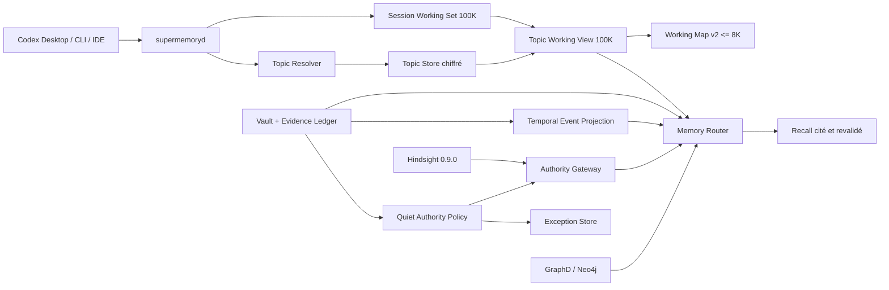

# SuperMemory Memory Fabric v2.2 — Topic Continuity & Quiet Authority

| Champ | Valeur |
|---|---|
| Statut | **Implémenté — contract-ready ; smoke live Z2 requis** |
| Version | 1.0 |
| Date | 2026-08-08 |
| Portée | Continuité multi-session, checkpoints de sujet, Working View 100K, recall temporel à couverture vérifiée, autorité canonique silencieuse et exceptions groupées |
| Déploiement | Activation intégrale ; `canary=false`, `progressive=false` |
| Documents parents | [Working Memory 100K](./supermemory-working-memory-100k-blueprint.md), [Hindsight-Native Memory Plane](./hindsight-native-memory-plane-blueprint.md) |

## 1. Résumé exécutif

Cette tranche fait évoluer SuperMemory d'une mémoire de travail liée à une seule session vers une mémoire opérationnelle liée à un **sujet durable**. Plusieurs sessions Codex peuvent contribuer au même sujet sans fusionner leurs journaux bruts et sans injecter tout leur historique dans le contexte du modèle.

La capacité de 100K est conservée. Elle devient la limite d'une **Topic Working View** : une sélection de preuves adressables provenant de la session courante et des sessions antérieures du même sujet. Le dossier de sujet lui-même n'est pas limité à 100K, car il conserve surtout des références, des checkpoints et des citations. La carte automatiquement réinjectée reste plafonnée à 8K.

La tranche formalise également une **Quiet Authority Policy** et un recall temporel à couverture vérifiée. SuperMemory résout automatiquement les cas ordinaires à partir des preuves, de la temporalité, du type de claim et de règles d'autorité versionnées. Une contradiction ne devient pas automatiquement une question posée à l'utilisateur. Elle peut être résolue, marquée provisoire, conservée comme disputée ou expirée. Une interruption n'est autorisée que lorsqu'une ambiguïté non résolue bloque une action importante et difficilement réversible.

La séparation des rôles est inchangée :

- Hindsight 0.9.0 apprend, consolide, rappelle et synthétise ;
- le vault SuperMemory conserve les preuves, l'état canonique et les décisions d'autorité ;
- le Working Set conserve les preuves opérationnelles d'une session ;
- le Topic Dossier relie les sessions et leurs checkpoints ;
- GraphD/Neo4j reste optionnel pour les requêtes temporelles exactes et multi-hop ;
- aucun nouveau moteur sémantique, modèle ou provider n'est ajouté.

## 2. État de départ vérifié

Le dépôt possède déjà les fondations suivantes :

- `codex-working-set-store.mjs` crée un Working Set chiffré de 100K par `(workspace_id, project_id, session_id)` ;
- `codex-working-map.mjs` produit une carte citée plafonnée à 8K ;
- `codex-working-recall.mjs` recherche, ouvre et réouvre les preuves d'un Working Set lié ;
- `codex-working-offload.mjs` n'autorise le déchargement qu'après round-trip vérifié ;
- `memory-admission-policy.mjs` décide entre `auto_activate`, `activate_ttl`, `quarantine` et `discard` avec vérificateur indépendant ;
- `hindsight-authority-gateway.mjs` revalide localement chaque fait ou observation rappelé ;
- `product-store.mjs` et `codex-workspace-store.mjs` réservent déjà la revue humaine aux candidats quarantined en mode automatique ;
- les routes `/v1/working/*` et les outils MCP restent liés au `working_set_id` opaque.
- `codex-memory-router.mjs` choisit déjà un tier et exécute un fan-out parallèle, mais s'arrête après une fusion en un seul passage sans évaluer la complétude sémantique de la preuve ;
- `canonical-knowledge-worker.mjs` utilise encore `episode.observed_at` comme valeur de repli pour `valid_from` lorsqu'aucune date d'événement n'est extraite.

Le manque réel est triple :

1. le Working Set est encore identifié par une seule `session_id` et sa clôture ne crée pas de dossier durable réutilisable par une autre session ;
2. la quarantaine et les conflits ne possèdent pas encore un contrat commun déterminant quand rester silencieux, quand apparaître dans l'interface et quand interrompre l'utilisateur.
3. le recall ne distingue pas encore systématiquement le temps d'observation, le temps de l'événement et la validité courante, et ne sait pas réparer un manque de couverture après le premier passage.

## 3. Objectifs

### 3.1 Objectifs produit

- Reprendre un sujet après plusieurs jours et plusieurs sessions sans relire les transcripts.
- Retrouver une décision ou une preuve d'une ancienne session depuis la session courante.
- Conserver une carte courte de l'état courant, même lorsque le sujet contient beaucoup plus de 100K de preuves.
- Ne jamais demander à l'utilisateur de valider une mémoire standard suffisamment prouvée.
- Ne jamais interrompre l'utilisateur pour une contradiction sans conséquence opérationnelle immédiate.
- Montrer pourquoi une information est courante, provisoire, disputée ou remplacée.
- Regrouper les rares exceptions utiles dans une vue locale, sans notification proactive dans cette tranche.
- Répondre aux questions temporelles, d'évolution et d'agrégation avec une couverture explicitement vérifiée.
- S'abstenir ou signaler une couverture partielle lorsqu'un comptage ou un état courant ne peut pas être prouvé.

### 3.2 Objectifs techniques

- Ajouter un `topic_id` opaque au-dessus de plusieurs `working_set_id` sans affaiblir leur isolation.
- Produire des checkpoints structurés, cités, chiffrés, append-only et reconstruisibles.
- Construire une Topic Working View de 100K maximum sans copier les payloads sources.
- Étendre la carte de travail en schéma v2 avec continuité, invariants et dernier checkpoint.
- Versionner l'état d'autorité d'un claim indépendamment de son score Hindsight.
- Dédupliquer, temporiser et réévaluer automatiquement les exceptions.
- Mesurer séparément le taux de quarantaine, le taux d'exception visible et le taux d'interruption.
- Séparer `observed_at`, `event_time` et la validité d'autorité dans les événements canoniques.
- Produire un `RetrievalPlan v1` déterministe et borné par question.
- Vérifier les evidence gaps après le premier recall et effectuer au plus deux recherches correctives.
- Mesurer la complétude temporelle, l'exhaustivité des agrégations et le taux d'abstention justifiée.

## 4. Non-objectifs

- Augmenter la capacité opérationnelle au-delà de 100K avant une évaluation montrant un manque réel.
- Charger automatiquement 100K dans le prompt du modèle.
- Fusionner tous les Working Sets d'un projet.
- Autoriser un `topic_id` à donner accès à une preuve sans `working_set_id` courant et binding local valide.
- Utiliser une similarité LLM seule pour fusionner automatiquement deux sujets.
- Ajouter un second LLM, un second provider ou un fallback de modèle.
- Remplacer le recall, Reflect, les observations ou les Knowledge Pages de Hindsight.
- Reproduire le Hindsight Control Plane dans l'interface SuperMemory.
- Maintenir un deuxième index vectoriel ou un deuxième service de recherche de type Chronos.
- Ajouter un appel LLM dédié pour générer un plan de recherche à chaque question.
- Déclarer un comptage exhaustif à partir d'un simple `top-k` sans preuve de pagination ou de couverture complète.
- Permettre au pipeline mémoire d'autoriser une action externe irréversible.
- Envoyer des rappels, e-mails ou notifications de revue dans cette tranche.

## 5. Décisions structurantes

| ID | Décision | Motivation |
|---|---|---|
| TC-D01 | 100K reste le plafond de toute vue opérationnelle adressable. | La durée d'un sujet ne justifie pas un contexte actif illimité. |
| TC-D02 | Le Topic Dossier est non borné en références, mais ne duplique aucun payload. | La continuité dépend de l'index et des checkpoints, pas de la copie des sources. |
| TC-D03 | Chaque session conserve son propre `working_set_id`. | Préserve l'isolation, l'idempotence et les journaux existants. |
| TC-D04 | Un `topic_id` peut référencer plusieurs Working Sets d'un même workspace et projet seulement. | Interdit toute continuité implicite entre scopes. |
| TC-D05 | Le caller MCP ne choisit jamais librement un `topic_id`. | Le topic est résolu depuis le Working Set déjà lié au process. |
| TC-D06 | En cas de doute de continuité, le système crée un nouveau sujet silencieusement. | Une fragmentation temporaire est moins risquée qu'une mauvaise fusion. |
| TC-D07 | Une fusion suggérée n'élargit jamais le recall avant validation déterministe ou action locale explicite. | Empêche une fuite logique entre tâches d'un même projet. |
| TC-D08 | Le checkpoint de base est déterministe et n'attend pas Hindsight. | La clôture de session reste disponible en mode dégradé. |
| TC-D09 | Hindsight Reflect peut enrichir un checkpoint en arrière-plan, mais chaque élément accepté doit être revalidé et cité. | Réutilise l'intelligence native sans céder l'autorité. |
| QA-D01 | Une admission automatique et un état d'autorité sont deux décisions distinctes. | Un claim admis peut ensuite devenir provisoire, disputé ou superseded. |
| QA-D02 | Le pipeline mémoire n'émet jamais directement une question à l'utilisateur. | L'ingestion et la consolidation restent non bloquantes. |
| QA-D03 | Une exception possède trois niveaux : `latent`, `visible`, `blocking`. | Toutes les quarantaines ne méritent pas l'attention humaine. |
| QA-D04 | Seul `blocking` peut autoriser une question, au moment précis d'une action à impact. | Évite les sollicitations préventives. |
| QA-D05 | Une action réversible utilise un fallback conservateur au lieu de demander. | Favorise la continuité de travail. |
| QA-D06 | La dernière déclaration explicite de l'utilisateur fait autorité pour ses préférences et décisions dans le même scope. | Réduit les arbitrages répétitifs sans transformer une opinion en fait externe. |
| QA-D07 | Un état machine provient de la dernière observation vérifiée de la machine concernée. | Le recall narratif ne remplace pas une mesure actuelle. |
| QA-D08 | Les contradictions ferment des fenêtres de validité ; elles n'effacent jamais l'historique. | Préserve l'audit et les réponses `as_of`. |
| QA-D09 | Le score Hindsight n'influence jamais directement l'autorité, l'interruption ou une permission. | Sépare pertinence et vérité opérationnelle. |
| QA-D10 | Aucune notification proactive n'est créée dans la v1 de Quiet Authority. | La vue Exceptions est consultée à la demande et les blocages apparaissent seulement au point d'action. |
| TR-D01 | `observed_at`, `event_time` et la validité d'autorité sont trois dimensions distinctes. | Une conversation peut être observée aujourd'hui tout en décrivant un événement passé et un claim désormais remplacé. |
| TR-D02 | Un événement temporel ambigu est représenté par un intervalle ou une incertitude, jamais par une date ponctuelle inventée. | Préserve les bornes et empêche la fausse précision. |
| TR-D03 | Le `RetrievalPlan` est produit par des règles déterministes du routeur ; Luna ne devient pas un planificateur obligatoire. | Maîtrise coût, latence, audit et reproductibilité. |
| TR-D04 | Une question simple reste en recall à un passage ; seules les intentions temporelles, d'agrégation, d'évolution et multi-hop peuvent déclencher une réparation. | Évite de rendre tout recall lent et agentique. |
| TR-D05 | Une boucle de réparation comporte au maximum trois passages au total et un budget de temps, tokens et résultats. | Empêche les boucles infinies et les coûts imprévisibles. |
| TR-D06 | Une agrégation n'est déclarée exhaustive que si la source fournit une couverture complète, une pagination épuisée ou une partition temporelle vérifiée. | `top-k` et pertinence ne signifient pas exhaustivité. |
| TR-D07 | Le gap evaluator contrôle la couverture, jamais la vérité ni l'autorité. | Sépare recherche suffisante et décision canonique. |

### 5.1 Delta normatif avec Memory Fabric v2.0

Cette tranche remplace partiellement les décisions session-scoped du blueprint Working Memory 100K :

- `WM-D03` reste vrai pour les journaux et payloads bruts, mais la continuité synthétique peut désormais traverser plusieurs sessions via un Topic Dossier du même workspace et projet ;
- le non-objectif « fusionner automatiquement les working sets » reste vrai : la Topic Working View référence les Working Sets, elle ne fusionne ni leurs journaux ni leurs identités ;
- la grâce de sept jours du Working Set ne limite pas la durée du Topic Dossier, de ses checkpoints ou des mémoires durables ;
- `WM-D10` reste inchangé : aucun listing global de sessions ou sujets n'est exposé au modèle.

## 6. Expérience produit

### 6.1 Reprise d'un sujet

Au démarrage d'une session :

1. SuperMemory résout le workspace et le projet comme aujourd'hui.
2. Il crée ou reprend le Working Set de la session.
3. Le Topic Resolver cherche une continuité déterministe.
4. Si une continuité sûre existe, le Working Set rejoint le Topic Dossier correspondant.
5. Sinon, un nouveau Topic Dossier est créé sans question.
6. Une Topic Working View sélectionne les preuves pertinentes de la session courante et des checkpoints antérieurs.
7. La Working Map v2 injecte au maximum 8K : objectif, invariants, état courant, dernier checkpoint, décisions ouvertes et citations.
8. Les preuves détaillées sont rouvertes uniquement à la demande.

### 6.2 Clôture d'une session

La clôture écrit d'abord un checkpoint déterministe contenant :

- objectif poursuivi ;
- état final de la session ;
- éléments terminés ;
- décisions et contraintes ;
- invariants épinglés ;
- erreurs ou risques non résolus ;
- prochaines actions ;
- questions ouvertes ;
- artefacts actifs ;
- citations vers les preuves exactes.

La session peut ensuite se fermer même si Hindsight est indisponible. Un enrichissement Reflect optionnel peut compléter le rendu après clôture, mais ne modifie pas les preuves ni les décisions canoniques.

### 6.3 Autorité silencieuse

Lorsqu'un nouveau claim arrive :

1. l'admission existante vérifie preuve, scope, extraction, temporalité et risque ;
2. la Quiet Authority Policy détermine son état canonique courant ;
3. les claims précédents éventuellement remplacés sont clôturés temporellement ;
4. les conflits non bloquants restent `disputed` ou `provisional` ;
5. une exception est réévaluée à chaque nouvelle preuve et avant toute utilisation à impact ;
6. aucune question n'est posée pendant l'ingestion, le recall ou la consolidation.

### 6.4 Vue locale SuperMemory

La vue **Travail** affiche uniquement le sujet courant ou explicitement sélectionné dans l'interface locale :

- titre et objectif ;
- sessions contributrices ;
- `Topic Working View: 63K / 100K` ;
- dernier checkpoint ;
- invariants, décisions, questions ouvertes et prochaines actions ;
- état de continuité : `exact`, `inherited`, `high_confidence`, `new` ou `suggested_link` ;
- citations navigables.

La vue **Exceptions** affiche :

- les exceptions `blocking` en premier ;
- les exceptions `visible` persistantes groupées par sujet et cause ;
- la recommandation automatique, les preuves contradictoires et l'impact ;
- une résolution par lot lorsque plusieurs exceptions partagent la même règle.

Les exceptions `latent` ne créent ni badge, ni notification. Elles restent auditables dans le journal.

### 6.5 Recall temporel et evidence gap

Pour une question simple, le comportement existant reste privilégié : un passage, une fusion, une revalidation et une réponse citée. Pour une question d'état courant, d'évolution, de date relative, de préférence remplacée ou d'agrégation :

1. le routeur classe l'intention et construit un `RetrievalPlan v1` déterministe ;
2. il interroge en parallèle les sources autorisées du plan ;
3. le `Evidence Gap Evaluator` vérifie la fenêtre temporelle, les états précédents, la pagination et les citations ;
4. si une lacune est réparable, il lance une recherche ciblée, au maximum deux fois ;
5. il transmet ensuite uniquement les preuves couvertes à l'Authority Gateway ;
6. si la couverture reste insuffisante, il retourne `partial` ou s'abstient, sans transformer un résultat `top-k` en réponse exhaustive.

Le plan et la couverture sont auditables mais ne sont pas proposés comme mémoire durable. Ils décrivent comment la question a été recherchée, pas ce qui doit devenir vrai.

## 7. Architecture cible



### 7.1 Plans de données

| Plan | Contenu | Autorité | Budget |
|---|---|---|---:|
| Session Working Set | preuves sélectionnées d'une session | journal de session | 100K par Working Set |
| Topic Dossier | membres, checkpoints, invariants, références | vault local | références non bornées |
| Topic Working View | sélection inter-session pour le travail courant | projection reconstruisible | 100K maximum |
| Working Map v2 | résumé opérationnel cité | projection reconstruisible | 8K maximum |
| Evidence Ledger | épisodes et payloads canoniques | vault local | politique de rétention |
| Temporal Event Projection | événements avec `event_time`, bornes et ancres | vault/GraphD reconstruisible | requête par intervalle, sans index vectoriel dédié |
| Learned Memory | facts, observations, Reflect | Hindsight dérivé | budget Hindsight |
| Authority Ledger | états, révisions, supersession, exceptions | vault local | non applicable |

### 7.2 Règle de capacité

La Topic Working View applique :

```text
100K = pins + current_session + unresolved + prior_checkpoints + reopened_history
```

Ordre de sélection :

1. invariants et preuves épinglés ;
2. session courante ;
3. erreurs et questions non résolues ;
4. décisions toujours actives ;
5. dernier checkpoint de chaque branche active ;
6. preuves antérieures récemment réouvertes ;
7. historique pertinent rappelé à la demande.

Contraintes :

- les pins peuvent provoquer `over_capacity`, comme aujourd'hui ;
- une session antérieure ne peut occuper plus de 35 % de la vue hors pins ;
- la session courante reçoit au moins 40 % du budget si elle contient assez de preuves ;
- l'ouverture d'une preuve retourne 8K par défaut, 20K maximum ;
- la vue est recalculable à partir des Working Sets, checkpoints et épisodes ;
- aucune réinjection automatique des 100K n'est autorisée.

## 8. Contrats de données

### 8.1 Topic Dossier v1

```json
{
  "schema": "supermemory.topic.v1",
  "topic_id": "topic_<uuidv7>",
  "workspace_id": "ws_...",
  "project_id": "prj_...",
  "title": "Continuité multi-session",
  "status": "active",
  "created_at": "...",
  "updated_at": "...",
  "last_checkpoint_id": "tcp_...",
  "authority_revision": 12,
  "retention_class": "project_default"
}
```

`status` vaut `active`, `paused`, `closed` ou `purged`. Le titre est un label dérivé et non une autorité. Un changement de titre ne modifie ni l'identité ni le scope.

### 8.2 Topic Membership v1

```json
{
  "schema": "supermemory.topic-membership.v1",
  "topic_id": "topic_...",
  "working_set_id": "wset_...",
  "session_id": "session_...",
  "relation": "root|continuation|fork",
  "resolution": "exact|inherited|high_confidence|manual",
  "resolution_score": 1,
  "reason_codes": ["fork_parent_binding"],
  "bound_at": "...",
  "unbound_at": null
}
```

Invariants :

- un Working Set actif appartient à un seul Topic Dossier ;
- tous les membres partagent exactement `workspace_id` et `project_id` ;
- un unbind clôture la membership mais ne réécrit pas les journaux ;
- une fusion de sujets produit une nouvelle révision et un reçu d'audit ;
- un `topic_id` seul ne constitue jamais une capability de lecture.

### 8.3 Topic Checkpoint v1

```json
{
  "schema": "supermemory.topic-checkpoint.v1",
  "checkpoint_id": "tcp_<sha256>",
  "topic_id": "topic_...",
  "working_set_id": "wset_...",
  "session_id": "session_...",
  "kind": "periodic|compaction|session_end|manual",
  "goal": [],
  "invariants": [],
  "current_state": [],
  "completed": [],
  "decisions": [],
  "open_questions": [],
  "next_actions": [],
  "artifacts": [],
  "evidence_ids": ["wev_..."],
  "input_hash": "sha256:...",
  "generated_by": "deterministic-map-v2",
  "enrichment": null,
  "created_at": "..."
}
```

Chaque item de chaque section porte au moins un `evidence_id`. Un enrichissement Reflect éventuel est stocké séparément avec `authoritative=false`, ses faits sources et son hash. Il ne peut ni retirer un invariant ni changer une décision canonique.

### 8.4 Canonical Event Time v1

Les épisodes et claims temporels portent séparément le moment où l'information a été observée et le moment auquel l'événement décrit a pu se produire :

```json
{
  "observed_at": "2026-04-12T10:00:00Z",
  "event_time": {
    "kind": "interval",
    "earliest": "2026-03-01T00:00:00Z",
    "latest": "2026-03-31T23:59:59Z",
    "granularity": "month",
    "anchor_timestamp": "2026-04-12T10:00:00Z",
    "normalization": "relative_expression"
  }
}
```

`event_time.kind` vaut `instant`, `interval` ou `uncertain`. `earliest` et `latest` peuvent être nuls lorsque la source ne permet aucune borne fiable. `granularity` vaut `exact`, `minute`, `hour`, `day`, `week`, `month`, `year` ou `unknown`. `normalization` vaut `explicit`, `relative_expression`, `inferred` ou `legacy_observed_only`.

`valid_from` et `valid_to` d'une relation ou d'un `Authority State` ne sont pas remplacés : ils décrivent respectivement la validité de la relation ou du claim, et non nécessairement la date à laquelle l'événement s'est produit. Une date absente ne peut donc pas être remplacée silencieusement par `observed_at` comme si elle était exacte.

### 8.5 Authority State v1

```json
{
  "schema": "supermemory.authority-state.v1",
  "claim_id": "mem_...",
  "workspace_id": "ws_...",
  "project_id": "prj_...",
  "topic_id": "topic_...",
  "fact_class": "user_decision",
  "state": "current",
  "revision": 4,
  "valid_from": "...",
  "valid_until": null,
  "supersedes": ["mem_old"],
  "evidence_ids": ["wev_..."],
  "policy_version": "quiet-authority-v1.0.0",
  "reason_codes": ["latest_explicit_owner_decision"],
  "evaluated_at": "..."
}
```

`state` vaut :

- `current` : utilisable comme état courant dans son scope ;
- `provisional` : utilisable pour une action réversible avec incertitude visible ;
- `disputed` : plusieurs claims restent plausibles, aucun ne devient vérité silencieusement ;
- `superseded` : historiquement valable mais remplacé ;
- `revoked` : interdit immédiatement ;
- `expired` : TTL ou fraîcheur dépassé.

### 8.6 Exception v1

```json
{
  "schema": "supermemory.authority-exception.v1",
  "exception_id": "exc_<sha256>",
  "fingerprint": "sha256:...",
  "workspace_id": "ws_...",
  "project_id": "prj_...",
  "topic_id": "topic_...",
  "claim_ids": ["mem_a", "mem_b"],
  "level": "latent",
  "status": "open",
  "reason_codes": ["active_conflict"],
  "recommended_resolution": "prefer_fresh_machine_observation",
  "impact": "low",
  "irreversibility": "reversible",
  "first_seen_at": "...",
  "last_evaluated_at": "...",
  "next_evaluation_at": "...",
  "evaluation_count": 2
}
```

Une exception de même fingerprint est mise à jour, jamais dupliquée. Elle peut être résolue automatiquement par une nouvelle preuve, une expiration, une supersession ou une règle owner déjà enregistrée.

### 8.7 Retrieval Plan et couverture v1

Le routeur dérive un plan borné sans appel LLM obligatoire :

```json
{
  "schema": "supermemory.retrieval-plan.v1",
  "intent": "current_state|temporal_range|aggregation|preference|multi_hop|simple_recall",
  "time_window": {
    "start": null,
    "end": null,
    "required": false
  },
  "steps": [
    {"source": "events", "mode": "range", "exhaustive": true},
    {"source": "topic_turns", "mode": "lexical_semantic", "exhaustive": false},
    {"source": "graph", "mode": "multi_hop", "exhaustive": false}
  ],
  "requirements": {
    "require_current_and_superseded": false,
    "require_complete_range": false,
    "require_explicit_preference": false
  },
  "max_rounds": 3,
  "budget": {
    "max_ms": 5000,
    "max_results": 1000,
    "max_tokens": 12000
  }
}
```

Après chaque passage, le routeur produit une couverture :

```json
{
  "coverage": {
    "temporal_window": "complete|partial|not_required|unavailable",
    "current_state": "complete|partial|not_required|unavailable",
    "aggregation": "exact|bounded|unknown|not_required",
    "evidence_gap": ["missing_prior_state"]
  },
  "round": 1,
  "repair_attempted": false,
  "abstention_required": false
}
```

Une question simple reste en un passage. Une question d'agrégation, d'évolution, de plage temporelle, de préférence remplacée ou multi-hop peut déclencher une recherche corrective, sans dépasser trois passages au total. Le résultat ne peut être présenté comme exhaustif si la pagination, la partition temporelle ou la source complète n'a pas été vérifiée.

## 9. Résolution de continuité

### 9.1 Signaux autorisés

Le Topic Resolver utilise par ordre de force :

1. binding exact d'un identifiant de conversation public déjà observé ;
2. `forked_from_working_set_id` valide ;
3. checkpoint de reprise explicitement transmis par l'adaptateur de confiance ;
4. identifiant externe exact et scopé, par exemple issue, goal ou document de tâche ;
5. chevauchement d'artefacts actifs et de décisions citées ;
6. fingerprint déterministe de l'objectif initial.

Une similarité Hindsight peut produire `suggested_link`, jamais une membership active à elle seule.

### 9.2 Décision

```text
exact/inherited                         -> bind
score >= 0.90 et marge >= 0.25          -> bind high_confidence
plusieurs candidats ou score inférieur  -> nouveau topic
similarité dérivée seulement            -> nouveau topic + suggested_link latent
```

Le resolver ne pose aucune question. Une mauvaise séparation peut être corrigée plus tard sans perdre de données. Une mauvaise fusion exige un unbind audité et une reconstruction de la Topic Working View.

## 10. Politique d'autorité

### 10.1 Classes de faits

| Classe | Règle d'autorité par défaut |
|---|---|
| `machine_state` | Dernière observation authentifiée de la cible exacte, avec TTL court |
| `source_state` | Dernier snapshot autorisé et frais |
| `user_decision` | Dernière décision explicite de l'utilisateur dans le même scope |
| `user_preference` | Dernière préférence explicite, sauf portée temporaire ou locale |
| `project_constraint` | Dernière contrainte explicite non révoquée, épinglée dans le Topic Dossier |
| `external_fact` | Preuve primaire ou corroboration selon la fiabilité de source |
| `derived_observation` | Toujours non autoritative ; utilisable comme piste citée |
| `permission` | Grant explicite, scopé, non expiré ; jamais inféré |
| `high_impact_fact` | Preuve renforcée ou état disputed ; aucune action irréversible automatique |

### 10.2 Automate de décision

```text
admitted claim
  -> classify fact
  -> load current claims in exact scope
  -> validate freshness and evidence
  -> apply precedence rule
  -> current | provisional | disputed | superseded | expired
  -> update temporal windows
  -> revalidate Hindsight/GraphD projections
  -> evaluate exception visibility
```

Règles :

- une nouvelle observation plus fraîche peut supersede un état machine ancien sans intervention ;
- une décision utilisateur explicite plus récente supersede l'ancienne dans le même sujet ;
- deux interprétations LLM ne se départagent jamais par leur confiance auto-déclarée ;
- un conflit à faible impact peut rester disputed indéfiniment sans sollicitation ;
- un résultat provisional doit annoncer son incertitude dans la réponse citée ;
- une mémoire revoked est refusée avant tout appel ou nettoyage dérivé distant.

### 10.3 Gate d'interruption

Une exception ne passe à `blocking` que si toutes les conditions sont vraies :

1. au moins deux états restent plausibles après revalidation ;
2. aucune règle versionnée ou preuve fraîche ne les départage ;
3. une opération concrète attend cette information maintenant ;
4. l'impact est important ;
5. l'opération est difficilement réversible, externe, destructive ou liée à une permission ;
6. aucun fallback conservateur ne permet de continuer ;
7. aucune directive owner antérieure ne couvre déjà ce cas.

Dans tous les autres cas :

- le système continue avec l'état `current` ; ou
- il utilise un résultat `provisional` et cite l'incertitude ; ou
- il diffère l'action concernée tout en poursuivant les tâches indépendantes ; ou
- il conserve une exception `latent` ou `visible` sans question.

## 11. API daemon et MCP

### 11.1 Routes internes

| Route | Rôle |
|---|---|
| `POST /v1/topic/resolve` | Créer ou lier le sujet de la session courante |
| `POST /v1/topic/checkpoint` | Écrire un checkpoint idempotent |
| `POST /v1/topic/context` | Construire la Topic Working View et la carte v2 |
| `POST /v1/topic/search` | Chercher dans les Working Sets membres et le ledger durable |
| `POST /v1/recall/plan` | Produire le Retrieval Plan déterministe et ses budgets |
| `POST /v1/recall/coverage` | Évaluer la couverture et les evidence gaps d'un passage |
| `POST /v1/authority/explain` | Expliquer état, précédence, preuves et supersession |
| `POST /v1/exceptions/query` | Alimenter l'interface locale avec filtres de visibilité |
| `POST /v1/exceptions/resolve` | Appliquer une décision owner locale et auditée |

Toutes les routes de contenu exigent le binding `(workspace_id, project_id, working_set_id)` existant. `topic_id` est résolu côté serveur. Les erreurs inter-scope restent indistinguables d'un identifiant inconnu.

### 11.2 Évolution des outils MCP

- `supermemory_working_map` retourne le schéma v2 et le dernier checkpoint du sujet ;
- `supermemory_working_search` accepte `scope=current_session|topic`, avec `topic` par défaut après binding ;
- `supermemory_working_open` conserve les limites et le round-trip existants ;
- `supermemory_recall` peut utiliser le `topic_id` résolu comme filtre local, sans l'accepter du modèle, et retourne le plan, la couverture et le nombre de passages ;
- `supermemory_explain_citation` inclut l'état d'autorité et la chaîne de supersession.

Aucun outil MCP ne permet :

- de lister tous les topics ;
- de fournir arbitrairement un `topic_id` ;
- de fusionner, rebind ou supprimer un topic ;
- de résoudre une exception owner ;
- de modifier les règles d'autorité.

## 12. Rôle de Hindsight 0.9.0

Hindsight reste propriétaire de :

- retain, recall et Reflect ;
- facts, experiences et observations ;
- Knowledge Pages et documents dérivés ;
- extraction d'entités et graphe appris ;
- temporal retrieval, graph retrieval et reranking ;
- synthèses structurées non autoritatives.

SuperMemory n'ajoute pas de moteur concurrent. La tranche utilise Hindsight pour :

- rappeler des éléments durables liés au sujet ;
- proposer un enrichissement de checkpoint avec Reflect ;
- suggérer des liens de sujets à faible confiance ;
- fournir des candidats de recall ensuite revalidés localement.

Hindsight ne décide jamais :

- qu'un Working Set appartient à un Topic Dossier ;
- qu'un claim est canonique ;
- qu'une exception doit interrompre l'utilisateur ;
- qu'une permission existe ;
- qu'une source stale redevient actuelle.

La sélection sémantique, le temporal retrieval, le graph retrieval et le reranking Hindsight restent utilisables comme étapes du plan. Le routeur SuperMemory ajoute uniquement les contraintes de fenêtre, de scope, de couverture et de revalidation ; il ne crée pas un index vectoriel parallèle.

## 13. Runtime config v5

```json
{
  "schema": "supermemory.codex-runtime.v5",
  "working_memory": {
    "capacity_tokens": 100000,
    "map_target_tokens": 4000,
    "map_max_tokens": 8000
  },
  "topic_continuity": {
    "enabled": true,
    "working_view_capacity_tokens": 100000,
    "auto_bind_threshold": 0.90,
    "auto_bind_margin": 0.25,
    "semantic_link_mode": "suggest_only",
    "checkpoint_on_compaction": true,
    "checkpoint_on_session_end": true,
    "reflect_enrichment": true
  },
  "temporal_retrieval": {
    "enabled": true,
    "plan_schema": "supermemory.retrieval-plan.v1",
    "max_rounds": 3,
    "repair_intents": ["current_state", "temporal_range", "aggregation", "preference", "multi_hop"],
    "max_ms": 5000,
    "max_results": 1000,
    "max_tokens": 12000,
    "abstain_on_incomplete_coverage": true
  },
  "authority": {
    "mode": "quiet",
    "policy_version": "quiet-authority-v1.0.0",
    "routine_user_prompts": false,
    "interrupt_only_at_action_boundary": true,
    "proactive_notifications": false,
    "visible_exception_min_age_ms": 86400000
  }
}
```

La migration v4 → v5 est atomique. Elle ne change ni provider LLM, ni modèle, ni banque Hindsight, ni topologie Docker.

## 14. Carte d'impact du code

### 14.1 Nouveaux modules

| Fichier | Responsabilité |
|---|---|
| `scripts/lib/codex-topic-store.mjs` | Journal AEAD des topics, memberships et checkpoints |
| `scripts/lib/codex-topic-resolver.mjs` | Résolution déterministe de continuité |
| `scripts/lib/codex-topic-view.mjs` | Sélection inter-session bornée à 100K |
| `scripts/lib/codex-topic-checkpoint.mjs` | Checkpoint déterministe et enrichissement optionnel |
| `scripts/lib/codex-temporal-normalizer.mjs` | Normalisation bornée des dates explicites, relatives et incertaines |
| `scripts/lib/codex-retrieval-plan.mjs` | Classification déterministe et construction du Retrieval Plan v1 |
| `scripts/lib/codex-evidence-coverage.mjs` | Vérification de couverture, gaps et décision de recherche corrective |
| `scripts/lib/memory-authority-policy.mjs` | États d'autorité, précédence et supersession |
| `scripts/lib/memory-exception-store.mjs` | Déduplication, temporisation et visibilité des exceptions |

### 14.2 Modules modifiés

| Fichier | Modification |
|---|---|
| `scripts/lib/codex-working-set-store.mjs` | Binding minimal vers le topic et accès contrôlé aux états membres |
| `scripts/lib/codex-working-map.mjs` | Schéma v2, invariants et checkpoint de sujet |
| `scripts/lib/codex-working-recall.mjs` | Recherche `current_session|topic` sans listing global |
| `scripts/lib/codex-memory-router.mjs` | Routage topic-aware, Retrieval Plan, passages bornés et propagation de la couverture |
| `scripts/lib/canonical-knowledge-worker.mjs` | Conservation distincte de `observed_at` et `event_time`, sans repli silencieux vers une date exacte |
| `scripts/lib/knowledge-graph-adapter.mjs` | Requêtes d'événements par intervalle, pagination et état `as_of` |
| `scripts/lib/memory-admission-policy.mjs` | Transmission normalisée vers l'Authority Policy, sans modifier les décisions v1 |
| `scripts/lib/hindsight-authority-gateway.mjs` | Revalidation de `authority_revision`, `provisional` et `disputed` |
| `scripts/lib/codex-runtime-config.mjs` | Schéma v5 et validation des nouveaux invariants |
| `scripts/lib/supermemory-daemon.mjs` | Routes topic, checkpoint, authority et exceptions |
| `scripts/supermemoryd.mjs` | Composition des nouveaux stores et policies |
| `scripts/supermemory-app.mjs` | APIs locales Travail et Exceptions |
| `web/app.js`, `web/index.html`, `web/styles.css` | Vue sujet courant et exceptions silencieuses |
| `plugins/supermemory/scripts/mcp.mjs` | Contrats MCP v2 sans mutation de topic |

### 14.3 Modules explicitement non dupliqués

- aucun nouveau vector store ;
- aucun nouveau moteur d'embeddings ;
- aucun index vectoriel séparé pour les tours et événements ;
- aucun appel LLM obligatoire pour planifier la recherche ;
- aucun nouveau composant de modèles mentaux ;
- aucune nouvelle UI de facts/observations Hindsight ;
- aucune nouvelle queue distante ;
- aucun nouveau service Docker.

## 15. Migration

### 15.1 Données existantes

- Chaque Working Set historique sans lien de fork devient initialement le root d'un Topic Dossier distinct.
- Les chaînes `forked_from_working_set_id` valides sont regroupées déterministiquement dans le même topic.
- Aucun regroupement sémantique historique automatique n'est effectué.
- Les journaux Working Set v1 restent immuables ; le Topic Store référence leurs identifiants.
- Les cartes v1 sont reconstruites en v2 à la première ouverture.
- Les admissions et mémoires existantes reçoivent un Authority State initial dérivé de leur décision, TTL, validité et statut courant.
- Les épisodes historiques sans date d'événement reçoivent `event_time.kind=uncertain`, `normalization=legacy_observed_only` et conservent `observed_at` comme ancre non équivalente à une date d'occurrence.
- Les quarantaines existantes deviennent `latent` sauf si elles bloquent déjà une action ou une permission connue.

### 15.2 Séquence

1. arrêter les écritures du daemon ;
2. sauvegarder et vérifier le vault ;
3. migrer la runtime config v4 → v5 ;
4. construire Topic Store et Authority Ledger en staging ;
5. vérifier hashes, scopes et memberships ;
6. basculer atomiquement les nouveaux index ;
7. redémarrer le daemon ;
8. reconstruire les Working Maps v2 à la demande ;
9. lancer les tests E2E multi-session et quiet authority ;
10. construire la projection temporelle et vérifier les plans de recall sur le corpus de migration ;
11. conserver les artefacts staging jusqu'à validation de la restauration.

La migration ne requiert aucune réingestion Hindsight ni reconstruction Neo4j pour les données non temporelles. Une reconstruction ciblée de la projection temporelle est autorisée si les événements existants n'ont pas encore de bornes ou si une incohérence d'autorité est détectée.

## 16. Sécurité et confidentialité

Invariants obligatoires :

- Topic Store, checkpoints, memberships et exceptions sont chiffrés AEAD ;
- `workspace_id` et `project_id` sont immuables pendant la vie d'un topic ;
- un Working Set d'un autre scope est indistinguable d'un identifiant inconnu ;
- un topic ne permet pas de contourner le `working_set_id` capability-bound ;
- une suggested link ne participe jamais au recall ;
- un checkpoint ne peut citer une preuve tombstonée ou purgée ;
- une vieille carte est revalidée avant chaque réinjection ;
- une exception ne contient pas de payload source en clair ;
- une résolution owner est signée par le contexte local et auditée ;
- une permission ne peut jamais être inférée depuis Hindsight, Reflect ou un résumé de topic.

## 17. Résilience

| Panne | Comportement |
|---|---|
| Hindsight indisponible | checkpoint déterministe, topic et Working Set restent disponibles ; pas d'enrichissement |
| Neo4j indisponible | continuité et autorité fonctionnent ; multi-hop marqué unavailable |
| Topic Store corrompu | fail closed sur recall inter-session ; session courante reste utilisable |
| Authority Ledger corrompu | facts dérivés refusés ; preuves brutes citées encore ouvrables selon scope |
| Checkpoint invalide | rejet et reconstruction depuis Working Set/Evidence Ledger |
| Resolver ambigu | nouveau topic silencieux |
| Exception worker arrêté | aucune interruption ; les actions à impact utilisent le gate local et échouent conservativement |

## 18. Observabilité et SLO

### 18.1 Métriques

- `topic_count`, `topic_active_count` ;
- `topic_sessions_per_topic` ;
- `topic_auto_bind_exact_total`, `topic_auto_bind_high_confidence_total` ;
- `topic_new_on_ambiguity_total`, `topic_suggested_link_total` ;
- `topic_view_selected_tokens`, `topic_view_prior_session_ratio` ;
- `checkpoint_build_ms`, `checkpoint_rebuild_total` ;
- `authority_current_total`, `authority_provisional_total`, `authority_disputed_total` ;
- `authority_supersession_total` ;
- `exception_latent_total`, `exception_visible_total`, `exception_blocking_total` ;
- `user_interruption_total` et `user_interruption_avoided_total` ;
- `stale_or_revoked_recall_rejected_total` ;
- `temporal_event_normalized_total`, `temporal_event_uncertain_total` ;
- `retrieval_plan_total`, `retrieval_repair_total`, `retrieval_round_total` ;
- `retrieval_coverage_complete_total`, `retrieval_coverage_partial_total` ;
- `retrieval_exhaustive_claim_rejected_total`, `retrieval_abstention_total`.

### 18.2 Cibles

| Indicateur | Cible |
|---|---:|
| Working Map | ≤ 8K tokens estimés dans 100 % des cas |
| Topic Working View | ≤ 100K tokens estimés hors pins explicites |
| Auto-bind precision sur corpus | ≥ 99 % |
| Auto-bind ambigu | 0 fusion ; création d'un nouveau topic |
| Checkpoint déterministe local p95 | < 500 ms hors ouverture de payload volumineux |
| Claims standards auto-traités | ≥ 95 % |
| Exceptions visibles | < 5 % des claims standards |
| Interruptions directes | 0 pour claims standards ; < 1 % de toutes les décisions mémoire |
| Recall stale/revoked accepté | 0 |
| Recall simple en un passage | ≥ 99 % des requêtes simples |
| Passages de réparation | ≤ 2 réparations et ≤ 3 passages au total |
| Agrégation déclarée exhaustive sans couverture | 0 |
| Question temporelle sans `event_time` ou ancre explicite | 0 réponse temporelle exacte ; résultat `partial` ou abstention |
| Fuite inter-workspace/projet/topic | 0 |

## 19. Plan d'implémentation

### Lot 0 — Contrats rouges

- Ajouter les schémas topic, checkpoint, authority et exception.
- Ajouter le runtime config v5.
- Écrire les fixtures multi-session et quiet authority avant le code fonctionnel.
- Ajouter un corpus temporel local de type LongMemEvalS avec oracle de couverture, sans reprendre ses scores comme vérité produit.
- Faire échouer explicitement les tests sur l'absence de `topic_id`, de checkpoint v1 et de gate d'interruption.

### Lot 1 — Topic Store

- Implémenter le journal AEAD append-only.
- Ajouter Topic Dossier, membership, checkpoint et rebuild.
- Garantir l'idempotence des créations et bindings.
- Ajouter les tests de corruption, scope, replay et crash recovery.

### Lot 2 — Resolver et migration

- Implémenter les signaux exacts et inherited.
- Implémenter le score high-confidence borné.
- Créer un nouveau topic en cas d'ambiguïté.
- Migrer les Working Sets existants sans modifier leurs journaux.

### Lot 3 — Checkpoints et Topic Working View

- Construire le checkpoint déterministe.
- Ajouter l'enrichissement Hindsight Reflect asynchrone.
- Implémenter la sélection inter-session de 100K.
- Faire évoluer Working Map en v2.

### Lot 4 — Recall multi-session

- Étendre working search avec `scope=topic`.
- Ouvrir une preuve d'ancienne session via citation et binding courant.
- Ajouter topic context au Memory Router.
- Conserver les limites d'ouverture et protections inter-scope.

### Lot 4.5 — Temporal Event Retrieval & Evidence Coverage

- Ajouter les contrats `observed_at`, `event_time` et validité d'autorité sans confondre leurs sémantiques.
- Normaliser les dates explicites, relatives et incertaines en intervalles bornés.
- Construire un `RetrievalPlan v1` déterministe selon l'intention de la question.
- Évaluer après chaque passage la couverture temporelle, l'état courant et l'exhaustivité d'une agrégation.
- Autoriser au plus deux recherches correctives, dans une limite de trois passages et d'un budget global.
- Retourner `partial` ou s'abstenir lorsqu'une réponse exacte ou exhaustive ne peut pas être prouvée.
- Réutiliser Hindsight, Evidence Ledger, Working Search et GraphD sans second index vectoriel ni appel LLM de planification obligatoire.

### Lot 5 — Quiet Authority

- Implémenter les classes de faits et règles de précédence.
- Ajouter Authority State, révisions et supersession temporelle.
- Revalider Hindsight avec l'état courant.
- Propager `provisional` et `disputed` dans les réponses citées.

### Lot 6 — Exceptions silencieuses

- Implémenter fingerprint, déduplication et réévaluation.
- Ajouter les niveaux latent, visible et blocking.
- Implémenter le gate d'interruption à l'action boundary.
- Adapter l'interface locale sans notification proactive.

### Lot 7 — E2E, migration et release

- Exécuter les scénarios 1, 5, 20 et 50 sessions par sujet.
- Tester Hindsight et Neo4j indisponibles.
- Tester tombstone, TTL, supersession et restauration.
- Vérifier UI, MCP, runtime, Compose, secrets et backup/restore.
- Mettre à jour la documentation de production et le release receipt.

## 20. Critères d'acceptation

| ID | Critère |
|---|---|
| TC-AC01 | Une session neuve crée un Topic Dossier sans intervention. |
| TC-AC02 | Une reprise exacte ou un fork rejoint automatiquement le topic parent. |
| TC-AC03 | Une résolution ambiguë crée un nouveau topic et ne demande rien à l'utilisateur. |
| TC-AC04 | Deux Working Sets du même topic restent physiquement et cryptographiquement distincts. |
| TC-AC05 | Un topic ne peut contenir deux workspaces ou projets. |
| TC-AC06 | Le MCP ne peut ni lister ni choisir arbitrairement un topic. |
| TC-AC07 | La Topic Working View ne dépasse pas 100K hors pins explicites. |
| TC-AC08 | La Working Map v2 ne dépasse jamais 8K et cite chaque item factuel. |
| TC-AC09 | Une session retrouve une décision citée de la première session après au moins vingt sessions intermédiaires. |
| TC-AC10 | La clôture produit un checkpoint valide même si Hindsight est arrêté. |
| TC-AC11 | Un enrichissement Reflect non fondé est rejeté sans modifier le checkpoint déterministe. |
| TC-AC12 | Une preuve tombstonée disparaît immédiatement des cartes et recherches inter-session. |
| TC-AC13 | Une Suggested Link n'élargit jamais le recall. |
| TC-AC14 | La migration crée un topic par racine historique et regroupe seulement les forks vérifiés. |
| TR-AC01 | Un événement décrit le 12 avril comme ayant eu lieu « le mois dernier » conserve `observed_at=12 avril` et un `event_time` borné au mois précédent. |
| TR-AC02 | Une date ambiguë ne devient jamais une date ponctuelle exacte par défaut. |
| TR-AC03 | Une question simple utilise un seul passage et ne déclenche pas de planificateur LLM. |
| TR-AC04 | Une question d'agrégation vérifie la période complète et refuse le qualificatif exhaustif si la couverture est partielle. |
| TR-AC05 | Une question d'état courant recherche l'état actuel et les claims superseded nécessaires avant de conclure. |
| TR-AC06 | Un evidence gap déclenche au maximum deux recherches correctives et trois passages au total. |
| TR-AC07 | Une absence de couverture renvoie `partial` ou une abstention citée, jamais un comptage inventé. |
| TR-AC08 | L'indisponibilité de GraphD ou Hindsight expose la couverture dégradée sans élargir le scope ni contourner l'autorité. |
| TR-AC09 | Aucun index vectoriel ou service Chronos supplémentaire n'est créé. |
| QA-AC01 | Un claim standard fortement prouvé devient current sans question utilisateur. |
| QA-AC02 | Une nouvelle observation machine fraîche supersede automatiquement l'ancienne. |
| QA-AC03 | Une décision utilisateur explicite récente supersede l'ancienne dans le même scope. |
| QA-AC04 | Deux claims faibles et contradictoires deviennent disputed sans interruption. |
| QA-AC05 | Une information temporaire devient provisional puis expire ou est revalidée. |
| QA-AC06 | Une quarantaine nouvelle reste latent tant qu'elle ne bloque rien et n'est pas persistante. |
| QA-AC07 | Une exception persistante à valeur réelle devient visible sans notification proactive. |
| QA-AC08 | Une exception ne devient blocking qu'au point d'une action importante sans fallback. |
| QA-AC09 | Une action réversible continue avec un résultat provisional cité au lieu de demander. |
| QA-AC10 | Une permission ambiguë n'est jamais inférée et bloque uniquement l'action concernée. |
| QA-AC11 | Une nouvelle preuve résout et ferme automatiquement l'exception correspondante. |
| QA-AC12 | Une observation ou synthèse Hindsight avec une source non current est rejetée entièrement. |
| QA-AC13 | Le score Hindsight ne change jamais un Authority State. |
| QA-AC14 | Le corpus standard produit zéro interruption directe et moins de 5 % d'exceptions visibles. |
| QA-AC15 | Chaque résolution owner ou automatique possède un reçu d'audit et une révision. |
| E2E-AC01 | Le flux session A → checkpoint → session B → recall cité fonctionne avec le même topic. |
| E2E-AC02 | Le flux admission → supersession → Hindsight recall rejette l'ancienne mémoire. |
| E2E-AC03 | Backup, restore et rebuild reproduisent topics, checkpoints, authority states et exceptions ouvertes. |
| E2E-AC04 | La suite complète existante reste verte sans second provider, fallback, canary ou service Docker. |

## 21. Stratégie de test

### 21.1 Nouveaux tests unitaires

- `tests/codex-topic-store.test.mjs` ;
- `tests/codex-topic-resolver.test.mjs` ;
- `tests/codex-topic-view.test.mjs` ;
- `tests/codex-topic-checkpoint.test.mjs` ;
- `tests/codex-temporal-normalizer.test.mjs` ;
- `tests/codex-retrieval-plan.test.mjs` ;
- `tests/codex-evidence-coverage.test.mjs` ;
- `tests/memory-authority-policy.test.mjs` ;
- `tests/memory-exception-store.test.mjs`.

### 21.2 Tests d'intégration

- extension de `codex-working-memory-integration.test.mjs` ;
- extension de `codex-working-recall.test.mjs` ;
- extension de `codex-memory-router.test.mjs` ;
- tests de dates relatives, intervalles, pagination, gaps et abstention ;
- extension de `codex-hindsight-recall.test.mjs` ;
- extension de `supermemory-daemon-recall.test.mjs` ;
- tests UI Travail et Exceptions avec Playwright.

### 21.3 Corpus obligatoires

- sujet unique sur vingt sessions avec décisions anciennes encore retrouvables ;
- deux sujets voisins dans le même projet sans contamination ;
- fork exact et nouvelle session ambiguë ;
- préférence utilisateur remplacée ;
- état machine devenu stale ;
- contradiction externe à faible impact ;
- conflit permission/destruction à impact élevé ;
- résolution automatique après arrivée d'une preuve primaire ;
- Hindsight indisponible à la clôture ;
- suppression d'une preuve citée dans un ancien checkpoint.
- événement observé aujourd'hui mais situé le mois précédent ;
- succession de trois états d'une même préférence ou machine ;
- agrégation multi-session complète et agrégation volontairement partielle ;
- question « actuellement » avec état précédent superseded ;
- question temporelle sans borne exploitable ;
- premier recall insuffisant réparé par voisinage ou intervalle ;
- gap non résolu après trois passages entraînant une abstention ;
- Hindsight ou GraphD indisponible pendant une question temporelle.

## 22. Definition of Done

La tranche est terminée lorsque :

- tous les critères `TC-*`, `QA-*` et `E2E-*` sont exécutables et verts ;
- le runtime production utilise `supermemory.codex-runtime.v5` ;
- les Working Sets v1 existants sont migrés sans perte ni réécriture de journal ;
- le même sujet peut être repris sur plusieurs sessions avec une carte ≤8K ;
- la vue opérationnelle reste ≤100K et les preuves anciennes restent rouvrables ;
- les claims standards ne provoquent aucune sollicitation utilisateur ;
- seules les actions réellement bloquées peuvent produire une question ;
- les questions temporelles utilisent `event_time` sans confondre observation et occurrence ;
- les agrégations et états courants exposent une couverture vérifiée ou s'abstiennent ;
- les recherches correctives restent bornées et mesurables ;
- Hindsight reste l'unique plan appris et aucun moteur dupliqué n'est introduit ;
- les tests unitaires, intégration, E2E, release, sécurité, backup/restore et Playwright sont verts ;
- la documentation d'exploitation décrit migration, diagnostic, restauration et purge des topics.

## 23. Risques résiduels

| Risque | Réponse |
|---|---|
| Mauvais auto-bind | Seuil de précision élevé, marge obligatoire et création d'un nouveau topic en cas de doute |
| Fragmentation excessive | Suggested Links silencieux et fusion locale ultérieure, sans perte de preuve |
| Dérive des checkpoints | Checkpoint déterministe, citations obligatoires et enrichissement séparé |
| Topics trop gros | Working View bornée, checkpoints hiérarchiques et recherche à la demande |
| Exceptions oubliées | Réévaluation sur nouvelle preuve, avant recall à impact et avant action |
| Règles owner trop larges | Scope exact, expiration possible et audit de chaque application |
| Autorité trop conservatrice | État provisional utilisable pour les opérations réversibles |
| Double intelligence avec Hindsight | Hindsight synthétise ; SuperMemory ne fait que valider, scoper et versionner |
| Fausse précision temporelle | Intervalles, granularité et ancre obligatoires ; legacy marqué uncertain |
| Boucle de recall coûteuse | Intentions réparables explicites, trois passages maximum et budget global |
| Comptage incomplet présenté comme exact | Coverage evaluator, pagination/partition obligatoires et abstention |
| Sur-architecture de retrieval | Réutilisation Hindsight, Evidence Ledger, Working Search et GraphD ; aucun index vectoriel nouveau |

## 24. Décision finale

La prochaine tranche est **Topic Continuity & Quiet Authority**, avec le **Lot 4.5 — Temporal Event Retrieval & Evidence Coverage** entre le recall multi-session et Quiet Authority.

Elle ne cherche pas à agrandir indéfiniment le contexte ni à concurrencer Hindsight. Elle transforme les 100K existants en une fenêtre de travail durable à travers les sessions, rend le recall temporel capable de vérifier sa couverture et rend l'autorité canonique automatique dans le cas normal. La mémoire doit demander moins à l'utilisateur à mesure qu'elle accumule des preuves et des règles, pas davantage.
